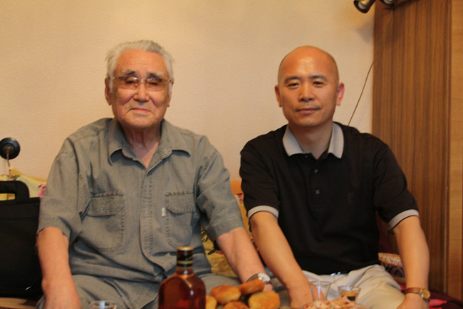
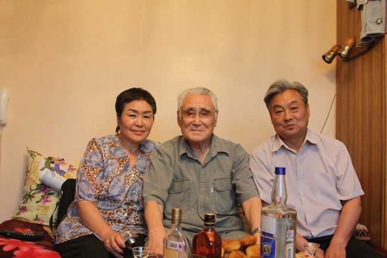
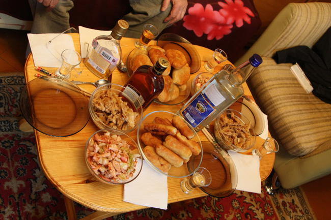

2009년 6월 25일. 타고난 반공주의자(?) 백규의 출현을 알고나 있었던 것일까. 모스크바의 하늘은 잔뜩 흐려 있었다. 6·25의 원흉 구소련은 러시아로 이름을 바꾼 채 목하(目下) 자본주의의 실험을 펼치고 있는 중인데, 백규 일행은 그 심장부 모스크바에서 과거를 발판으로 미래의 가능성을 탐지하고자 이리저리 뛰고 있었다.

\*\*\*

오전엔 전쟁기념관을 찾아 러시아의 오늘을 있게 한 역사의 질곡들과 만났고, 오후에는 트레챠코프 미술관을 찾아 러시아 미술의 진수를 확인했다. 그리고 저녁에 ‘최후의 고려인’ 정상진 선생과 열망하던 만남을 갖게 되었다. 6·25날에 그 전쟁의 한 당사자였던 인물을 만나게 된 것은 한민족의 일원으로서 쉽게 말할 수 없는 ‘역사의 아이러니’였다.

                  <자택에서 정상진 선생과 백규>  
  

                         <함께 살고 있는 따님과 정선생, 그리고 사위>  
  
모스크바 외곽의 울리쨔에 있는 그 분의 아파트로 찾아간 시각이 오후 5시쯤. 함께 살고 있는 사위가 문을 열어주었다. 우리는 반색을 하며 맞아주시는 선생과 많은 이야기를 나누었다. 민족, 이념, 문학을 중심으로 살아온 이야기와 살아갈 이야기들이 그 중심이었다. 그리고 그 핵심은 고려인들의 과거와 현재, 미래를 거울삼아 한민족 공동체가 꾸려나가야 할 미래였다.

\*\*\*

북한의 문화선전성 차관을 지냈고, 6·25에 참전했던 그 분이 김일성으로부터 숙청을 당하여 소련으로 귀환한 뒤, 카자흐스탄 인으로 살아온 세월은 우리 민족의 디아스포라를 몸으로 보여준 사례였다. 사실 그는 2세 고려인으로서 고려 말을 구사할 수 있는 최후의 1인으로 남아있는 셈이었다. 그래서 그런가. 20여 년 간 수십 차례 한국을 왕래하며 한국의 지식인들과 교유해오고 있는 선생임에도 당신의 거처로 찾아온 한국의 교수들에게 하실 말씀이 많은 듯 했다. ‘공산치하에서 살아본 사람은 결코 공산주의자가 될 수 없다’는 그 분의 말씀은 역으로 공산주의를 경험해보지 못한 우리 사회의 이른바 ‘관념적·이상적 공산주의자들’에 대한 경고의 의미를 내포하고 있었다.

‘그대들을 만난 오늘이 내 명절이야!’를 반복하시는 90 노구의 지식인으로부터 비로소 ‘탈이념의 민족혼’이 의미하는 바가 무엇인지 그 정수를 얻어들을 수 있었다. 고려 말을 하는 고려인들은 모두 사라졌지만, 고려 정신을 지키기 위해 무엇을 해야 할 것인지 바로 지금부터 고민해야한다는 말씀은 큰 울림으로 전해져 왔다.

그것만이 아니었다. 꿈을 키우기 위해 북으로 왔다가 시련을 당한 많은 문인, 예술인들의 삶을 통해 그 체제가 갖고 있던 허위와 기만, 그리고 역사의 아이러니를 고발하고자 하는 의지 또한 읽을 수 있었다. 그러면서 선생은 대한민국에서 누리는 무한한 자유와 민주의 즐거움을 부러워하며, 그것만큼은 소중하게 지켜주기를 소망했다.

\*\*\*

선생은 2005년에 펴낸 <<아무르 만에서 부르는 백조의 노래>>를 통해 해방공간과 6·25, 대규모 숙청사건에 이르는 북한사회의 이면사를 보여준 바 있다. 선생은 조만간 그 책의 수정·보완판을 내고자 한다 했다. 매우 절제된 구술을 통해 이미 보여준 그 시절의 이면사에 덧붙이고 싶은 말들이 많은 것일까. 아마 ‘덧붙임’ 자체도 극도의 절제를 벗어나지 못할 것임은 ‘정확하지 않은 말’은 모두 잘라버리는 선생의 결벽증으로 미루어 피할 수 없을 것이다.

\*\*\*

노소(老少) 간에 왕래하는 정담은 좀처럼 끝날 기미가 보이지 않고, 가슴을 훑어 내리는 보드카의 주향(酒香)만이 지성의 칼날을 더욱 날카롭게 벼리는 백야(白夜)의 한밤이었다.

2009. 6. 25.

공유하기

게시글 관리

**백규서옥\_Blog ver.**