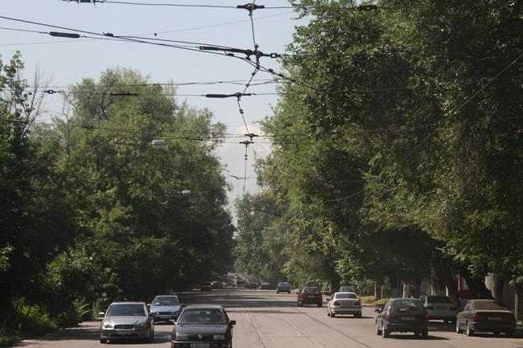
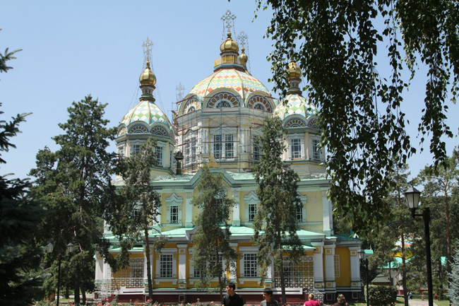
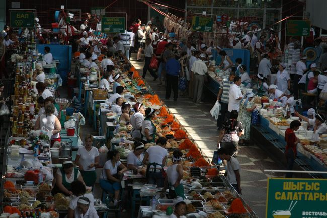
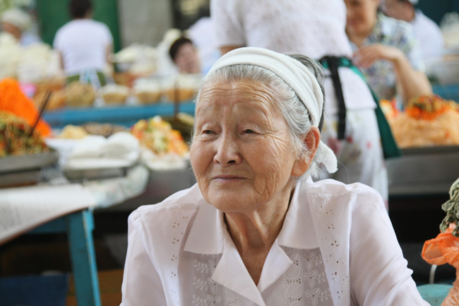
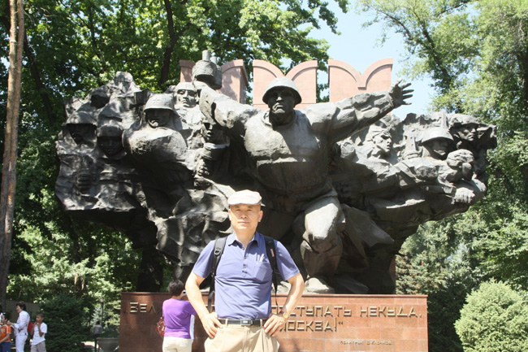
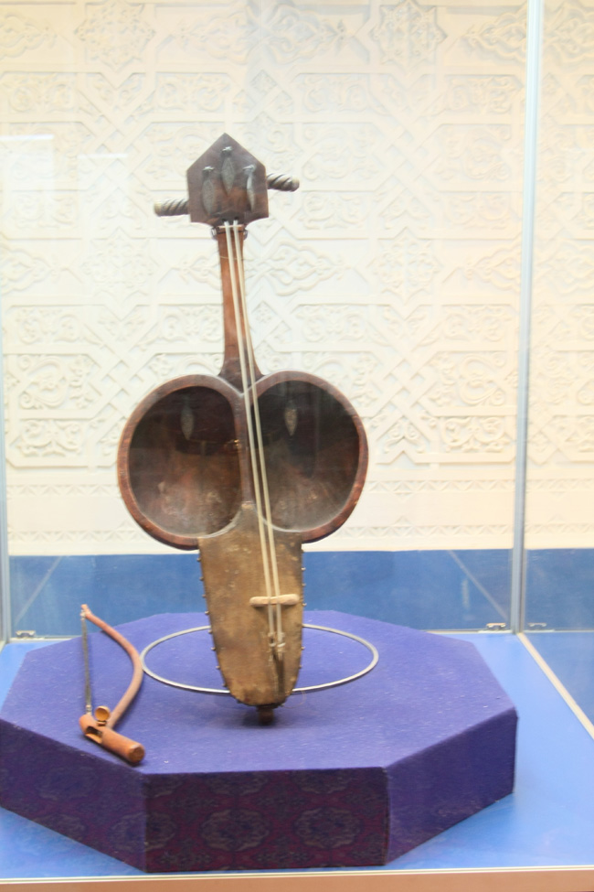
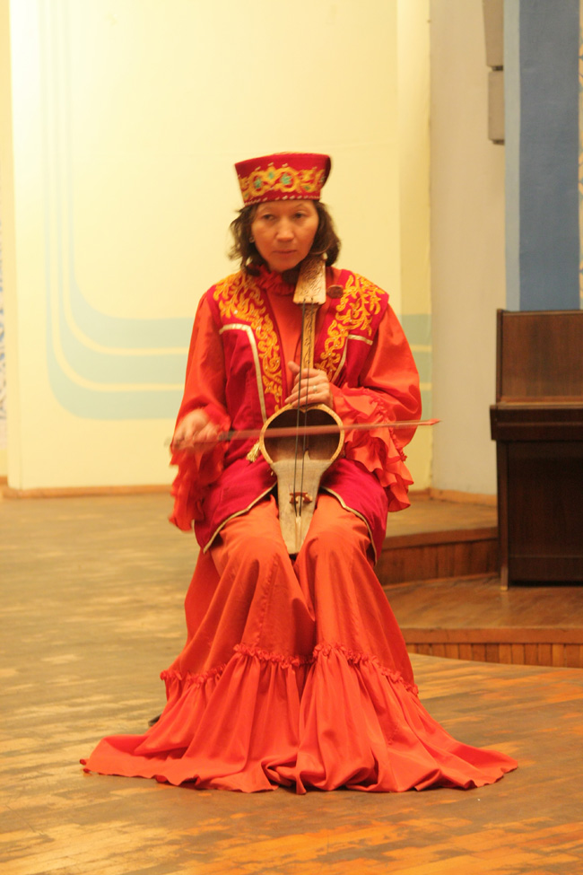
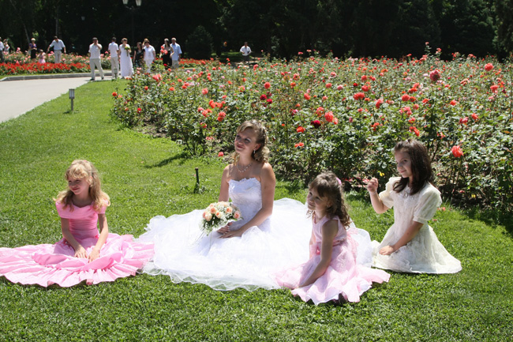

알마티 통신 1 : 알마티의 매연과 천산의 만년설

2009년 7월 11일. 알마티에서의 첫날. 어딜 가나 시내에는 푸른 숲이 가득 했다. 아름드리  나무들이 수백 년의 연륜을 족히 드러내고 있었다. 울창한 숲을 보고 깨끗한 공기를 상상했으나, 시가지에 깔린 공기는 매연에 쩔어 있었다. 들숨 가득 탁한 공기가 폐부를 찔러댔다. 그나마 고개를 들 때마다 압도해오는 천산의 만년설 덕분에 숨 막히는 매연으로부터 겨우 놓여날 수 있었다. 뜨람바이를 타도, 버스를 타도, 택시를 타도, 모든 공간엔 여지없이 매연들이 자리 잡고 있었다. 아스팔트에서 튀어오르는 열기와 매연이 어우러져 채워진 욕조를 유영하듯 힘겹게 걸었다.

         <알마티의 도로와 멀리 보이는 천산의 만년설>  
  
김병학 시인의 안내로 햇살에 달구어진 시내를 책 읽듯 훑어나갔다. 카자흐스탄 첫 방문, 알마티 첫 방문. 모든 것들이 생소하면서도 신기했다. 구소련의 문화적 동질성에 갇혀 있었건만, 러시아에서와는 다른 느낌을 주는 게 신기했다. 걷는 동안 러시아 정교회 건물을 찾아 이곳 사람들의 경건한 신심을 확인했고, 시장을 찾아 삶의 박동도 느꼈다. 시내 한복판에 ‘푸른시장(질료녜 바자르)’이란 이름의 재래시장이 있었다. 그곳에서 81세의 고려인 서올랴 할머니를 만났다. 아직도 고운 자태를 잃지 않은 고려인 할망은 올망졸망 찬거리들과 각종 양념들을 늘어놓고 손님들의 눈치를 살피며 앉아 있었다. ‘장사가 안 된다’고 혀를 차면서도 웃음을 잃지 않은 표정에 적이 안도가 되었다. 심심하던 차였는가 은근히 잡으려는 할망을 뒤로 하고 2․8공원을 찾았다.

  
  <알마티시 러시아 정교회 건물>  
  

  <러시아 정교회 제대 뒤의 장식>  
  

  <알마티 질료녜 바자르의 모습>  
  

  <질료녜 바자르의 서올랴 할머니>  
  
그곳엔 거대한 조형물이 공간을 압도하고 있었다. 적진을 향해 무기를 들고 돌진하는 군인들이었다. 그 밑의 글자들이 걸작이었다. “위대한 러시아! 모스크바를 뒤로 물러설 곳이 없다”는 뜻의 문구였다. 모스크바를 죽음으로 지키겠다는 속뜻일 것이다. 그야말로 구소련의 살기 어린 구호였다. 그 옆쪽에는 1차 대전과 2차 대전의 조형물들이 붙여져 있고, “조국의 자유와 독립을 위한 투쟁에 용기 있게 목숨을 바친 이들에게 영원한 영광 있으라!”는 구호가 보는 이의 내면을 압도해왔다. 공산주의 국가들이 흔히 사용하던 선동의 구호와 문구들을 알마티에서 확인할 수 있었다. 모스크바의 전쟁기념관을 그득 채우고 있던 선동의 모티프가 이곳에 그대로 재현되어 있었다. 토요일이기 때문일까. 결혼하는 커플들이 많았다. 결혼식을 마친 커플들은 이곳 광장의 ‘꺼지지 않는 불꽃’에 헌화하는 것이 관례란다. 하얀색 예복을 입은 신부들이 그림처럼 아름다웠고, 그들이 들고 있는 백합 다발은 순결한 영혼 그 자체였다.   

  <알마티 2-8 공원의 조형물 앞에서>  
  

  <카자흐스탄의 전통악기 돈브라>  
  

  <알마티 악기 박물관의 악사 까를라가쉬>  
  

  <러시아 정교회 앞뜰의 아름다운 신부>  
   
러시아 정교회 안에도 결혼식을 마친 커플, 결혼식을 올릴 커플, 그들의 가족 친지 친구들로 만원이었다. 밀려드는 인파를 피해 찾은 곳은 공원 한 켠의 악기 박물관. 그곳에서 카자흐스탄 민족의 음악을 엿볼 수 있었다. 우리의 비파 비스름한 카자흐스탄 전통악기 돔브라가 유난히 눈에 띄었다. 악기들을 본 다음 문을 나서려는데 우리를 잡는 손길이 있었다. 참하게 생긴 카자흐스탄 아가씨가 우리를 위해 직접 악기를 연주하고 노래를 부르겠단다. 카자흐스탄 돈 200원을 투자하여 한동안 애상적인 분위기에 젖어들게 되었다. 노래를 끝낸 그녀는 ‘까를라가쉬’라는 자신의 이름을 알려주었다. ‘제비’라는 뜻을 갖고 있다는 설명과 함께. 피곤하지만, 카자흐스탄과의  의미있는 첫 만남이었다.

공유하기

게시글 관리

**백규서옥\_Blog ver.**