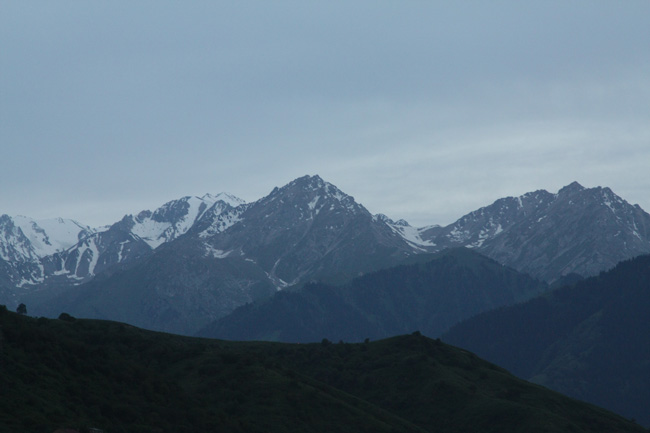
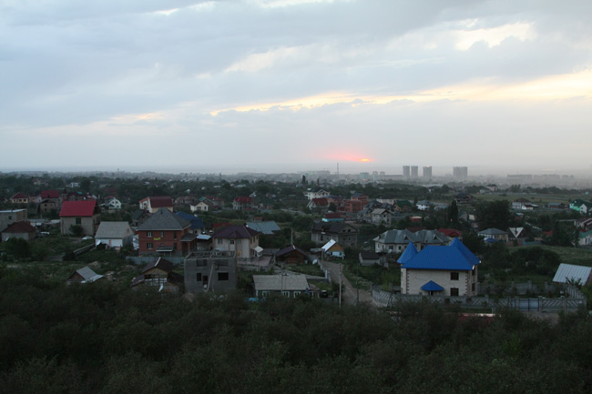
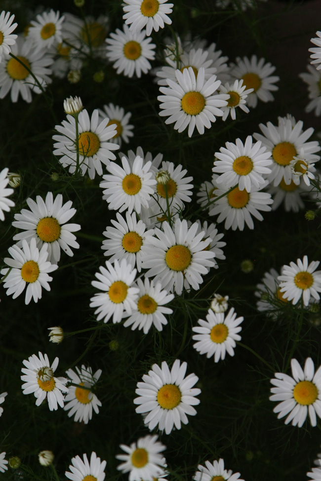
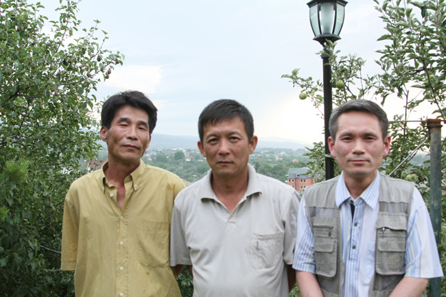

까를라가쉬와 헤어진 우리는 한국식당 청기와에서 시장기를 지웠다. 더위에 지친 우리는 천산의 만년설이 잡힐 듯한 곳에 둥지를 틀고 있는 최석 시인을 만나기로 했다. 택시로 30분을 달려 도착한 곳에서 마중 나온 최 시인의 차를 만났고, 함께 하기로 연락된 리 스타니슬라브 시인, 문희권 선생 등을 만났다. 최 시인의 차로 20분 이상을 달려 올라간 산중턱에 빨간 지붕을 한 최 시인의 집이 참하게 자리 잡고 있었다. 주변엔 과수원이, 저 멀리로 알마티 시가지가, 아득히 펼쳐져 있었다. 알마티 시가지 너머에는 보일락 말락 지평선이 그어져 있고, 발코니에서는 천산의 만년설이 손에 잡힐 듯 가까웠다. 과연 신선이 깃들만한 곳. 아니 내 자신이 신선이 된 듯한 기분이었다. 매연에 절은 인세홍진(人世紅塵)의 추억이 먼 옛날의 일인 듯, 불어오는 바람이 시원하기만 했다.

   <최석 시인 집 발코니에서 올려다 본 천산의 만년설>  
  

   <최석 시인 집 발코니에서 내려다 본 시가지>   
  

  <최석 시인 집 뜰에 피어있는 아름다운 꽃>  
  
그곳에서 만난 세 시인 모두 고려인 사회의 독특한 존재들이었다. 우선 최석 시인. 논산에서 태어난 그는 1987년부터 무크지『현실시각』으로 작품활동을 시작했고, 1989년 시집『작업일지』를 도서출판 청하에서 펴냈으며, 현재 카자흐스탄에서『고려문화』의 편집위원으로 활동하고 있는 중견시인이다.

 전남 신안 출생인 김병학 시인은 1992년 카자흐스탄으로 건너와 한글학교 교사, 대학 한국어과 강사, 고려일보 기자 등을 역임했고, 2005년 시집 『천산에 올라』를 도서출판 화남에서 펴냈으며, 2007년에는 『재소 고려인의 노래를 찾아서』Ⅰ과 Ⅱ를 도서출판 화남에서 펴내는 등 카자흐스탄 고려인 사회의 정신적 자취를 발굴하는데 앞장서고 있다.

 1959년 우슈또베에서 고려인 3세로 출생한 리 스타니슬라브 시인. 그는 1985년 시집 『이랑』을 알마티에서 출판했고, 1997년 제2시집『별들은 재 속에서 간혹 노란색을 띤다』를 출간했으며, 1999년 카자흐스탄 공화국 11학년용 교과서에 그의 시가 수록되었고, 최근 러시아 문학잡지 『유노스찌/청춘』에 그의 시가 실리는 등 문학적 성가를 높이고 있는 중이다.

   <최석 시인 집 발코니에 선 세 시인-왼쪽부터 최 시인, 리 스타니슬라브 시인, 김병학 시인>  
  
보드카의 주향 속에 중앙아시아 고려인 문화의 미래에 관한 이들의 담론들은 무르익어 갔다. 다민족 사회의 소수자인 고려인들은 자신들의 정체성을 어떻게 유지해야 하는가, 한글로 문학한다는 것의 의미는 무엇인가, 고려인들끼리의 갈등을 어떻게 해소해나갈 것인가, 등등. 천산의 만년설은 말없이 굽어보고 있는데, 민족의 미래를 놓고 토론하는 이들의 가슴은 장작불마냥 활활 불타오르고 있었다. 그 불꽃이 걷잡을 수 없이 밀려드는 어둠을 밝히고, 중앙아시아의 평원을 고독하게 걸어가는 고려인들의 앞길을 이끄는 향도가 될 것이다.

공유하기

게시글 관리

**백규서옥\_Blog ver.**