7월 13일, 알마티에서 처음으로 맞는 월요일이자 고려극장 가는 날. 새색시마냥 가슴이 두근거린다. 최영근 문예부장의 차를 타고 공항 가는 길로 나가다가 시가지 외곽에서 빠졌다. 상처투성이의 길을 숨차게 돌고 돌자 아담한 단층의 고려극장이 나타났다. 그동안 걸어온 80년 영욕의 역사가 한눈에 들어온다. 여장부 이 류보위 극장장은 예의 그 호탕한 웃음으로 나를 맞아준다. 극장장의 방에서 간결하게 의전 절차(?)가 끝난 뒤 나와 최영근 부장이 찾은 자료실. 그곳엔 먼지와 시간에 절고 절은 대본들이 쌓여 있었다. 1930년대부터 현재까지 다양한 필체로 쓰인 대본들이 눈물겨운 모습으로 우리를 기다리고 있었다.

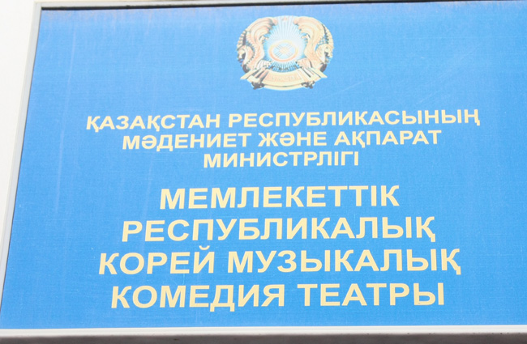

                   <카자흐스탄 국립 고려극장 간판>

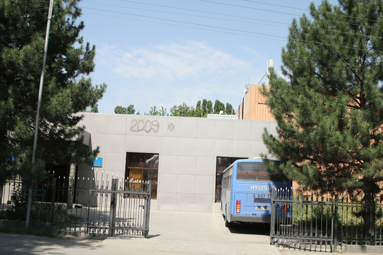

   <고려극장 정문>

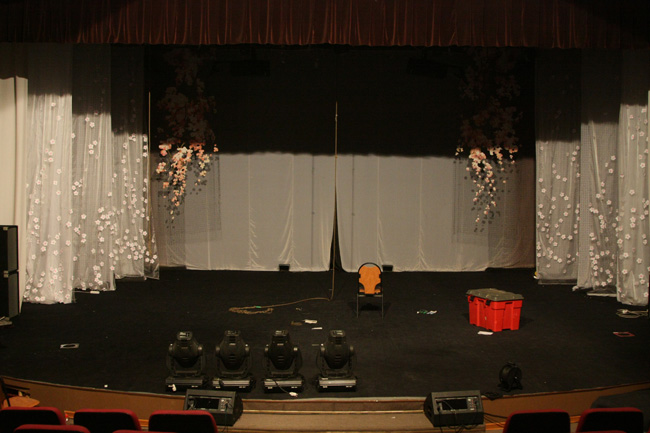

  <고려극장의 무대>

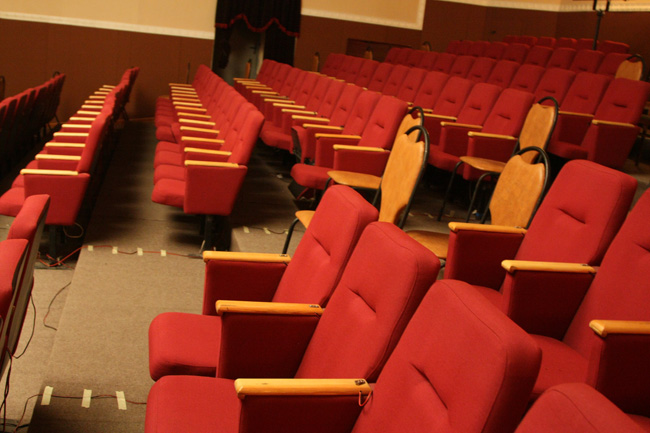

  <고려극장의 객석>

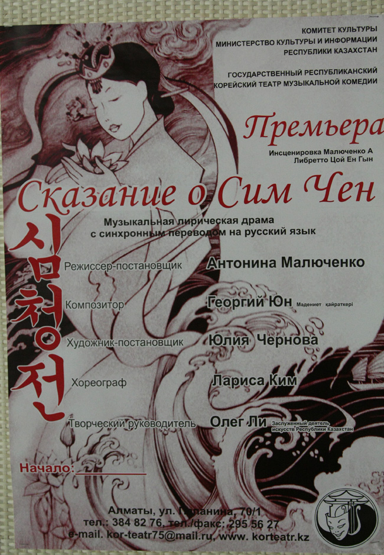

  <연극 심청전의 포스터>

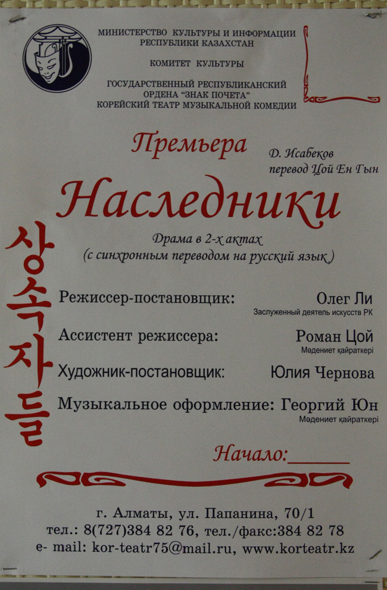

  <번역극 상속자들의 포스터>

   \*\*\*

10여 만 명의 고려인들이 거주하고 있는 카자흐스탄은 구소련 중앙아시아에서 핵심적인 의미를 지니고 있는 지역. 1937년 스탈린에 의한 강제이주 이후 이곳에 정착한 고려인들은 우리 민족의 문화적 전통과 언어를 보존하기 위해 노력해왔으며, 고려극장은 그 중심이었다.

 일제 통치 하의 극동 연해주 블라디보스톡에서 항일 지사들과 고려인들이 우리 문화와 민족 전통을 유지⋅보존하겠다는 의지로 설립한 기관이 바로 1932년에 설립된 고려극장이다. “1932년 이후 극장이 걸어온 운명에는 우리 민족의 역사가 고스란히 담겨져 있다”(『고려극장-어제, 오늘, 그리고 내일』, 1999)는 전 극장장 김 겐나지의 말에서도 암시되는 것처럼 고려극장의 문화적ㆍ역사적 의미는 쉽게 말할 수 없을 만큼 크다. 최근 발행된 『고려극장의 역사』에도 고려극장의 의미나 사명은 다음과 같이 천명되어 있다.

 카자흐스탄과 우즈베키스탄에 이주하게 된 고려극장은 모든 어려움에도 불구하고 민족 유산을 보존했을 뿐만 아니라 선진적이며 자랑할 만한 전문적인 문화 발원지로 변모했다. 고려극장의 무대에서 카자흐, 서양, 러시아 극작가들의 작품을 볼 수 있다. 75년 기간 극장은 수많은 유명한 배우들을 배출했고, 오늘날도 그 어느 때와 마찬가지 고려인 문화 발전을 위한 사명을 다하고 있다. <149쪽>

창립 이후 고려인ㆍ카자크스탄인들을 비롯한 수백 만 명의 관객들이 이곳을 찾았으며 수백 편의 연극과 음악회가 열릴 정도로 고려극장의 인기는 대단했다. 이곳에서는 대부분 한인 극작가들에 의해 창작된 200여 편의 연극을 통해 고려인들의 삶과 문화, 역사가 무대에 올려지기도 했다. 그런데 이 희곡들이 단순히 예술적인 의미만을 지닌 것들은 아니다. 해외에서 독립운동에 헌신하던 지사(志士)들이나 고려인들의 삶, 「춘향전」⋅「심청전」⋅「홍길동」⋅「흥부전」 등 우리의 고전 등 넓은 내용적 편폭을 보여준다.

  <1936년 상연된 연극대본의 표지>

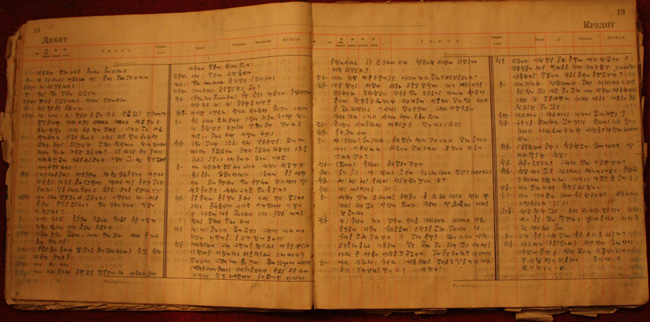

  <그 연극대본의 내용>

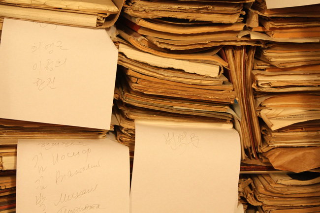

  <쌓여있는 대본들>

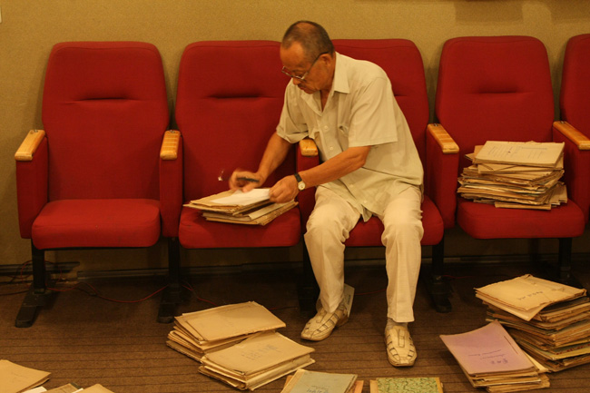

  <자료를 정리 중인 최영근 문예부장>

  <고려극장의 포스터들>

그런데 안타까운 사실은 이런 희곡작품들이 정리되지도 못한 채 고려극장의 창고에서 썩어가고 있다는 점이다. 연구 인력과 자금이 모자라는 현지에서 이런 일을 수행할 수 없다면, 우리라도 그 자료들의 정리⋅연구⋅출판(보급)에 적극 나서야 한다. 구소련으로부터의 독립 이후 이 지역에서 거세게 타오르고 있는 ‘민족주의’ 성향과 그에 따른 고려인 문화의 위축현상을 타개하기 위해서라도 시급히 나설 필요가 있다.

내가 불원천리 이곳을 찾은 것도 그 때문이다. 내게 고려극장은 카자흐스탄 여행의 중심이자 종착역이다. 먼지투성이의 자료들, 기나긴 연륜 속에서 누렇게 바래고 바스러지는 종이를 바라보며 난감한 표정을 짓는 내게 최영근 부장은 겸연쩍은 표정을 짓는다. “이 분들은 그동안 왜 한 번도 정리를 하지 않았까.”라는 힐난을 내 표정에서 읽었기 때문일 것이다.

태장춘, 연성용, 김기철, 채영, 맹동욱, 최영근 등 쟁쟁한 고려인 문사들의 손때가 묻은 대본들. 그것들은 역사의 굽이굽이 고난을 극복해온 ‘고려인의 함성’으로 다가왔다. 나는 과연 이것들을 어떻게 요리할 것인가. 어떤 모습으로 단장시켜 사람들 앞에 내놓을 것인가.

  \*\*\*

천산의 만년설 위로 해가 지니 종이 썩는 냄새에 찌든 내 마음도 덩달아 바빠진다. 그러나, 아무리 바쁘다 해도 최영근 부장과 이 스타니슬라브 시인을 마주하고 한 잔 할 시간마저 없을 소냐? 자, 누군가의 성공을 축하하고, 무언가를 위하여 축배!

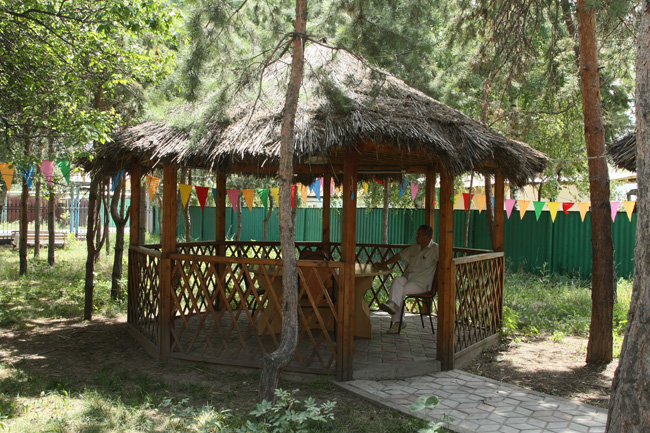

  <고려극장의 야외식당>

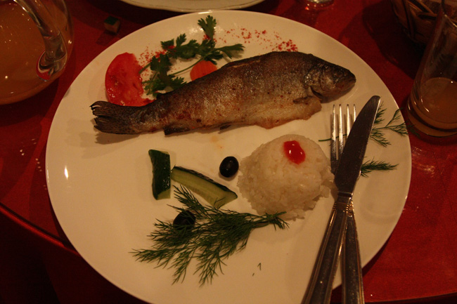

  <카자흐스탄의 산천어 요리>

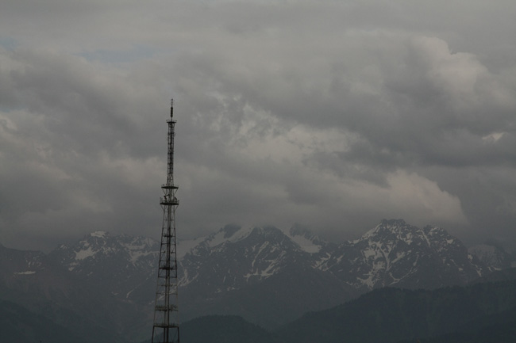

  <저녁 무렵의 천산, 그 만년설>

공유하기

게시글 관리

**백규서옥\_Blog ver.**