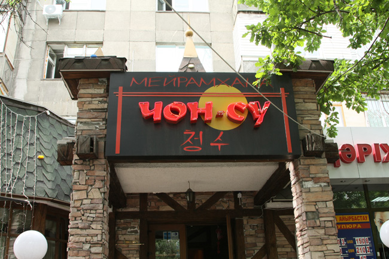
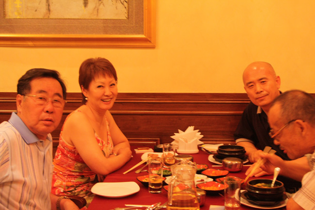

최근 들어 러시아어 권의 국가들을 자주 찾게 된다. 그리고 그곳에서 동족들을 수시로 만난다. 미국이나 일본, 혹은 중국에서 만나는 50대 60대 동포들은 대부분 한국어에 능숙하니 불편함을 느낄 필요가 없다. 그러나 구소련 권은 사정이 다르다. 최근에 이주한 사람이 아니라면, 모두 이곳에서 나고 자란 사람들이다.

 구소련의 엄혹했던 ‘동화정책’은 대부분의 동포들을 철저한 러시아인들로 만들고 말았다. 진짜 속이야 어떤지 알 수는 없으나, 타고난 제 말 혹은 조상의 말을 버리고 러시아어를 모어 혹은 모국어로 삼게 함으로써 내면까지 바뀌었을 가능성이 크다.

 말이 다르면 생각도 달라진다고, 그들이 2대, 3대를 지나면서 바꾸어 가진 말 때문에 의식구조 역시 완벽하게 달라지고 말았다. 구소련 권의 국가들을 여행하면서 말과 민족성의 문제를 새삼 다시 인식하게 되는 것도 그 때문이다.

 여기서는 한 가지 사례를 소재로 두 가지의 말을 하고자 한다. 말에 따르는 소외감, 말과 민족의식 등이 그것들이다.

 하나

이번 여행 중 알마티에서의 어느 점심시간. 70대, 60대, 50대 등 고려인 3명과 함께 하는 자리였다. 모두 고려인 3세들이나, 70대는 우리말과 러시아말에 유창한 이중 언어 구사자, 나머지 둘은 러시아말만 할 줄 아는 지식인들이었다.

  <알마티의 한국식당들 가운데 하나인 '청수'>

  <고려인들과 함께 점심을>

 두 언어에 능통한 70대가 본의 아니게 나와 나머지 두 사람 사이의 통역으로 참여하게 되었다. 그러나 말만 능하다고 통역이 수월한 게 아님을 그는 여실히 보여주었다. 통역이란 언어능력과 순발력을 요하는 업무임을 분명히 깨닫게 된 자리이기도 했다.

 통역의 임무를 제대로 수행하지 못할 경우 대화 판은 대부분 둘로 나뉘게 된다. 특히 통역해야 할 상대 언어 구사자가 단 한 사람이라면 그는 필경 본의 아닌 ‘왕따 신세’가 될 수밖에 없다. 사람이란 어쩔 수 없이 의사소통이 되는 사람끼리 대화를 나누게 되고, 그에 따라 통역이란 징검다리를 거쳐야 하는 상대는 소외되기 마련이다. 행인 앞에 두 갈래 길이 있다 하자. 한쪽은 탄탄대로, 또 한 쪽은 차가운 시냇물에 덩어리 덩어리 던져놓은 징검다리라면 그가 어느 쪽으로 길을 잡아들지는 묻지 않아도 분명해진다.

 우리의 모임이 그랬다. 4명이 합석한 자리였는데, 3명이 같은 러시아어, 1명인 나는 한국어 구사자였다. 더구나 3명 중 2명은 러시아어 외에 영어 등 구사할 수 있는 다른 언어가 전혀 없었다. 반면 나는 한국어와 영어를 구사할 수 있었지만, 그 자리에서 영어는 전혀 의미가 없었다. 3명 중 1명은 러시아어와 한국어를 구사했지만, 수시로 통역의 임무를 망각했다. 말하자면 러시아어를 구사하는 그룹의 일원으로 스스로를 규정하고 그들과의 대화에 몰입하는 것이었다. 연로한 때문인지 전혀 순발력을 발휘하지도 못했다.

 힘겹게 대화에 끼어든 내가 “이 말 좀 통역해 주시오!”라고 소리쳐야 겨우 통역을 하는 수준이었으니 말이다. 더구나 러시아 말이란 얼마나 소란스럽고 수다스러우며 안하무인적(眼下無人的) 언어인가. 그들이 자신들의 일에 관해 요란한 러시아어로 떠들어댈 때 나는 우두커니 앉아 음식만 씹어댈 수밖에 없었다. 대화 판에서 사람이 외로움을 느낀다거나 일상생활에서 소외를 당하는 일이 사실은 다른 게 아니다. ‘자기들만의 언어로 자기들 끼리 만 소통함으로써 남을 문 밖에 세워두는 일’이야말로 현대사회의 비참한 소외현상이다. 사전적인 의미에서 ‘같은 언어’를 쓰느냐의 여부는 큰 문제가 아니다. 같은 언어를 쓰는 동족끼리도 서로 간에 얼마나 비참하게 소외시키는지를 보면 그 점을 잘 알 수 있다. 말하자면 ‘자기들만의 언어’를 쓰는 것이 소외의 가장 큰 조건임을 우리가 깨달아야 한다는 것이다.

 생계유지의 어려움에 몰려 어쩔 수 없이 떠난 초기 이민들이나, 비슷한 이유로 우리나라에 들어온 동남아의 새댁들을 생각해 보라. 언어 때문에 그들이 겪어야 했던 소외감이 어떠했을까를. 그럼에도 심지어 우리 중의 몰지각한 어떤 인사들은 우리말을 못 알아들을 거라는 지레짐작으로 그들을 같은 자리에서 돌려세워놓고 험담을 하기도 한다. 차별의식으로부터 나온 우리 민족의 못된 습성이다. 같은 동족끼리도 말을 통해 소외시키기를 밥 먹듯이 하는 민족인데, 하물며 우리와 피부색과 사고가 다른 외국인들에 대해서야 오죽할까.

둘

그 식사 자리에서 ‘고려 말’에 대한 이야기가 나왔다. 사실은 60대나 된 사람들이 우리말을 한 마디도 모르는 게 눈에 거슬리던 차였다. ‘고려인들은 고려 말을 좀 배워야 하고, 젊은 세대는 더욱 그래야 한다’는 것이 내 주장의 요지였다. 그러자 대뜸 ‘우리는 러시아 말을 하고 있고, 외국어를 배우려면 영어를 배워야 한다’는 대답이 돌아왔다. 현실로 따진다면야 옳은 말일 것이다. 그러나 늘 애틋하게만 생각해오던 동포들의 입에서 망설임도 없이 이런 말이 튀어나올 줄은 꿈에도 생각지 못한 나였다.

 더 기가 막힌 것은 ‘한국말을 배워서 어디에 써 먹느냐?’는 대답이었다. 한국말 배울 시간에 영어를 배우는 것이 훨씬 더 유용하다는 것이었다. 더더욱 기가 막힌 것은 ‘고려인의 후예들보다 훨씬 더 많은 수의 카자흐스탄 사람들이 고려 말 배우기에 열성적’이라는 말을 덧붙인 점이었다. 그런 그들에게 나는 한국말을 배워야 한국의 정신을 배울 수 있고, 한국의 정신을 익혀야 뿌리를 잃지 않을 수 있다는 설득의 말을 건넬 용기가 나지 않았다.

 이미 구소련 혹은 카자흐스탄을 조국으로 생각하고 있는 그들이었다. 한국은 독일이나 중국과 같은 먼 외국일 따름이었다. ‘비록 해외에 나가 있는 우리의 피붙이들에게 잘 해 준 건 없어도 늘 애틋하게 생각해왔는데, 이럴 수가 있는가!’라는 한탄은 이미 그들에게 통할 수 있는 생각이 아니었다. 그동안 혼자서 이들을 짝사랑해왔음을 그 순간 분명히 깨달을 수 있었다.

 생김새는 분명 나와 별로 다를 바 없었다. 그러나 ‘뚜르르~’ 굴러가는 러시아어를 술술 구사하는 그들, 한국에 가서 며칠간 한국음식을 먹느라고 죽을 뻔 했다는 그들을 보며, 민족이란 ‘상상의 공동체’에 불과하다는 앤더슨의 말을 떠올리지 않을 수 없었다. 옮겨 심은 나무처럼 그저 그 땅에 적응하면 그 땅의 나무가 되는 것 아닌가. 누구의 말대로 ‘줄기와 뿌리는 이파리를 잡고 있으려 하나, 이파리들은 한사코 나무를 떠나려’ 하는 이치가 바로 이것 아닌가. 모체를 떠난 이파리인 그들은 결코 모체를 떠올리려 하지 않았다.

 본향 회귀를 염원하는 1세대의 정신적 자장(磁場)으로부터 멀리 벗어난 그들이었다. 그들에겐 돌아갈 본향도, 그리워할 음식도, 붙들고 울어야 할 피붙이도 없었다. 그저 기름 줄줄 흐르는 러시아나 중앙아시아의 음식들을 먹으며, ‘뚜르르~’ 굴러가는 러시아어로 수다를 떨며, ‘바로 지금 이곳’을 사는 이곳 사람들일 뿐이었다.

  \*\*\*

민족이란 무엇인가. 아니 가족이란 무엇인가. 부정적이든 긍정적이든 우리는 그간 ‘피붙이’라면 끔찍이 생각해왔다. 준 것도, 줄 것도 없지만, 정 하나만큼은 나누어야 할 대상으로 생각해온 것이 해외의 우리 동포들이었다. 그러나 이제 분명히 깨닫자. 그들에게 자신들의 나라는 카자흐스탄이요, 러시아일 뿐 대한민국이 아니다. 잘 나가는 대한민국을 특별히 자랑스러워해야 할 의무도 그들에게 없고, 고국을 잊지 말하고 강요할 권리도 우리에겐 없다. 너와 나는 그저 ‘바로 지금, 여기’에 충실해야 할 생활인들일 뿐임을 잊지 말자. 이런 바탕 위에서 해외 교민들에 대한 정책도 재조정되어야 한다. 민족의 실체 또한 새롭게 깨달아야 한다.

공유하기

게시글 관리

**백규서옥\_Blog ver.**