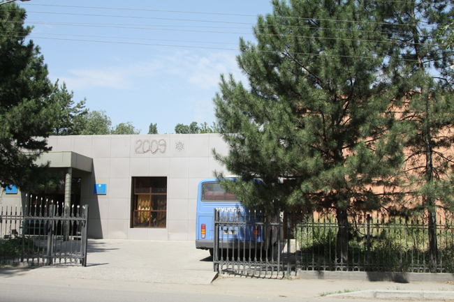
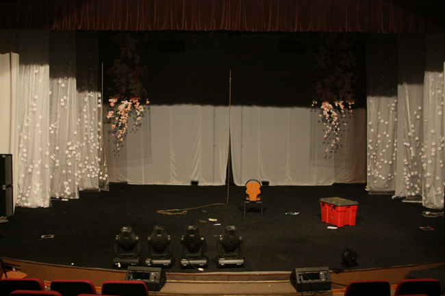
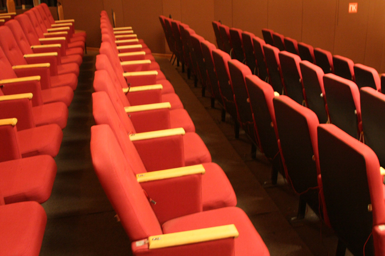
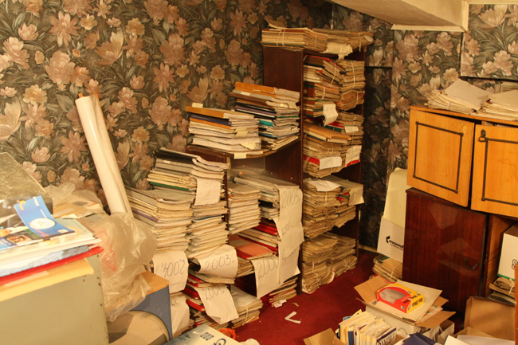
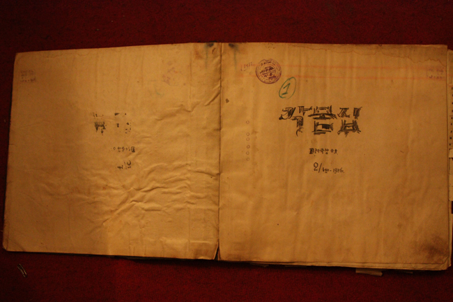
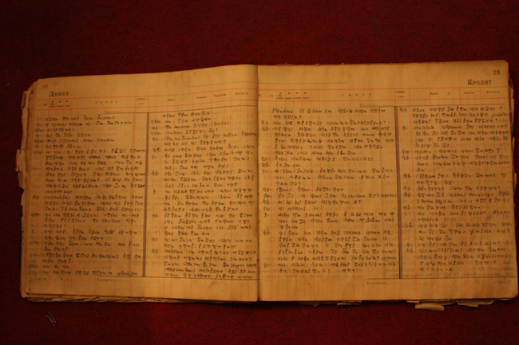
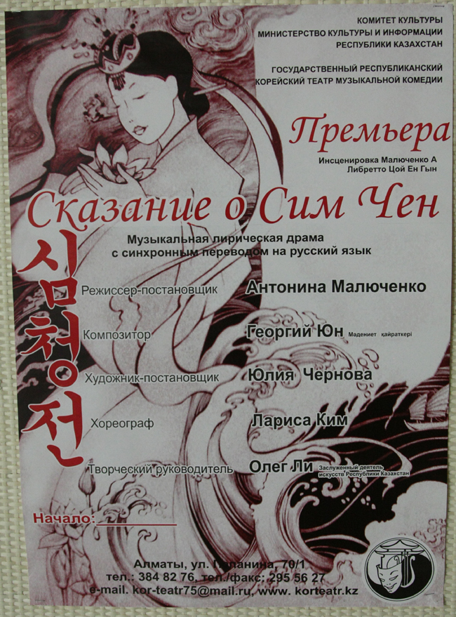

바스러져 가는 고려인들의 목소리

-카자흐스탄 고려극장의 공연 대본들-

   <카자흐스탄 국립 고려극장의 외관>  xml:namespace prefix = o ns = "urn:schemas-microsoft-com:office:office" /

‘탈식민(脫植民)’이 시대의 핵심적인 코드로 정착된 지금, 새삼 민족 정체성을 운위한다는 것이 가당키나 한 일일까. 그러나 디아스포라(diaspora ; 離散)의 한복판에서 벗어나지 못하고 있는 우리 민족에게 아직도 그것은 절실한 문제다. 이산의 시련 속에서 우리의 민족문화나 민족정신의 현장은 중심부와 주변부로 분리되어 왔다. 손을 쓸 수 없을 정도로 변화되고 있는 중심부에서 살아있는 민족정신의 맥을 잡기가 어려운 것이 현실이다. 일제나 구소련의 시기가 우리 민족에게 물리적 디아스포라의 시대였다면, 지금은 정신적 방랑 혹은 방향성 상실의 관념적 디아스포라 시대다. 우리에게 탈식민이 요원한 것도 그 때문이다.  

  

  <사진 위는 고려극장 중앙무대, 아래는 객석> 

1937년 스탈린의 강제이주 정책에 의해 짐짝처럼 실려가 내동댕이쳐진 존재가 중앙아시아 고려인들이다. 그로부터 70여년의 세월이 흘렀고, 카자흐스탄에만 10여만 명의 고려인들이 살고 있다. 그 고려인들의 문화적 전통과 언어 보존의 핵심 기지 역할을 해온 고려극장. 1932년에 설립되었으니, 올해로 무려 77년 고난의 역사를 장하게 견뎌온 고려극장이다. 지금 이곳에서 한국 근현대사 혹은 민족정신사의 ‘노다지’가 썩어가고 있다.

   <고려극장 창고>

고려극장에서는 1932년부터 올해까지 한 해도 빼놓지 않고 연극이 공연되었다. 단순히 즐거움을 주기 위한 ‘놀이’로서의 연극이 아니라, 해외에서 독립운동에 헌신하던 지사(志士)들이나 고려인들의 삶, 「춘향전」ㆍ「심청전」ㆍ「홍길동전」ㆍ「흥부전」같은 우리 고전들의 수용을 통해 민족정신을 환기시켜온 고려인들의 육성이다. 이들은 그런 연극을 통해 수시로 민족 정체성을 공유하고자 했다. 구소련 시절 ‘대러시아’의 구호 아래 강요된 동화정책으로 고려인들의 정체성은 크게 붕괴되었고, 구소련 붕괴 이후 이 지역에서 불고 있는 민족주의의 바람은 또 다른 방향에서 고려인의 문화를 위축시키고 있다.

   <고려극장의 대본들과 대본 모습>

이제 고려 말을 구사하는 몇몇 고려인들이 사라지고 나면 민족의 정체성을 회복할 만한 한 가닥 정신적인 끈마저 놓게 될 것이다. 사실 그동안 고려인들은 ‘아무데도 쓸 일이 없는’ 고려 말을 용케도 유지해왔다. 그런 고려 말을 재료로 문학작품을 쓰기도 하고 노래를 지어 불렀으며, 연극도 상연했다. 그러나 이제 이곳에서 고려 말은 임종을 앞둔 환자의 형국으로 변했다. 고려말로 연극을 공연할 배우도 없고 들어서 이해할 수 있는 관객도 없는 현실에서 고려말 연극은 존속될 이유가 없다.

그렇다면 어디서 그 끈을 찾아낼 수 있는가. 77년간 이어온 고려극장의 찬란한 전통과 역사를 되살리는 것만이 그 유일한 길이다. 연선용, 태장춘, 채영, 김기철 등 당시의 뛰어난 극작 및 연출가로부터 최영근, 송 라브렌지 등 현재의 작가들에 이르기까지 빛나는 고려인 연극의 맥을 되살려야 한다. 그러자면 우선적으로 고려극장의 창고에서 썩어가는 대본들의 먼지를 털어내고 그것들에 내재된 의미를 끄집어내야 한다. 200건이 훨씬 넘는 대본들에는 연극을 통해서 그들이 절규했던 ‘고려인들의 함성’이 들어있다.

  <심청전 공연 포스터>  
    
자신들의 마음을 ‘보여줄 수 있는’ 예술이라는 점에서 그들은 활자나 소리 아닌 연극을 매체로 선택했다. 그들이 연극을 통해 보여주려 한 것은 일제와 스탈린의 철권통치에도 죽지 않고 살아남을 수 있었던 불굴의 정신이다. 그걸 살리기 위해 백방으로 뛰어도 적은 돈이나마 확보하기 어려운 게 현실이다. 고려극장의 보물을 건지기 위한 최소 비용조차 추렴하지 못한다면, 우린 문화국민의 타이틀을 내려놓아야 한다.

공유하기

게시글 관리

**백규서옥\_Blog ver.**