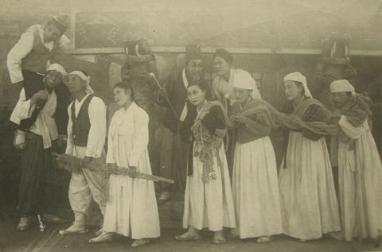
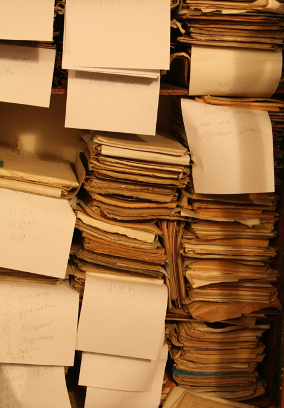

[조선일보 기사보기](http://news.chosun.com/site/data/html_dir/2009/08/19/2009081900010.html)   
  
  
30년대 강제이주 이후 고려극장에서 공연한 한글대본 200여편 발굴 《춘향전》 《심청전》 《홍길동》…. 일제 강점기 중앙아시아에 끌려간 한인들이 고향 땅을 그리며 무대에 올린 우리 고전들이다. 카자흐스탄 알마티의 국립 고려극장이 지난 80년간 우리 말로 무대에 올린 연극 대본 200여편과 공연 일정이 공개됐다. 한글로 쓰인 이 연극 대본 가운데는 우리 학계에는 이름조차 알려지지 않은 작품들이 많아 우리 문학·연극사 연구에 획기적 계기가 될 것으로 보인다.   
  
고려극장은 1937년 스탈린에 의해 중앙아시아로 강제 이주당한 한인들의 문화적 구심점 역할을 해온 곳이다. 조규익 숭실대 한국문예연구소장은 최근 알마티 고려극장을 방문, 극장 설립 이래 최근까지 공연된 연극 대본들을 정리·발간하기로 합의했다고 밝혔다.   
  
1932년 블라디보스토크에서 설립된 고려극장은 알마티로 옮겨온 뒤, 한인과 러시아 극작가들의 창작 희곡·번역 희곡 등 200여편의 연극을 무대에 올려 왔다. 조 소장이 공개한 대본 목록에는 우리 고전과 역사 인물을 각색한 작품들이 가장 많았다. 《토끼전》(1959) 《장한몽》(1935) 《흥부와 놀부》(1946)와 김두칠의 《논개》(1962), 정동혁의 《온달전》(1972) 등이 대표적이다.   
  
  
▲ 1956년 카자흐스탄 고려극장에서 올린 연극〈흥부와 놀부〉. 가운데 담뱃대를 들고선 이가 놀부 역을 맡은 인민배우 리 니꼴라이./최 아리따·김병학 제공   
  
특히 1942년 태장춘(1911~1960)이 쓰고 공연한 《홍범도》는 1920년 봉오동전투의 주역이자 중앙아시아 한인들의 우상인 홍범도 장군의 일대기를 그린 작품이다. 홍범도 장군은 만년에 카자흐스탄에서 극장 수위를 지내는 등 곤궁한 생활을 하다 1943년 세상을 떴다. 스탈린 치하인 1953년 셰익스피어의 고전 《오셀로》를 무대에 올린 것도 눈길을 끈다. 사회주의 리얼리즘문학의 정수로 꼽히는 고리키의 《사람들》(1940)과 고골리의 《검찰관》(1952)과 함께 이념극으로 보이는 《동쪽의 빨치산》(1934) 《38선 이남》(1950) 《모란봉》(1962) 등도 무대에 올렸다.   
  
고려극장은 한인 극작가·연출가들의 산실(産室)이었다. 그 가운데 태장춘은 《밭두렁》(1934), 《신 철산》(1935), 《노예들》(1937), 《행복한 사람들》(1938), 《생의 흐름》(1945), 《흥부와 놀부》, 《해방된 땅에서》(1948), 《노예들》(1948) 등 거의 해마다 신작을 발표한 고려극장의 주요 작가였다. 문세준·연선용·김기철·채영·이정림·김해운·이길수·최길춘·한진·최영근 등도 우리 말로 대본을 쓰고 공연한 예술가들이다. 조규익 소장은 "고려극장은 일제시대부터 현재까지 매년 우리 말로 연극 공연을 올려 온 유일한 해외단체"라면서 "이들이 올린 연극 대본은 해외에서 독립운동에 헌신하던 지사들이나 고려인들의 삶을 다룬 역사적 기록물로 볼 수 있다"고 말했다.   
  
   
▲ 카자흐스탄 고려극장 창고에 보관 중인 대본들.

공유하기

게시글 관리

**백규서옥\_Blog ver.**