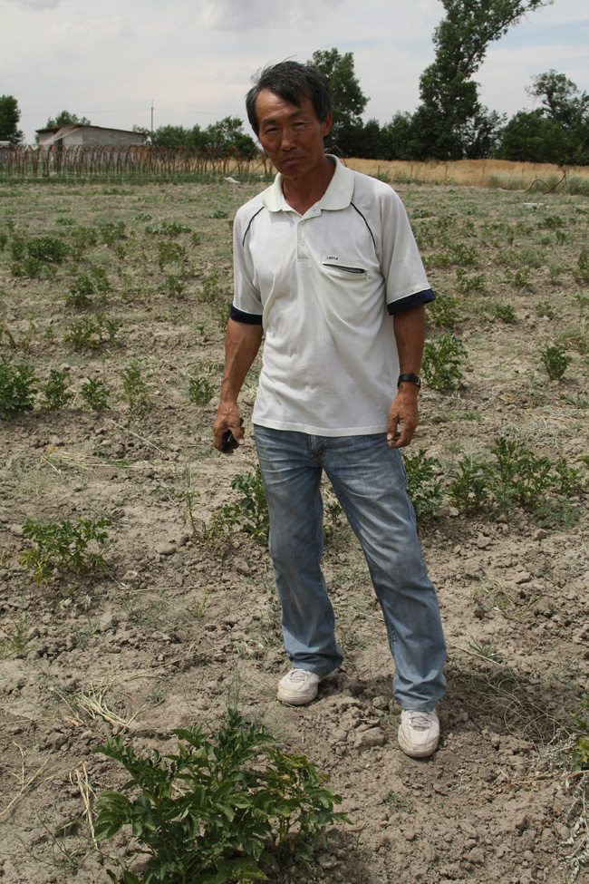
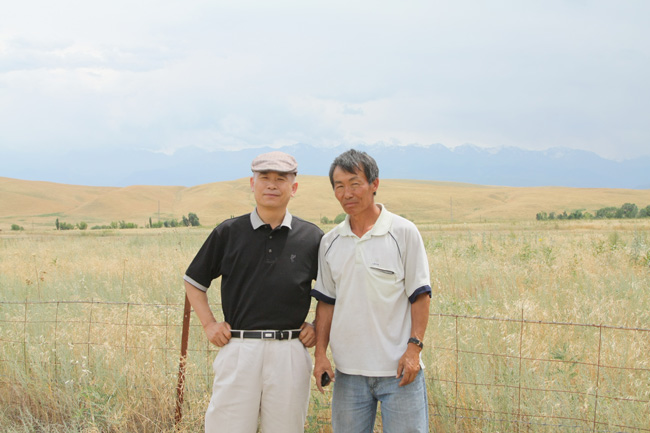
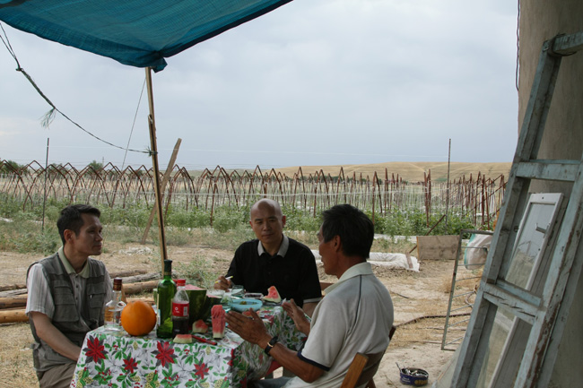
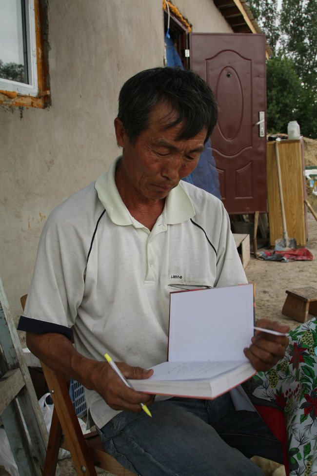

[동아일보 기사보기](http://news.donga.com/fbin/output?from=email&n=200909010085)

고려인 ‘계 니콜라이’의 21세기 민족운동

알마티에서 만난 50대의 계(桂) 니콜라이는 정체성의 위기를 겪는 중앙아시아 고려인에게 뚜렷한 비전을 제시한다는 점에서 주목할 만한 인물이다. 그는 독립운동가이자 역사학자로서 한일강제합방 뒤 북간도로 망명하여 이동휘와 함께 독립운동에 헌신했고, 상하이 대한민국임시정부 의정원 의원으로 활동한 계봉우(桂奉瑀·1880∼1959)의 손자다. 현재 독립유공자 후손회 회장인 그가 보기에 중앙아시아의 한민족 공동체는 이미 와해됐다고 할 만큼 이 지역 고려인에게 민족정신의 상실은 심각하다.

     <자신의 농장에 서 있는 니꼴라이 선생>  
  
한민족의 표지(標識) 가운데 가장 중요한 점이 말과 글이다. 말과 글을 잃은 세대 사이에 역사나 문화가 이어질 리 없다. 말과 역사를 잃은 경우, 본질적인 의미에서 민족공동체의 일원일 수 없다. 그런 이유로 말과 글이 민족 정체성 회복의 관건이라는 계 니콜라이의 관점은 해외동포의 교육이나 계몽에 관하여 시사하는 바가 크다.

        <농장을 배경으로 서 있는 백규와 니꼴라이 선생>  
  
많은 고려인처럼 ‘편하게 잘 먹고 잘살아 오다가’ 나이 50이 넘어서야 진정한 삶의 의미를 깨우쳤다는 그는 지배자 일본에 붙어 편하게 살 수 있었음에도 불구하고 모든 것을 바쳐 투쟁한 독립투사의 삶을 보면서 자신의 관점을 바꿨다고 했다. 요즈음도 한국어교육원에 나가 우리말을 익히고 있을 만큼 말과 글에 거는 그의 기대는 크다. 무엇보다 자금 마련에 도움이 안 된다는 이유로 박봉의 대학교수 직을 접고 농장을 경영하며 고려인에게 우리말과 역사를 보급하는 일에 나선 그의 삶은 계몽 중심의 독립운동을 주도해 온 조부의 행적과 흡사하다.

고려인은 사실 오랫동안 가족과 소비에트 국가만을 위해 일했다. 모국어 학교의 폐쇄를 강요당하면서도 변변히 저항 한번 못했다. 모국어 극장이나 신문이 지리멸렬해지는데도 손 한번 써보지 못하는 것이 고려인이다. 모국어가 탄압받고 ‘쓸모없는 존재’로 전락한 상황에서 그 언어로 쓰인 모국의 역사를 전승하는 일은 거의 불가능했다. 그런 활동 모두가 ‘민족을 위한 일’이라면 언어의 상실과 함께 사실상 민족운동은 막을 내렸다고 할 수 있다. 그는 이런 점을 그리 심각하게 받아들이지 않는 고려인 단체의 현실인식이 가장 큰 문제라고 한다.

     <고려인들의 미래에 대하여 담론하고 있는 세 사람. 좌로부터 김병학 시인, 백규, 니꼴라이 선생>  
  
그는 자신들의 현재와 미래를 개척하지 못하고 외부의 도전에 너무 쉽게 자신을 접어온 원인으로 ‘노예근성’을 꼽는 데 주저하지 않는다. 그가 보기에 ‘잘 먹고 잘살아 온’ 그간의 삶은 철저한 순응의 역사였다. 구소련의 동화정책에 맞서지는 못했다 해도 최소한 민족의 정신을 지키려는 가정 단위의 개별적 노력 정도는 해볼 수 있지 않았느냐는 그의 주장을 순진한 생각으로 치부할 수만은 없다. 역경 속에서도 민족공동체의 미래를 내다보며 현실적 난관을 극복하기 위해 노력한 선각자의 고난을 그는 매 순간 떠올리기 때문이다.

   <자신의 책에 서명하고 있는 니꼴라이 선생>  
  
이런 일에 착수하기 위한 방안의 하나로 새로운 한글 신문을 제작하겠다는 것이 그의 구상이다. 우리 민족의 언어 문화 관습 정보 등 모든 것을 묶어 무가지(無價紙)로 배포하겠다고 한다. 그는 5, 6년간만 고려인 가정에서 우리의 말이나 역사에 관한 담론이 오갈 수 있다면 궁극적으로 민족에 대한 인식이나 관점도 살아날 수 있다고 본다. 잘 먹고 잘사는 차원을 벗어나 가치 있는 삶을 모색할 때임을 강조하는 그가 있으므로 고려인 사회엔 아직도 희망이 있다.

조규익 숭실대 국문과 교수

공유하기

게시글 관리

**백규서옥\_Blog ver.**