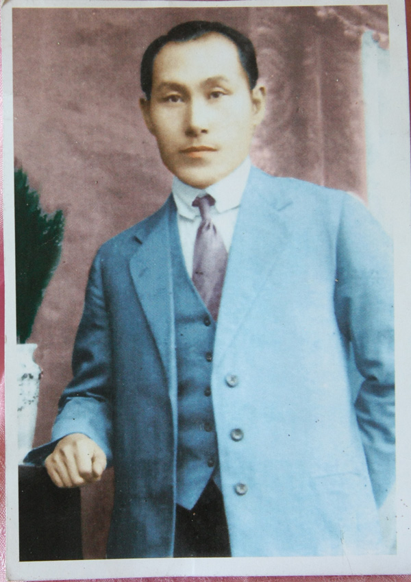
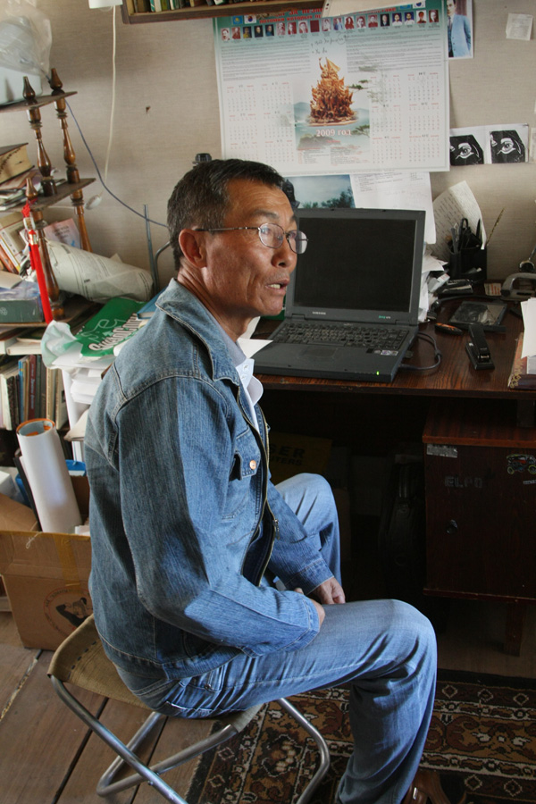
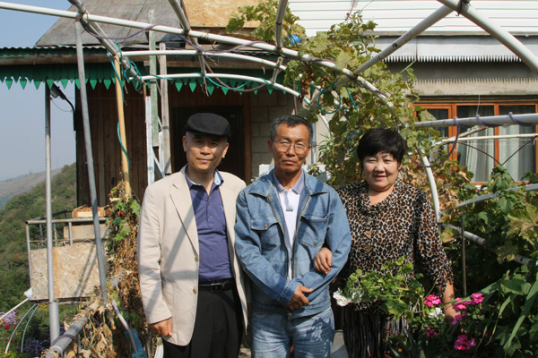

다시 만난 계 니꼴라이

다시 찾은 알마틔. 가을답게 날씨가 청명했고, 뜨겁던 여름철 가까이 보이던 하얀 천산도 아득히 멀었다. 바쁜 일정을 대충 소화한 다음 니꼴라이를 만났다. 그는 자신의 투박한 차를 몰고 숙소 앞으로 와주었다. 김병학 시인과 함께 동승하여 40분 넘게 도심 외곽으로 달리니 천산이 손에 만질 듯 가까운 언덕받이, 진녹색 수풀 속에 그의 집은 조용히 숨어 있었다. 그의 형형한 눈빛만큼이나 꾸밈없는 다차가 이채로웠다. 우리를 위해 음식을 만들고 있던 그의 부인 역시 조용한 고려인이었다.

 <계봉우 선생>

마주 앉기만 하면 민족의 장래를 걱정하는 니꼴라이. 그의 할아버지가 바로 계몽 중심의 독립운동을 주도한 북우(北愚) 계봉우(桂奉瑀) 선생이다. 북우 선생에게는 네 명의 아들이 있었다.  맏아드님은 35세에 사망했고, 둘째 아드님은 2남2녀를 두었는데, 그 중 막내가 니꼴라이다. 니꼴라이에게 영향을 준 사람은 숙부인 계학림(桂學林) 선생이었다. 니꼴라이는 어린 시절부터 숙부로부터 “할아버지는 위대한 분이셨다”는 말씀을 들으며 자랐다고 한다. 크즐오르다에서 고등학교까지 마친 그는 알마틔 체육대학에서 스포츠 지도자 과정을 이수했다. 1985년 모스크바의 체육대학에서 연구원 생활을 시작한 그는 1991년 스포츠 교육에 관한 중요한 논문을 발표함으로써 주목을 받기 시작했다.

   <거실에서 니꼴라이>

 그 후 대학 체육학과의 교수로 재직하던 중 민족의 존재나 정체성에 대한 의문과 깨달음을 얻고 계몽운동에 몰두하게 되었다. 말을 잃어버리면 문화도 역사도 정신도 모두 잃어버린다는 것이 그의 지론이었다. 고려인들이 고려 말을 회복하는 순간 민족의 정체성을 회복할 수 있다는 것이 그의 믿음이었다. 민족의 정체성을 상실한다면 아무리 돈이 많아도 지위가 높아도 ‘떠돌이’를 면할 수 없고, 이민족으로부터 멸시를 당할 수밖에 없다는 것이다. 그런 신념을 바탕으로 그는 고려인들의 혼을 일깨우기 위한 ‘신문’의 제작을 준비하고 있었다. 무가지(無價紙)로 배포하여 고려인들로 하여금 민족 정체성 회복의 열망을 갖도록 하겠다는 것이 그의 포부였다.

 그는 자신만만했다. 지금 고려인 사회가 수적으로 열세를 면치 못하고 있으나, 타고난 근면성과 명민성을 바탕으로 하고 있기 때문에 한 번 자각의 불꽃만 댕겨 준다면 걷잡을 수 없이 타오를 것이라는 믿음을 그는 갖고 있었다. 그러나 찬바람이 드나드는 허름한 다차의 거실에서 노트북 컴퓨터 자판을 두드리는 그의 어깨가 무거워 보이는 것은 그의 열망에 비해 고려인 사회의 현실이 너무 열악하기 때문이리라,

  <니꼴라이 부부와 함께>

 집 앞의 과수밭에서 갓 따온 사과를 씹으며 우리의 대화는 끝없이 이어졌고, 회색빛 고려인 사회의 미래는 일순 희망의 분홍빛으로 물들고 있었다. <2009. 9. 28.>

공유하기

게시글 관리

**백규서옥\_Blog ver.**