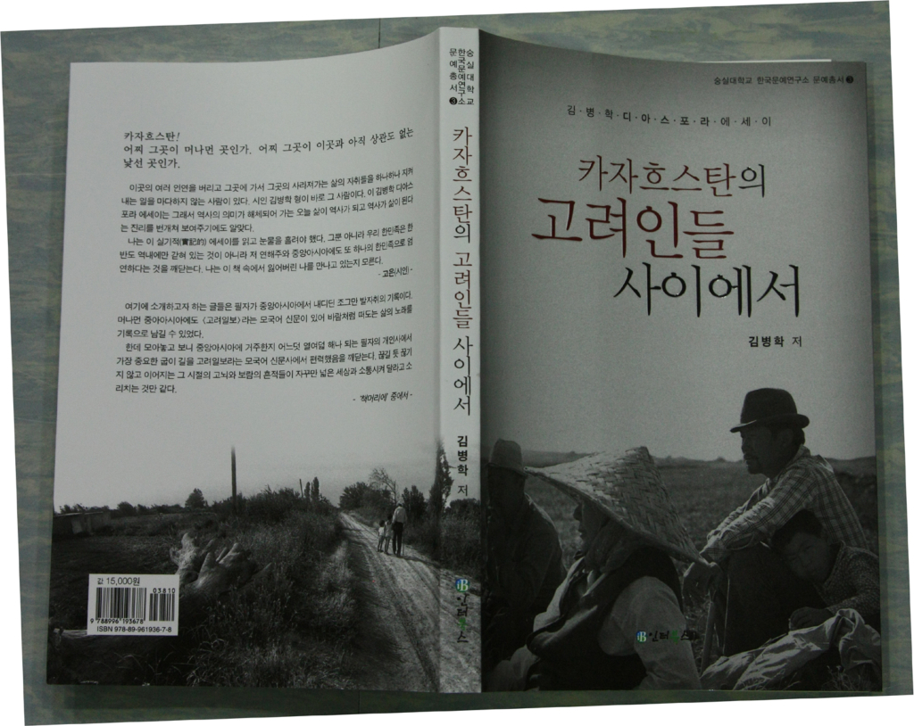

김병학 디아스포라 에세이, 『카자흐스탄의 고려인들 사이에서』(서울, 인터북스, 2009) 가 한국문예연구소 문예총서 3으로 발간되었습니다!!!

  재소고려인들이 사는 나라 중앙아시아 카자흐스탄에서 열여덟 해를 살아오고 있는 김병학 시인이 그동안 고려인들과 어울려 살면서 보고 느끼고 체험한 이야기들을 모아 한 권의 책으로 펴냈다. 9월 20일 도서출판 인터북스에서 발행한 김병학 디아스포라 에세이, 『카자흐스탄의 고려인들 사이에서』(서울, 인터북스, 2009)가 바로 그것이다.

  김 시인은 지난 1992년 카자흐스탄으로 건너가 우스또베광주한글학교 교사, 알마아타고려천산한글학교장, 알마틔대학교 한국어과 강사, 구소련 고려인들의 민족지 <고려일보> 기자 등을 역임했다. 이와 같은 독특한 경력이 말해주듯이 김 시인은 누구보다도 고려인들과 가까이 어울려 산 한국인이다. 그는 그렇게 고려인들 속에서 살면서 그들에 대한 연민과 사랑을 꾸준히 <고려일보>에 글로 남겼고 그 글들이 모여 오늘의 에세이가 되었다.

  책 머리말에서 저자는 “여기에 소개하고자 하는 글들은 필자가 중앙아시아에서 내디딘 조그만 발자취의 기록이다. 머나먼 중앙아시아에도 <고려일보>라는 모국어 신문이 있어 바람처럼 떠도는 삶의 노래를 기록으로 남길 수 있었다. 얼마나 고마운 일인지 모른다. 더욱이 필자는 그 신문사의 부름을 받아 두 번이나 기자로 일하는 행운을 누리기도 했다.

  …한데 모아놓고 보니 중앙아시아에 거주한 지 어느 덧 열여덟 해나 되는 필자의 개인사에서 가장 중요한 굽이 길을 <고려일보>라는 모국어신문사에서 편력했음을 깨닫는다.” 라고 고려일보에 대한 인연을 강조하고 있다.

  책은 크게 나누어 순수한 사념의 글, 고려인 ․ 고려일보 ․ 고려일보 기자에 대한 단상, 그림전시회나 음악공연 등을 감상하거나 취재한 글, 국제신문에 쓴 디아스포라 칼럼, 카자흐스탄 거주초기에 쓴 글 등으로 이루어져 있다. 모든 글마다 고려인들과 맺은 저자의 깊은 고뇌와 끈끈한 애정이 배여 있어 이를 읽는 독자들은 가슴 시린 감동을 받을 것이다. 특히 강제이주세대 선배들을 기린 ‘삶이 그대를 속일지라도’나 고려일보의 운명을 고민한 ‘과연 고려일보에 장래가 있는가?’, 그리고 사라져가는 세대들의 삶의 궤적을 하나하나 찾아 기록한 여러 글들에서 독자들은 저자의 고려인에 대한 애정과 사색의 깊이를 가늠하기가 어려울  것이다.

  고은 시인은 다음과 같이 이 에세이를 극찬하고 있다. “이곳의 여러 인연을 버리고 그곳에 가서 그곳의 사라져가는 삶의 자취들을 하나하나 지켜내는 일을 마다하지 않는 사람이 있다. 시인 김병학 형이 바로 그 사람이다. 이 김병학 디아스포라 에세이는 그래서 역사의 의미가 해체되어 가는 오늘 삶이 역사가 되고 역사가 삶이 된다는 진리를 번개쳐 보여주기에도 알맞다.

  나는 이 실기적(實記的) 에세이를 읽고 눈물을 흘려야 했다. 그뿐 아니라 우리 한민족은 한반도 역내에만 갇혀 있는 것이 아니라 저 연해주와 중앙아시아에도 또 하나의 한민족으로 엄연하다는 것을 깨닫는다. 나는 이 책 속에서 잃어버린 나를 만나고 있는지도 모른다.”

  과연 이 김병학 디아스포라 에세이는 저자가 머리말에서 그렇게 썼듯이 “끊길 듯 끊기 지 않고 이어지는 그 시절의 고뇌와 보람의 흔적들이 자꾸만 넓은 세상과 소통시켜달라고 소리치는 것만 같다.”

  김 시인은 2005년에 시집 『천산에 올라』를, 2007년에 재소고려인 구전가요를 집대성한 『재소고려인의 노래를 찾아서 I ․ II』를 편찬해 국내의 주목을 받은 바 있다. 그는 현재 중앙아시아 고려인의 문화와 언어를 보존하고 살리는 일을 하고 있다.

공유하기

게시글 관리

**백규서옥\_Blog ver.**