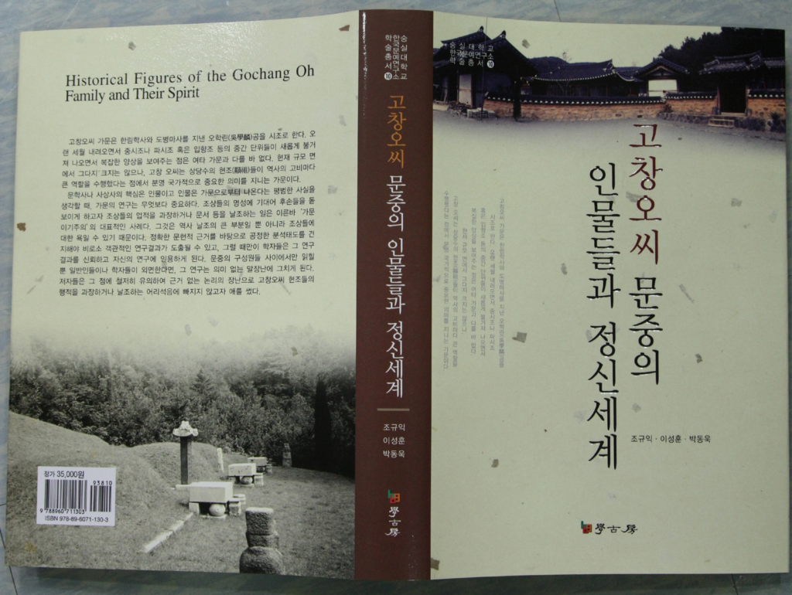

국어국문학과 조규익 교수가 이성훈 교수, 박동욱 교수와 공동으로 한국문예연구소 학술총서 10 『고창오씨 문중의 인물들과 정신세계』(학고방, 2009)를 발간!!!

조규익 교수, 이성훈 박사(국어국문학과 겸임교수), 박동욱 박사(한양대학교 조교수)는 최근 『고창오씨 문중의 인물들과 정신세계』를 숭실대학교 한국문예연구소 학술총서 10으로 발간했다. 고창오씨 가문은 고려시대 한림학사와 도병마사를 지낸 오학린(吳學麟)공을 시조로 하고 뛰어난 인물들을 다수 길러낸 명문 가운데 하나다. 현재 규모 면에서 그다지 크지는 않으나, 고창 오씨는 상당수의 현조(顯祖)들이 역사의 고비마다 큰 역할을 수행했다는 점에서 분명 국가적으로 중요한 의미를 지니는 가문이다. 이 책의 내용은 다음과 같다.

 제1부 : 가문의 연원과 갈래

        Ⅰ. 오씨의 유래와 고창 오씨

        Ⅱ. 오씨의 흐름과 그 문헌적 변증

        Ⅲ. 고창 오씨에 관한 구전자료

 제2부 : 고창오씨 문중 인물들의 행적 및 내면세게

        Ⅰ. 금석문을 통해 본 고창오씨의 현실적 위상

        Ⅱ. 문집 및 각종 간행물에 반영된 실상

 제3부 : 고창오씨 문중 인물들의 문학적 성취와 정신세계

        Ⅰ. 오학린․오인정의 삶과 문학세계

        Ⅱ. 오세문․오세재의 삶과 문학세계

        Ⅲ. 오세문의 현실적 위치와 역사의식

        Ⅳ. 오세재 문학의 서정성과 현실인식

        Ⅴ. 오수영의 생애와 교유 양상

        Ⅵ. 오운의 생애와 내면의식

 제4부 : 고창오씨 문중의 오늘과 내일

        Ⅰ. 고창오씨 세거지 및 문중 인물들의 활약

        Ⅱ. 고창오씨 현조(顯祖)들의 행적과 그 교육적 의미

 제5부 : 사적 및 유적 사진자료

고창오씨 뿐 아니라 역사상 굵은 족적(足跡)을 남긴 인물들의 현실적 의미를 어떻게 바라볼 것인가의 문제를 추구하는 독자들에게 만족할만한 해답이 바로 이 책에 제시되어 있다고 할 수 있다. 관심 있는 독자 제현의 일독을 권한다.

                                       도서출판 학고방, 2009. 9. 20.  값 35,000원

공유하기

게시글 관리

**백규서옥\_Blog ver.**