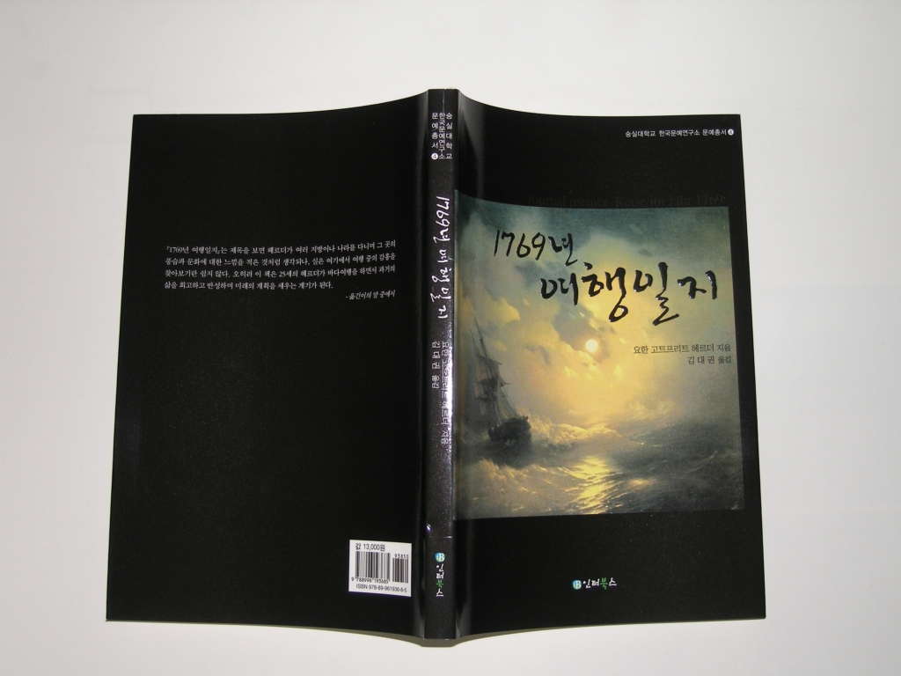

**김대권 교수, 헤르더의 「1769년 여행일지」번역 출간**요한 고트프리히 헤르더의 50일간 바다 여행일지 국내 최초 번역  
  

  
독어독문학과 김대권 교수가 요한 고트프리트 헤르더의 「1769년 여행일지」를 번역 출간했다.   
  
숭실대 한국문예연구소 문예총서 4로 발간된 이 책은 헤르더가 50일간의 바다여행(리가-발트해-북해-영불해협-팽뵈프)을 마치고 낭트와 파리에 체류하면서 쓴 글이다.   
  
헤르더의 여행일지에서 큰 골격을 이루는 것은 자아와 당대의 현실에 대한 반성이다. 그는 과거의 자아와 그 자아를 둘러싼 상황에 만족하지 못하여 바다여행을 결심하게 되며 여행 도중에는 바람직한 미래의 자아상을 정립하려고 노력한다. 그리고 그의 자아 개혁의지는 개인적인 차원에만 머물지 않고 시대적인 차원으로까지 확장되는데, 이는 자신의 문제가 당대에서도 그대로 재현됨을 지켜봤기 때문이다.  
  
또한 이 책은 문학사적인 측면에서 볼 때 헤르더의 ‘노화’한 자아와 현실을 개혁하려는 질풍노도 문학운동가의 고뇌가 스며있다. 답답한 ‘이론의 세계’를 떠나 ‘행동의 세계’로 나아가고자 했고, ‘죽은’ 지식을 양산하는 교육에서 ‘산지식’을 지향하는 교육으로 전환하고자하는  노력이 담겨 있다.  
  
요한 고트프리트 헤르더(Johann Gottfried Herder, 1744-1803)는 목사, 문학비평가, 철학자, 신학자, 교육자로서 독일의 질풍노도 문학운동을 주도한 인물이다.

공유하기

게시글 관리

**백규서옥\_Blog ver.**