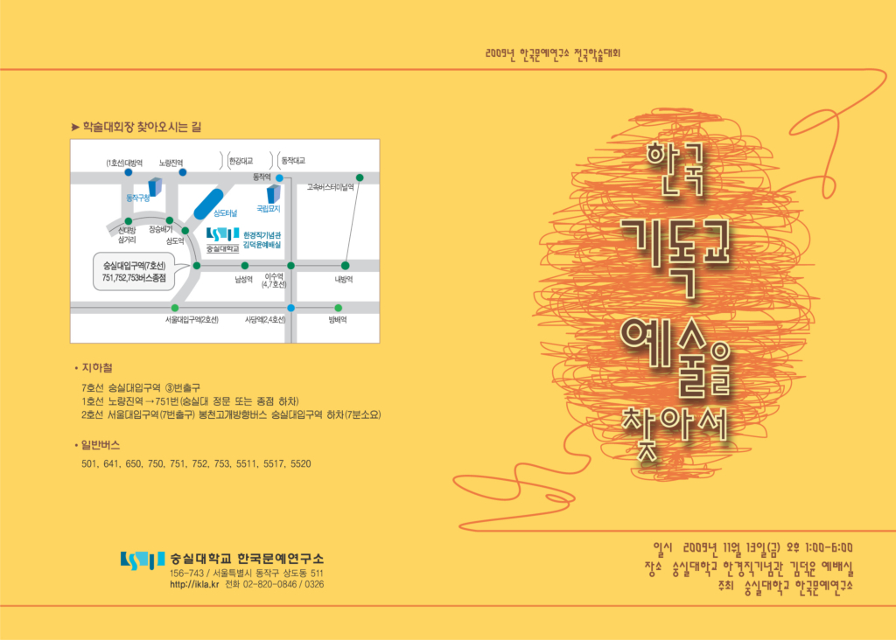
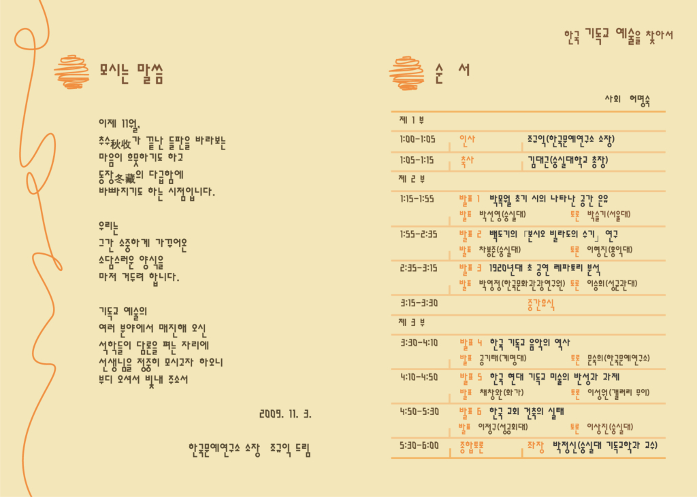

2009년 한국문예연구소 전국 학술 대회

한국 기독교 예술을 찾아서

일시: 2009년 11월 13일(금) 오후 1:00-6:00

장소: 숭실대학교 한경직기념관 김덕윤 예배실

주최: 숭실대학교 한국문예연구소

                       모시는 글  
  
    이제 11월,   
    추수(秋收)가 끝난 들판을 바라보는  
    마음이 흐뭇하기도 하고  
    동장(冬藏)의 다급함에  
    바빠지기도 하는 시절입니다.  
  
    우리는  
    그간 소중하게 가꾸어온  
    소담스러운 양식을   
    마저 거두려 합니다.  
  
    기독교 예술의   
    여러 분야에서 매진해오신  
    석학들이 담론을 펴는 자리에  
    선생님을 정중히 모시고자 하오니  
    부디 오셔서 빛내 주소서  
  
                    2009. 11. 3.  
  
          한국문예연구소  소장  조규익 드림

<순서>

                                                        사회: 허명숙

1부                                   

1:00-1:05 인사                                 조규익(한국문예연구소 소장)

1:00-1:15 축사                                 김대근(숭실대학교 총장)

2부                                   

발표 1) 1:15-1:55      박목월 초기시의 공간은유

                        발표: 박선영(숭실대) 토론: 박슬기(서울대)

발표 2) 1:55-2:35      백도기의 ｢본시오 빌라도의 수기｣ 연구

                        발표: 차봉준(숭실대) 토론: 이형진(홍익대)

발표 3) 2:35-3:15      1920년대 초 주일학교 공연 레퍼토리 분석

                                -아동가극 대본을 중심으로"

                        발표: 박영정(한국문화관광연구원) 토론: 이승희(성균관대)

중간 휴식 3:15-3:30

3부                                   

발표 4) 3:30-4:10      미주 한인교회의 역사와 성가대의 현황

                        발표: 공기태(계명대) 토론: 문숙희(한국문예연구소)

발표 5) 4:10-4:50      한국현대기독교미술의 반성과 과제

                        발표: 채창완(화가) 토론: 이성원(갤러리 무이)

발표 6) 4:50-5:30      한국 교회 건축의 실태

                        발표: 이정구(성공회대) 토론: 이상진(숭실대)

종합토론  5:30-6:00                    좌장: 박정신(숭실대학교 기독교학과 교수)

공유하기

게시글 관리

**백규서옥\_Blog ver.**