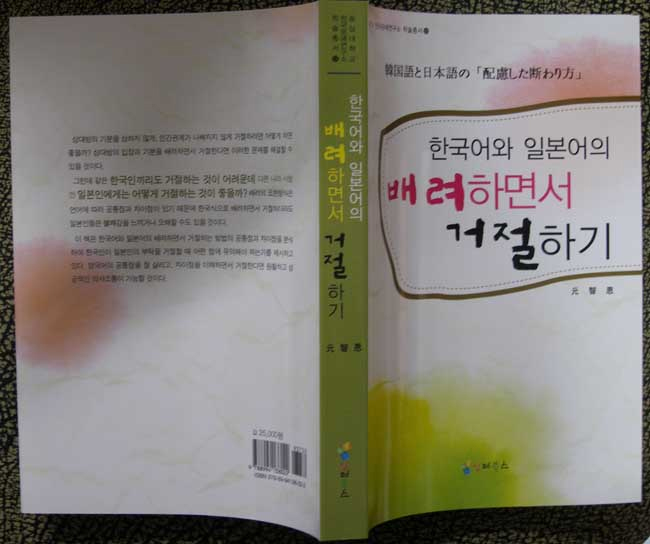

  
숭실대학교 인문대학 일어일본학과 원지은 교수의 책 <<일본어와 한국어의 ‘배려하면서 거절하기’  韓國語と日本語の「配慮した斷わり方>>가 한국문예연구 학술촐서 13으로 발간되었다.

  상대방의 기분을 상하지 않게, 인간관계가 나빠지지 않게 거절하려면 어떻게 하면 좋을까? 상대방의 입장과 기분을 배려하면서 거절한다면 이러한 문제를 해결할 수 있을 것이다.   
  그런데 같은 한국인끼리도 거절하는 것이 어려운데 다른 나라 사람인 일본인에게는 어떻게 거절하는 것이 좋을까? 배려의 표현방식은 언어에 따라 공통점과 차이점이 있기 때문에 한국식으로 거절하면 일본인들은 불쾌감을 느끼거나 오해할 수도 있을 것이다.   
  이 책은 한국어와 일본어의 배려하면서 거절하는 방법의 공통점과 차이점을 분석하였다.배려의 표현방식은 언어에 따라 공통점과 차이점이 있기 때문에 한국식으로 거절하면 일본인들은 불쾌감을 느끼거나 오해할 경우도 있을 것이며, 일본식으로 완곡하게 거절하면 한국인들은 상대방의 의도를 잘 몰라서 답답해하는 경우도 많을 것이다. 이 책은 한국인과 일본인이 배려하면서 거절하는 방법을 제시하고 있다. 특히 이 책에서는 Brown&Levinson(1987)의 배려 이론을 재검토하여 한일 언어행동의 분석에 적합한 ‘배려의 축’을 제안하였다. 이것을 바탕으로 한일 대학생을 대상으로 조사(설문지 조사와 담화완성테스트)를 실시하고 그 결과를 비모수 통계 검정법(nonparametric statistical analysis)으로 정밀하게 검증하였다. 배려라는 심리적인 문제를 언어학적인 방법만으로는 분석하기가 용이하지 않았기 때문에 다른 분야의 연구 방법을 사용하여 자료를 객관적으로 검증하고자 하였다. 이 책은 화용론에서 다루어지는 배려의 관점에서 본 거절의 언어행동이라는 주제를 사회학 및 통계학의 연구방법에 의해 정밀하게 검증한 것이다. 이 책이 한국인과 일본인의 원활한 의사소통과 우호적인 관계 구축에 조금이라도 도움이 되었으면 좋겠다.

공유하기

게시글 관리

**백규서옥\_Blog ver.**