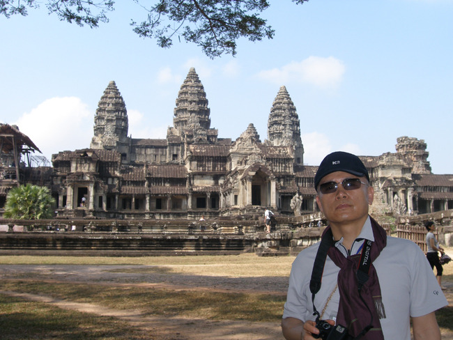
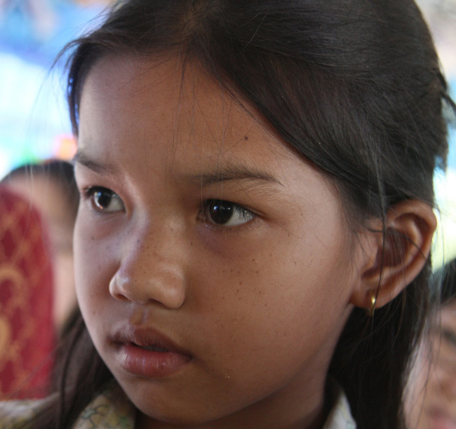

  
  
신년인사

xml:namespace prefix = o ns = "urn:schemas-microsoft-com:office:office" /

경인년의 새 아침이 밝았습니다.

지난 1년, 우리는 참으로 분주하게 지내왔습니다.

저는 그간 시종일관 학자를 자처하며 살아왔는데, 격에 어울리지 않게 지난 2학기부터 인문대학의 학장직을 겸하면서 행정 파트에도 한 발을 담그게 되었습니다. 학장직을 수행하면서 평소 연구실이나 서재에서는 보이지 않던 부분들이 눈에 들어오게 되었고, 그것이 공동체에 대한 제 생각을 얼마간 조정하는 요인이 되기도 했습니다. 크나 작으나 사람들이 모여 사는 집단의 돌아가는 모습이야 다 같지 않겠습니까? 욕망과 욕망이 부딪치면서 갈등이나 좌절이 생겨날 수도 있지만, 경우에 따라 그런 것들이 잘만 조정된다면, 공동체 발전의 추동력으로 작용할 수도 있겠다는 깨달음을 갖게 되었습니다. 

저는 지난 연말 며칠의 여유를 틈 타 캄보디아의 앙꼬르왓을 다녀왔습니다. 수백 년의 세월에 진이 빠져 널브러진 돌들을 신물 나게 보았습니다. 신이 떠난 신전에는 먼지와 찌든 시간의 때만 남아 있었습니다. 그들이 목을 매고 있던 신들은 모두 어디로 떠나버린 것일까요? 맨발에 ‘원 딸라(one dollar)!’를 구걸하며 관광객들의 눈만 애처롭게 바라보는 그들의 후예에게 그 신들은 왜 한줌의 은총도 내려주지 않은 것일까요? 참으로 알 수 없는 인간의 어리석음이 확인되는 현장이었습니다. 남들은 ‘7대 불가사의’니 ‘6대 불가사의’를 언급하며 존경스런 눈초리로 바라보는 그 신들의 집이 제겐 한갓 ‘인간 욕망의 찌꺼기’로 보이는 이유를 알 수가 없었습니다. 그건 다름 아닌 ‘허무’였습니다. 우리가 이 땅에서 아방궁을 짓고 살아도, 먼 훗날 후손들에게 물려진 그것들을 바라보며 저처럼 ‘허무’와 ‘부질없음’을 느낄 사람이 분명 있겠지요? 

그런 허무의 늪으로부터 빠져나오기 위해서라도 우리는 올해 기를 쓰고 살아야겠습니다. 우리에게 허여(許與)된 삶의 소중함을 찬양하는 유일한 길은 남들이 보고 감탄할 만큼 부지런히 움직이는 것입니다. 우리 모두 그 개미와 꿀벌의 대열에 함께 하십시다. 바야흐로 내려 쪼이는 은총의 햇볕을 원료로 맛있는 꿀을 빚어 남들을 기쁘게 하는 일이야말로 우리가 소원하는 ‘구원의 길’이 아니겠는지요? 

모쪼록 올 한 해 건강하시고, 뜻하시는 모든 일 성취하시길 기원합니다.

감사합니다. 

경인년 첫 날 아침에

  백규 드림

공유하기

게시글 관리

**백규서옥\_Blog ver.**