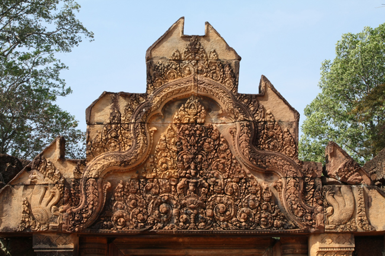
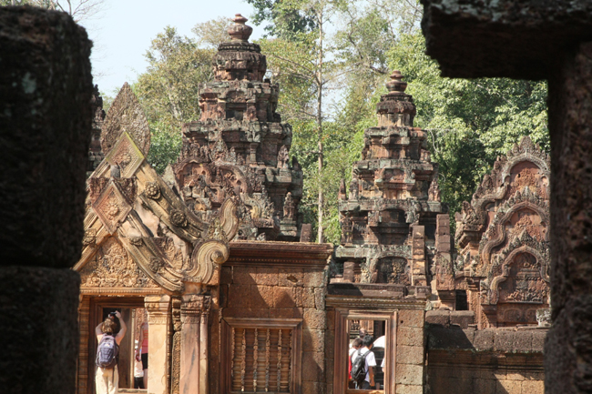
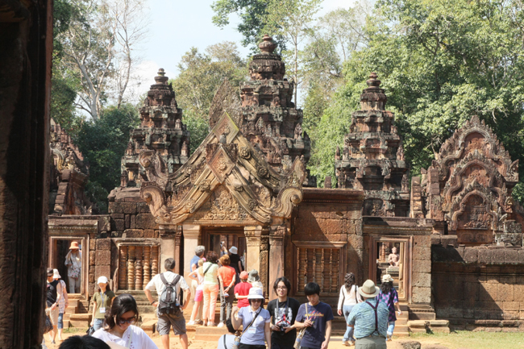
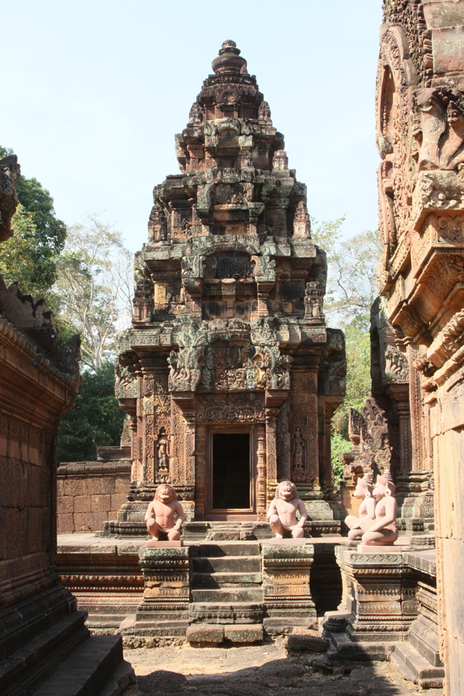
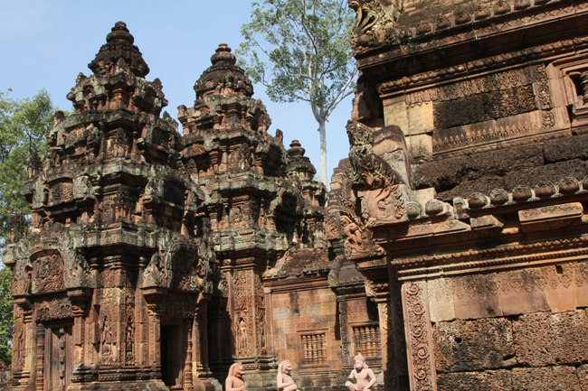
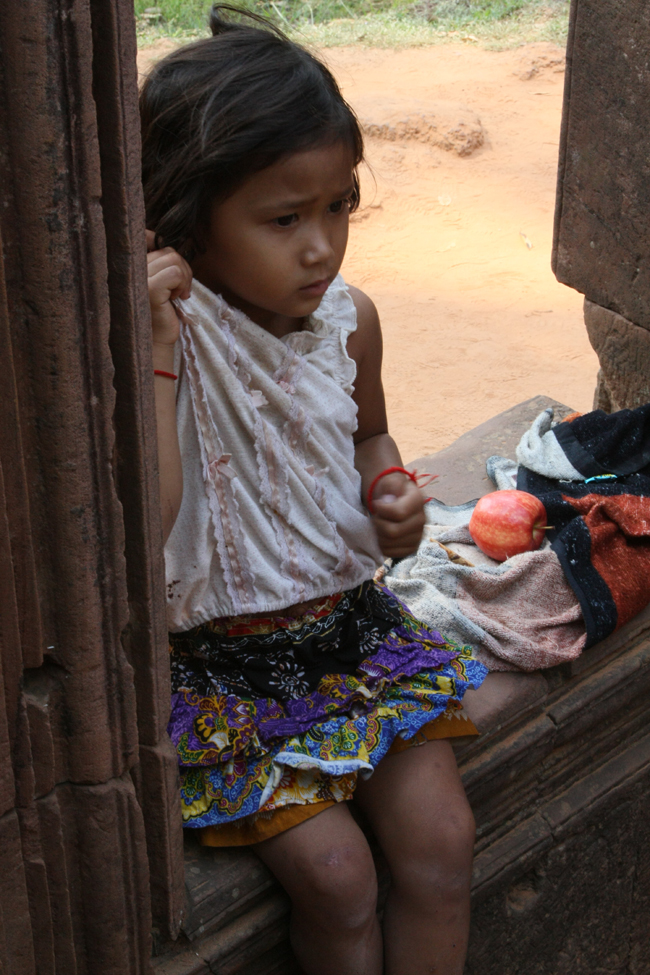
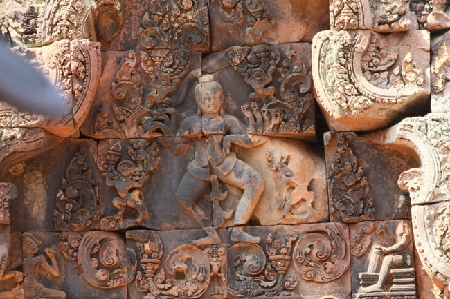
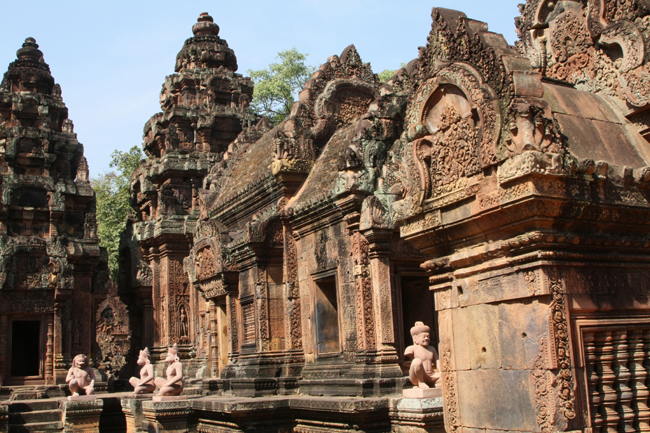
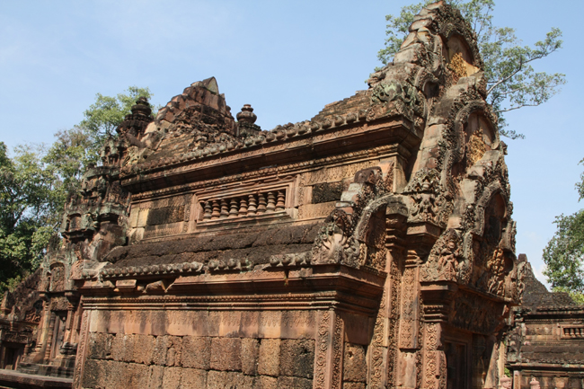
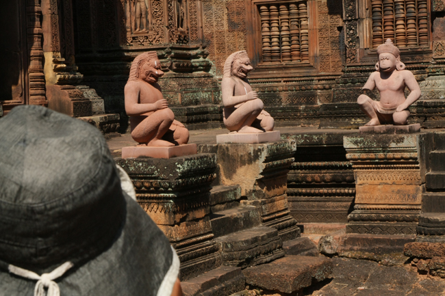

아, 캄보디아, 그곳에 신들은 없었네! (1)

  

  

  

  

  

  

  

  

  

  

  
\*사진 설명 : 사진 1 : 사원 문 위의 장식으로 중앙에 꼬끼리 아이라바타를 타고 있는 인드라  
                 사진 2 : 중앙성소 3개의 탑 중 두 개만 보인다.  
                 사진 3 , 4, 5, 8, 9 : 중앙성소 3개의 탑  
                 사진 6 : 불쌍한 캄보디아 여자아이  
                 사진 7 : 중앙 사원의 춤 추는 시바  
                 사진 10 : 중앙사원 탑들의 입구로 연결되는 계단에 앉아 있는 원숭이, 사자, 가루다, 약사의 머리를 가진 전설 속의 괴물들  
                 사진 11 : 시바신의 남근상이 박혀있던 자리  
xml:namespace prefix = o ns = "urn:schemas-microsoft-com:office:office" /

니체는 말했다. ‘신은 죽었다!’고. 신이 죽었다면 지금 이 세계엔 신이 없다는 말일 것이고, 그렇다면 니체는 무신론자였다는 말인가. 그렇진 않을 것이다. 조부와 부친이 루터교 목사였던 그의 가계를 살펴보아도, 종교와 신앙에 대한 회의를 갖기 전 그의 행적을 살펴보아도 그를 무신론자로 볼만한 근거는 없다. 그렇다면 그는 왜 ‘신이 죽었다’고 했을까. 어쩌면 그는 신을 제멋대로 만들어 세우고 신의 가면 뒤에 숨어 인간들을 제멋대로 주무르려던 ‘또 다른 인간들’ 혹은 성직자들에 대한 항변을 그런 식으로 표현한 것이나 아닐까?

캄보디아에 들어가서야 신이 죽었다는 니체의 외침을 내 깊은 인식 속에서 끄집어냈고, 도처에 널려있는 신전의 잔해들로부터 ‘신이 죽었다’는 니체 선언의 캄보디아식 버전을 확인하게 되었다. 나는 왜 캄보디아에 왔는가. 캄보디아에 와서 찾으려던 것은 무엇이고, 확인한 것은 무엇인가.

\*\*\*

2009년 한 해가 저물어 가는 막바지. 인천공항에서 출발한 저녁에 출발한 비행기가 시엠립에 도착한 것은 캄보디아 시각으로 9시가 넘어서였다. 차창 밖에서 밀려드는 더운 공기는 이곳이 열대임을 알려주는 일종의 신호였다. 밤이든 낮이든 절대로 혼자서 나다니지 말라는 현지 가이드의 엄포가 불쾌감을 돋우었고, 그에 따라 내 마음 속에 그려진 캄보디아의 이미지는 칙칙하게 바뀌어만 갔다.

다음 날 호텔 식당에서 쌀국수와 열대과일들로 아침 식사를 마친 우리가 버스로 이동한 곳은 사흘 동안 사용할 입장권을 사는 곳이었다. 워낙 넓은 사원지대라서 인물사진을 박아서 발급해주는 출입증을 목에 걸어야 했다. 사원들 입구마다 삼엄하게 진을 치고 있는 현지 경찰들이 일일이 출입증과 얼굴을 대조하는 것이었다.

출입증을 목에 걸고 첫 번째 간 곳이 반띠아이 스레이Banteay Srei. 매표소로부터 40분이나 달린 끝에 도달한 외곽지역의 사원이었다. 10세기 중반 자야바르만 5세의 스승인 야즈나바라하(바라문 승려)가 건설한 사원으로서 조각 기법이 정교하고 아름다워 크메르 예술의 정수로 불리는 곳으로, 프랑스의 세기적인 작가 앙드레 말로 부부가 도굴하려다가 실패로 끝날 만큼 아름다운 사원이다.

사원의 출입구는 동쪽과 서쪽에 있고, 세 겹의 담으로 둘러싸여 있다. 외곽의 벽을 둘러싼 해자는 95m×110m의 크기로 중간 벽과 경계를 이룬다. 중간 벽은 38m×12m 크기로 6개의 좁고 길쭉한 방들이 있다. 안쪽의 벽은 24m×24m의 정사각형으로 시바가 춤추는 장면이 부조되어 있다.

남북으로 나란히 세 개의 탑으로 구성된 중앙사원에서 중앙탑과 남쪽 탑은 시바에게, 북쪽 탑은 비쉬누에게 각각 헌정되었다고 한다. 사원 내부의 벽면에는 여신과 남신들이 정교하게 조각되어 있었다. 라마야나의 서사가 부조되어 있는 남쪽 도서관의 동쪽 박공에는 라바나가 시바를 만나려다 거절 당한 후 카일라사 산을 흔드는 장면이 표현되어 있는 등 도처에 신화의 내용들이 펼쳐져 있었다.

재미있는 것은 풍요를 상징하던 링가 즉 남근상이 있던 자리. 지금은 뽑히고 없지만, 그곳에 서 있던 남근의 윗부분은 시바, 중간부분은 비쉬누, 밑 부분은 브라만을 의미한다고 했다.

휑하니 남아 있는 구멍이 바로 이곳이 바로 파괴의 신 시바에게 헌정된, 여인의 사원이었음을 보여주는 증거였다.<계속>

공유하기

게시글 관리

**백규서옥\_Blog ver.**