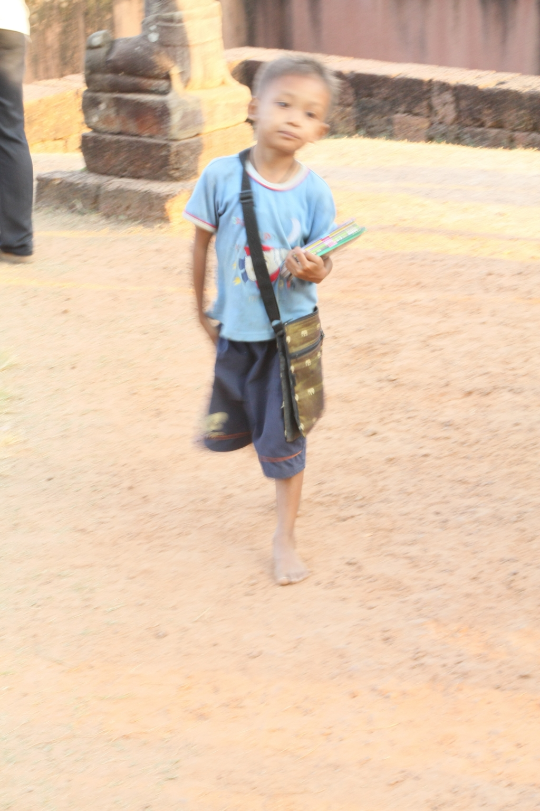

캄보디아의 아이들과 코리안 드림(Korean dream)

xml:namespace prefix = o ns = "urn:schemas-microsoft-com:office:office" /

지난 겨울 캄보디아를 다녀왔다. 겨울임에도 그곳엔 뜨거운 태양이 내려 쪼이고 있었다. 가는 곳마다 아이들이 따라붙어 더 더웠다. 어떤 아이들은 ‘원 딸라!’를 외치며 우리의 표정을 살피곤 했지만, 상당수의 아이들은 능숙한 한국어로 ‘언니, 오빠’를 불러대며 조잡한 물건들을 사달라고 애걸했다. 심지어 어떤 녀석들은 버스에서 내려서기 무섭게 눈을 맞춘 채 끈질기게 따라 붙었다. “아저씨 멋있어. 이 물건 싸요. 사주세요!” 하고 따라붙다가 눈길도 주지 않은 채 달아나 버리면 그 뒤에 대고 “할아버지, 뚱뚱하고 미워!”라고 한 마디씩 갈겨대기도 하는 얌체들이었다. 생각 같아서는 푼돈이나마 건네주고 싶었지만, 달려들 기회만 노리는 아이들이 주변에 그득했고, 그렇게 하는 것이 그들을 돕는 일은 아닌 듯싶어 슬그머니 물러서기 일쑤였다.

똔레삽 호숫가에서 가이드가 그들 중 세 명의 아이들을 관광버스 안으로 불러 들였다. 이제 겨우 대여섯 살 쯤 되는 아이들이었다. 한국노래를 부를 줄 아느냐는 말이 떨어지기가 무섭게 녀석들은 7,80년대의 대중가요를 부르기 시작했다. 가이드가 제지하고 나서야 아쉬운 표정으로 노래를 그쳤다. 그런 다음 그들은 통로를 오가며 한국 관광객들에게 물건들을 신나게 팔았다. 참으로 귀여우면서도, 마음 한 편으론 짠한 생각이 들게 하는 아이들이었다.  

캄보디아의 아이들이 처음에는 관광객을 대상으로 무작정 구걸에 나섰다고 한다. 그러나 그래서는 안 되겠다고 생각한 것이 한국인 선교사들이었다. 아이들을 모아놓고 한국어와 한국노래를 가르쳐서 한국 관광객들에게 물건을 팔도록 하는 것이 구걸하는 것보다 훨씬 떳떳한 일이라고 생각했으리라. 어쨌거나 캄보디아의 어린애들이 제비처럼 입을 벌려 정확한 한국어를 구사하고 한국노래를 부르는 광경은 놀랍고도 반가웠다. 비록 몇 문장의 말과 몇 곡의 노래에 불과하다고는 하지만, 그들에게서 조만간 캄보디아에 펼쳐질 한류(韓流)의 미래와 가능성을 발견했다면 지나친 속단일까.

그런데 언뜻 나는 이들의 얼굴에서 옛날 내 모습을 발견하게 되었다. 어린 시절 내가 살던 지역의 한 곳에 미군부대가 있었다. 가끔 큰 체구의 미군들을 볼 수 있었고, 그들을 졸랑졸랑 따라다니며 껌이며 초콜렛을 탐하던 아이들이 바로 우리였다. 미군들이 껌이나 초콜렛을 던져주면 그들을 뒤따르던 우리는 한 덩어리로 뭉쳐 아귀다툼을 벌이곤 했다. 땟국물이 졸졸 흐르는 옷가지는 넝마처럼 찢어지고, 시커먼 때가 덕지덕지 오른 손등과 얼굴에는 그 싸움 통에 생긴 멍자욱들이 훈장처럼 퍼렇게 새겨지기도 했다.

그러니 6⋅25를 전후하여 미군들을 따라다니며 ‘기브 미 초콜렛’을 외치던 우리 앞 세대들의 비참함이야 더 말하여 무엇하랴. 캄보디아 아이들의 얼굴에서 우리의 모습을 읽어낸 것이 나만의 생각은 아니었으리라.

사실 캄보디아 어린이들의 얼굴에 내 어린 시절의 모습을 오버랩 시키면서도 무언가 어긋나는 점을 깨닫기까지 그리 오랜 시간이 걸리지는 않았다. 우리가 어디로 이동해 가든 그곳에는 벌거벗다시피 한 아이들이 무리를 지어 지키고 있었다. 그런데 갓 젖 떨어진 아이들을 제외하곤 모두가 학령기의 아이들이라는 점이 놀라왔다.

이 아이들이 학교에는 안 가고 대체 왜 이곳에 나와 구걸이나 하고 있는 걸까. 이해가 되지 않았다. 심지어 서너 살이나 되었음직한 아이까지 우리가 지나가는 신전의 문지방에 앉아 관광객들의 눈만 뚫어지게 쳐다보며 동정심을 간구하고 있었다. 우리가 그 신전을 샅샅이 훑고 나오기까지 두어 시간을 녀석은 그렇게 앉아 있었는데, 그 뒤 얼마나 더 오랜 시간을 그렇게 앉아 있었을까 내내 눈에 밟히기도 했다.

내심 생각해 보니 분명 부모가 시킨 일이었다. 부모가 시키지 않았다면 어린 아이가 그렇게 하고 있을 턱이 없었다. 어린이집이나 유치원 혹은 학교에 가 있어야 할 아이들이 관광지에 퍼질러 앉아 ‘원 딸라’를 구걸하는 모습이야말로 ‘킬링필드’에 못지않은 참상으로 내게 다가왔다. 잔인하고 어리석었던 킬링필드의 참상은 겨우 30여 년 전의 일. 그러니 그것은 아직도 완결되지 않은 역사였다. 어리석은 역사의 극복을 위해 시급한 일이 아이들의 교육일 텐데, 그 싹이 보이지 않았다.

우리가 어린 시절 비록 미군을 상대로 ‘기브 미 초콜렛’을 외쳤을망정 학교에는 가야 한다는 것이 모든 부모들의 신조였다. 가난할수록 배워야 한다는 믿음으로 남루(襤褸)의 시간과 공간을 헤쳐 나왔기에 우리에겐 미래가 있었고, 그 열매를 지금 따고 있는 게 아닌가. 그러나 적어도 관광지에서 만나는 캄보디아의 얼굴엔 그런 게 없었다. 신기하게만 보이는 똔레삽 수상촌 아이들도 능숙한 솜씨로 달리는 배 위에 올라와 관광객들에게 물건들을 팔거나 발가벗은 채 흙탕물에서 헤엄치며 깔깔거릴 뿐, 주변에 책 읽는 모습도 학교도 보이지 않았다. 아이들에게 교육을 시켜 미래를 기약하기보다는 우선 외화 몇 푼이 소중할 것이다.

그러나, 그런 가운데서도 하나의 가능성은 보였다. 한국어를 배우려는 열기가 바로 그것이었다. 시엠립 국제공항 면세점의 두 여성은 아예 한국어 교재를 펴놓은 채 영업을 하고 있었다. 밑줄이 새까맣게 그어진 책장을 자랑스레 넘겨 보이며 한국어를 잘 해보겠노라는 야무진 꿈을 떠듬떠듬 말해 주었다. 비록 학교에는 가지 않아도 그곳의 어린 아이들도 한국어를 배우며 ‘코리안 드림’을 키우고 있었다. 그런데, 문제는 우리다. 코리안 드림을 가득 안고 노력하는 그들에게 우리가 약속해줄 수 있는 게 과연 무엇일까.

공유하기

게시글 관리

**백규서옥\_Blog ver.**