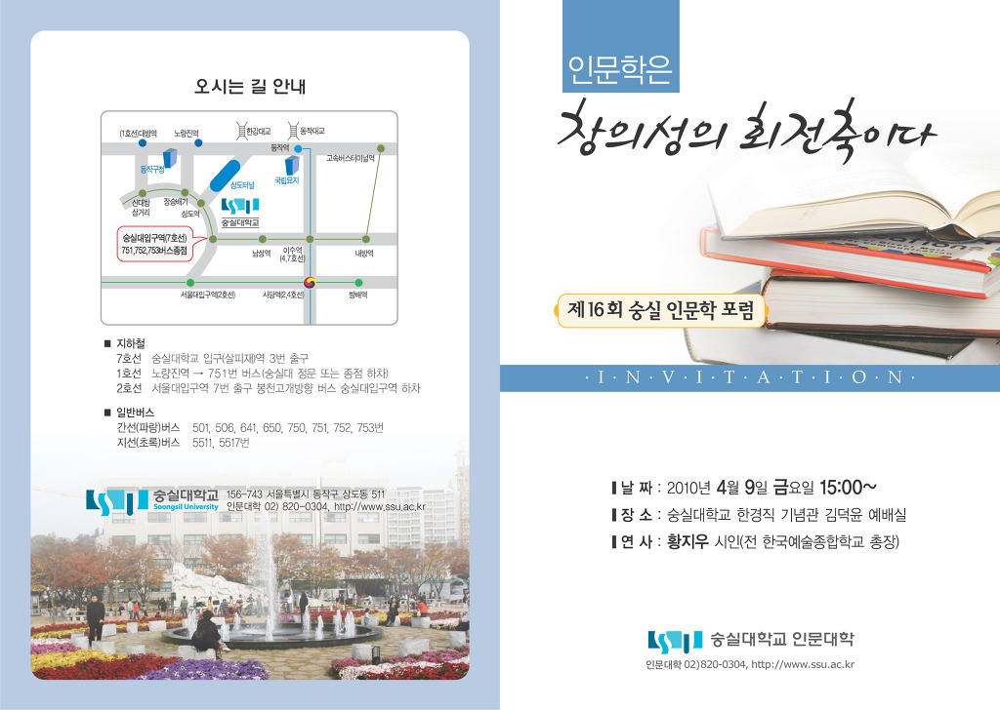
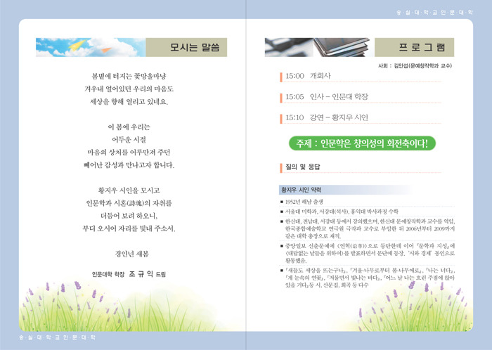

모시는 말씀  
  
봄볕에 터지는 꽃망울마냥  
겨우내 얼어있던 우리의 마음도  
세상을 향해 열리고 있네요.  
  
이 봄에 우리는  
어두운 시절  
마음의 상처를 어루만져 주던  
빼어난 감성과 만나고자 합니다.  
  
황지우 시인을 모시고  
인문학과 시혼(詩魂)의 자취를  
더듬어 보려 하오니,  
부디 오시어 자리를 빛내 주소서.  
  
경인년 새봄  
  
인문대 학장   조규익 드림  
  
     다음  
  
1. 일시 : 2010. 4. 9.(금요일) 오후 3시부터   
2. 장소 : 한경직기념관 김덕윤 예배실  
3. 연사 : 황지우 시인(전 한국예술종합학교 총장)  
4. 연제 : 인문학은 창의성의 회전축이다!  
  
  프로그램  
                                               사회 : 김인섭(문예창작학과 교수)  
  
15:00  개회사  
15:05   인사-인문대 학장  
15:10   강연-황지우 시인  
  
  
2010. 3. 29  
  
  
  

공유하기

게시글 관리

**백규서옥\_Blog ver.**