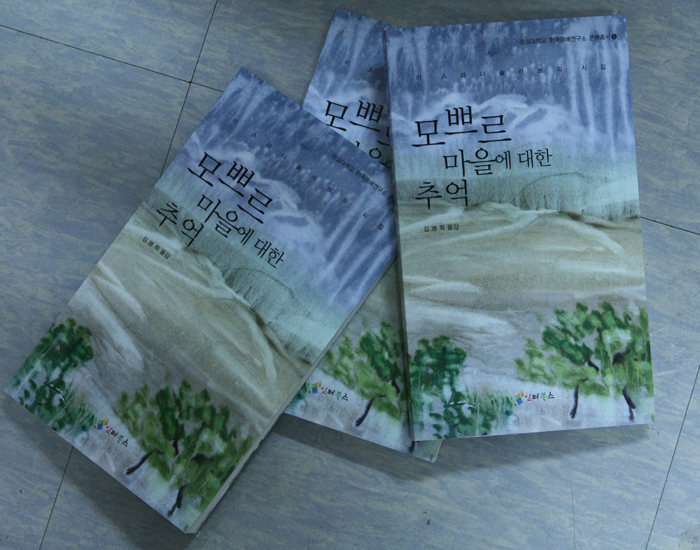

  
고려인 디아스포라 서정의 진수, 이 스따니슬라브 시집 출간!!!

xml:namespace prefix = o ns = "urn:schemas-microsoft-com:office:office" /

현재 왕성하게 활동하고 있는 카자흐스탄의 고려시인 이 스따니슬라브의 시집 <<모쁘르 마을에 대한 추억>>이 숭실대학교 한국문예연구소 문예총서5로 발간되었다. 우리는 현지 김병학 시인의 유려한 필치로 번역된 이 시집을 통해 러시아어 권 고려인 서정의 높은 경지를 비로소 훔쳐볼 수 있게 되었다.

원작에는 시 제목대신 번호만 달려 있는 점이 특이한데, 번역자는 전체 67수의 시들을 4부로 나누었다. 제1부[되돌아가지는 못 하리 언젠가 두고 떠나온 해변으로], 제2부[초원에 피어난 진달래꽃], 제3부[안개 위의 영원한 꿈 마냥…], 제4부[바람에 흔들리는 이삭들] 등의 표제에서 보듯이 스따니슬라브의 시들에는 고려인 특유의 민족 정서가 디아스포라 의식과 어울려 차원 높은 서정으로 승화되어 있다. <시 23>을 보자.

조상들의 고향으로

돌아가고 싶어라

시(詩)를 가지고서.

타향살이

힘들다 터져 나오는

흐느낌이나

울음이 아닌 시로써.

허나

내가 태어나고 자란

이 땅이

어찌 타향이란 말인가?

또 어릴 적부터

어울려 함께 자란

사람들이

어이 타인이란 말인가?

하지만 그래도

여기 카자흐스탄 땅과

이 시구를 채우는

러시아 말에

용서를 구해야 하리.

조상들의 고향으로

나 돌아가고 싶어라

오직 시(詩)만 가지고서라도.

머나먼 고국에서

태어나 살아갈

그런 운명 나 받지 못했느니…

스따니슬라브는 카자흐스탄에서 태어난 고려인 3세다. 러시아어를 모어(母語)로 받아 자라났지만, 고려 말도 제법 잘 한다. 고려인들 모두 “고려 말은 아무 쓸모도 없다”고 버렸지만, 그는 유독 고려 말에 집착을 갖고 있다. 이 시에서 확인할 수 있는 것처럼 민족정신의 끈을 놓지 않은 그가 디아스포라의 시혼을 가꾸어 온 것은 당연하다. 그는 어쩌면 ‘고향 찾기’를 화두(話頭) 삼아 카자흐스탄의 광야에서 여전히 서사적인 삶을 이어가고 있는지도 모른다. 그러니 “고난의 삶, 사연 많은 디아스포라의 삶 자체를 주신 선조들께 그렇게 감격해 하는 것 같다”고 지적한 번역자 김병학 시인의 말이 정곡을 찔렀다고 할 수 있으리라. 언제 끝날지 모르는 유랑의 세월을 감내하고 있는 시인의 다음과 같은 말은 디아스포라의 초입에도 못 가 본 우리로서는 가슴 깊이 새겨야 할 것이다.

“디아스포라는 누구나 고국과 연결되고 싶은 강한 열망을 품고 살아갑니다. 디아스포라에게 고국이란 언젠가는 돌아가야 할 마음의 고향이기 때문입니다. 그러므로 제가 고국과 시를 통해 연결되는 기쁨은 다른 어떤 기쁨이나 행복과 비교할 수 없이 큰 것입니다. 무수한 역사적 비극과 비운을 이기고 살아온 재소 고려인의 후손으로서 저에게 고국은 무엇보다도 절실하고 뜨겁게 만나야 할 근원입니다.”<‘지은이의 머리말’에서>

스타니슬라브와 같은 해외의 피붙이들에게 관심을 가지고 있는 강호제현의 일독을 권한다.

이 스따니슬라브, 김병학 역, <<모쁘르 마을에 대한 추억>>, 인터북스, 2010. 값 10,000원

공유하기

게시글 관리

**백규서옥\_Blog ver.**