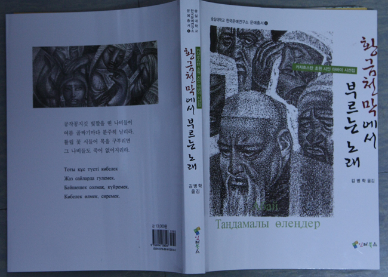

한국문예연구소 문예총서 6, 『카자흐스탄 초원 시인 아바이 시선집 : 황금천막에서 부르는 노래』출간!

xml:namespace prefix = o ns = "urn:schemas-microsoft-com:office:office" /

『카자흐스탄 초원 시인 아바이 시선집 : 황금천막에서 부르는 노래』(김병학 역 / 인터북스, 2010. 4.)가 한국문예연구소 문예총서 6으로 발간되었습니다. 카자흐스탄의 위대한 시인이며 사상가인 아바이 꾸난바이울릐는 시대가 급변하던 19세기에 홀연히 모습을 드러냈습니다. 그가 남긴 글들은 카자흐스탄 전역에 깊은 감동을 주었으며, 지금도 카자흐스탄 전 국민의 가슴에 그침 없는 울림을 주고 있습니다. 아바이 시인의 존재는 카자흐스탄 사람들의 자부심이자 카자흐 문학의 상징입니다.  

동양과 서양의 교차로에 위치한 카자흐스탄의 유목문화가 이질적인 요소들을 융합해냈듯이 아바이 시인도 광활한 초원의 정신에 바탕을 두고 대자연과 유목민의 삶을 포용하며 기쁨과 슬픔과 희망의 노래를 불렀습니다. 그는 카자흐 고유의 전통 및 서구의 합리성과 종교적 영성을 동시에 추구했으며 이는 현대 다민족국가인 카자흐스탄이 바람직한 미래로 나아가는데 더욱 더 긍정적인 빛을 던져주고 있습니다. 

이 시집은 제1부(자연에 대한 서정시), 제2부(철학의 서정시), 제3부(사랑의 서정시), 제4부(비애의 서정시), 제5부(8행시), 제6부(풍자시) 등 여섯 부분으로 나뉜다. 이것은 1909년 처음 발간된 아바이 시집의 테마별 분류를 바탕으로 하여 약간 바꾼 것입니다.

올해는 한국의 ‘카자흐스탄의 해’입니다. 조만간 카자흐스탄의 나자르바예프 대통령과 사절들이 한국을 방문할 것입니다. 한국의 뜻 있는 독자들이 이 책을 통해 카자흐스탄의 독특한 유목문화와 시인 아바이에 대한 이해를 넓힐 수 있길 바라며, 일독을 권합니다.

공유하기

게시글 관리

**백규서옥\_Blog ver.**