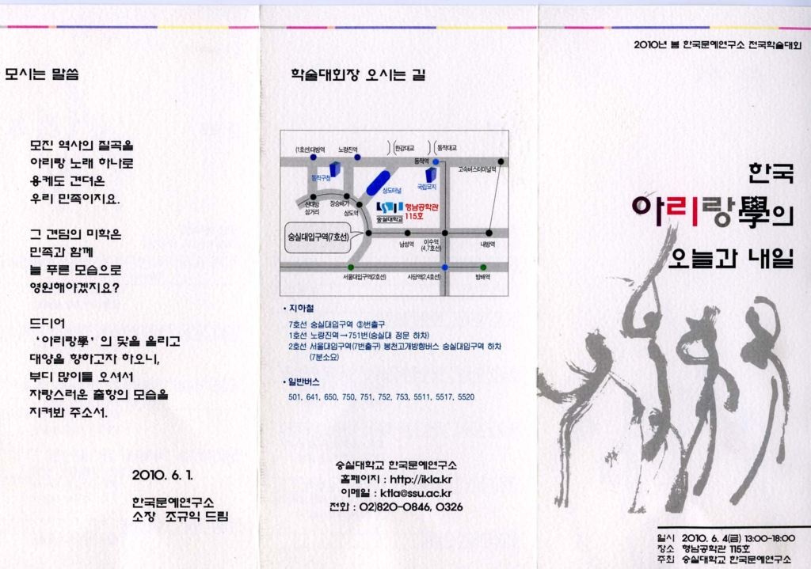

  
  
한국문예연구소 2010년 봄 학술대회

xml:namespace prefix = o ns = "urn:schemas-microsoft-com:office:office" /

“한국 ‘아리랑學’의 오늘과 내일”

1. 학술대회 취지

아리랑은 민족의 노래라는 위상만큼이나 국내는 물론 해외에서도 '코리아(Korea)'를 상징하는 노래로 널리 알려져 있다. 오랜 역사 속에서 아리랑은 지속과 변이의 과정을 통해 수많은 각 편[version]이 존재하며 단순한 노래라는 차원을 넘어 문학, 예술, 공연, 방송물, 축제, 문화콘텐츠 등을 비롯한 다양한 방면으로 외연이 확장되고 있다. 그러나 현실을 보면, 아리랑이라는 가장 기본적이고도 단순한 뜻조차 모르고 있다. 그럼에도 불구하고 학술적 측면에서는 학문적 체계화에 대한 필요성이 점증되고 있다. 한국문예연구소[소장, 조규익 교수]에서는 한민족이면 누구나 아는 아리랑의 중요성을 인식하고, 지난 2년 간 학문적 체계화를 위한 연구를 계속해왔다. 그 결과 아리랑의 실체를 파악할 수 있게 되었으며, 이를 바탕으로 분야별 전문가를 초청하여 지금까지 연구한 아리랑의 실체를 밝히고자 한다. 아울러 금번 토론의 장을 통하여 ‘아리랑學’의 중심연구기관으로 자리매김하려고 한다. 이는 정부를 포함한 어떤 연구기관이나 단체도 시도해본 적이 없는 ‘아리랑學’ 연구의 획기적인 사건이라 할 것이다.

정부에서는 막대한 예산을 투입하여 "아리랑 세계화 프로젝트"를 문화체육관광부 주도로 하고 있으나, 진행에 어려움을 겪고 있다. 본 연구소의 금번 행사를 통해 정부기관과의 공동연구나 사업화 추진 등에서도 당당한 리더십을 갖게 될 것이다.

2. 학술대회 내용

▪일시: 2010. 6. 4(금) 13:00-18:00

▪장소: 숭실대학교 형남공학관 115호

순서

1. 아리랑 연구사 발표: 조용호(숭실대) 토론: 신현규(중앙대)

2. 아리랑 텍스트의 지속과 변이과정 발표: 장유정(단국대) 토론: 정영문(숭실대)

3. 현대 대중예술의 아리랑 수용양상 발표: 김동권(용인 송담대) 토론: 백로라(숭실대)

4. 현대문학의 아리랑 수용양상 발표: 박경수(부산 외국어대) 토론: 엄경희(숭실대)

5. 북한의 아리랑 축제와 민족예술의 가능성 발표: 전영선(한양대)토론: 이경수(민족21)

6. 해외 한인들의 아리랑과 민족의식 발표: 김보희(한양대) 토론: 안상경(충북대)

7. ‘대중가요’ 아리랑의 1945년 이전 동아시아 전파 양상

                                             발표: 이준희(한국학중앙연구원) 토론: 이성훈(숭실대)

8. 아리랑의 문화 콘텐츠화, 그 가능성과 바람직한 방향

                                           발표: 이창식(세명대) 토론: 김정석(서강대)

9. 종합토론 좌장: 조규익(숭실대)

공유하기

게시글 관리

**백규서옥\_Blog ver.**