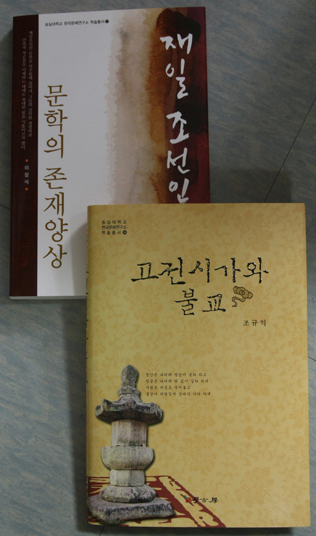

  
  
본 연구소 학술총서들 가운데 아래와 같은 두 건이 2010년 문화체육관광부 우수학술도서에 선정되었습니다.   
  
  1. 조규익, <<고전시가와 불교>>, 학고방, 2010.   
          \*숭실대학교 한국문예연구소 학술총서 14   
  
  2. 이정석, <<재일 조선인 문학의 존재양상>>, 인터북스, 2009.   
          \*숭실대학교 한국문예연구소 학술총서 12

공유하기

게시글 관리

**백규서옥\_Blog ver.**