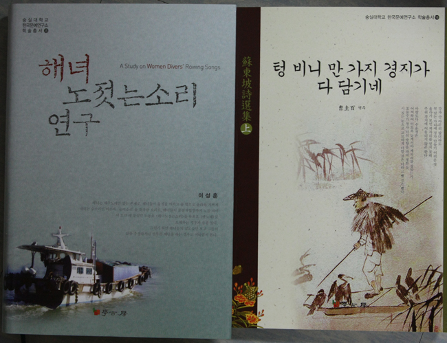

  
  
이성훈 박사의 『해녀 노 젓는 소리 연구』와 조규백 박사의 『텅 비니 만 가지 경지가 다 담기네-소동파 시선집(상)』이 한국문예연구소 학술총서(15/16)로 출간되었습니다.

xml:namespace prefix = o ns = "urn:schemas-microsoft-com:office:office" /

이성훈 박사(숭실대 국어국문학과 겸임교수/한국문예연구소 정보팀장)가 『해녀 노 젓는 소리 연구』를 한국문예연구소 학술총서(15호)로 펴냈다. 해녀는 제주도에만 있는 존재로, 해녀들이 물질을 마치고 물 밖으로 올라와 가쁘게 내쉬는 숨소리인 이른바 ‘숨비소리’를 휘파람 소리인데, 해녀들이 물질작업장까지 노를 저어서 오갈 때 불렀던 노동요 <해녀노젓는소리>를 유희요 <뱃노래>로 오해하는 경우가 종종 있다. 그런가 하면 해녀들의 겉모습만 보고 그들의 삶을 추정하거나 섣부른 예단을 하는 경우도 이따금씩 본다.

그간 <해녀노젓는소리>는 제주도에서 채록한 자료를 중심으로 음악학적, 민속학적, 문학적 측면에서 연구가 더러 있었지만 개별 학문의 입장에서 이루어졌을 뿐 통합적 관점에서의 연구는 거의 없었다. 또한 <해녀노젓는소리>는 제주도뿐만 아니라 본토 해안지역에서도 전승되고 있는 만큼 본토에서 채록한 자료도 연구 자료로 사용해야 함에도 불구하고 현실은 그렇지 못하다. 그 결과 <해녀노젓는소리>의 총체적 실상을 규명하지 못했다.

이 책은 목차에서 보듯이 <해녀노젓는소리>의 총제적 실상을 규명하기 위해서 집필되었다. <해녀노젓는소리>의 형성 과정과 전승 양상, 가창 방식과 율격, 사설의 분류와 교섭, 가창자의 생애와 의식 등을 현장론적 측면과 작가론적 측면에서 밝히는 것이 바로 이 책을 집필한 목적이다. 이를 위해 제주도와 본토에 정착한 해녀들로부터 채록한 해녀의 생애력과 <해녀노젓는소리> 사설을 주요 자료로 삼았고, 옛 문헌의 기록은 참고 자료로 이용하였다. 특히 본토에서 전승되는 <해녀노젓는소리>와 해녀의 생애력을 수집한 자료는 이 책의 필자가 2000년 9월부터 2007년까지 강원도 속초시․삼척시, 경상북도 경주시․포항시, 울산광역시, 부산광역시, 경상남도 사천시․통영시․거제시․남해군 일대를 두루 답사하여 조사한 결과물이다.

머리말

Ⅰ. 서 론

1. 연구 목적

2. 선행 연구의 검토

3. 연구 방법

Ⅱ. 형성 과정과 전승

1. 형성과 본토 전파

2. 가창 기연의 소멸

3. 사설 변이와 전승양상

Ⅲ. 사설의 분류와 교섭

1. 사설의 분류와 유형

2. 사설의 교섭양상

3. 구연상황과 현장성

Ⅳ. 가창 방식과 율격

1. 가창 동기

2. 가창 방식

3. 율격 구조

Ⅴ. 사설의 수집과 정리

1. 수집 및 정리의 통시적 양상

2. 제1기：단편적인 자료 수집 및 소개

3. 제2기：본격적인 자료 수집 및 정리

4. 제3기：체계적인 자료 수집 및 정리

5. 사설의 오기와 어석의 오류

6. 편저와 웹사이트 자료의 오류

Ⅵ. 가창자의 생애와 의식

1. 가창자의 생애

2. 가창자의 특성

3. 가창자의 의식

Ⅶ. 결론

참고문헌

찾아보기

\*\*\*\*\*\*\*\*\*\*\*\*\*\*\*\*\*\*\*\*\*\*\*\*\*\*\*\*\*

조규백 박사(한국외대 강사/한국문예연구소 연구원)가 『텅 비니 만 가지 경지가 다 담기네=소동파 시선집(상)』이 한국문예연구소 학술총서(16호)로 출간되었다. 이 책은 소동파의 전기(前期) 시(詩) 161수를 번역한 것으로, 각 시기의 체제와 내용, 풍격에 있어 대표성을 띤 작품들을 포괄하고 있다.

一. 중국

. 청(淸)나라 심덕잠(沈德潛)은 “소동파의 가슴에는 커다란 용광로가 있어 금, 은, 납, 주석 등이 모두 그 안에서 용해된다. 그 붓이 초광(超曠)하여 천마(天馬)가 굴레를 벗어나고 하늘을 나르는 신선이 노니는 듯 종잡을 수 없이 변화무쌍하다.”라고 평했다.

. 청나라 조익(趙翼)은 소동파의 시에 대해, “평심(平心)으로 소동파의 시를 읽어보니, 그는 재사(才思)가 넘쳐흘러 부딪치는 곳마다 생기가 일어나고, 흉중에 서권(書卷)이 가득하여 그때그때 두루 응용할 수 있어 뜻대로 되지 않는 것이 없다.”고 하였다.

二. 고려 ․ 조선시대

. 서거정(徐居正)은 “고려 문인은 오로지 동파를 숭상하여, 과거 급제자의 방이 나붙을 때마다, 사람들이 ‘33인의 동파가 나왔구나’라고 하였다.”(『東人詩話』, 卷上) 이에 대해 이규보(李奎報)는 “고려시대 문인들이 과거급제 전에는 과거시험 준비 때문에 풍월을 일삼을 겨를이 없다가, 과거 합격 후에야 부담 없이 시 지시기를 배우는데 그 가운데 소동파의 시를 더욱 좋아하게 된다.”고 하였다.

서거정은 이어서, “고려 고종, 원종 연간에, 송나라 사신이 시를 요구하자, 학사(學士) 권적(權適 )이 시를 지어 주었다. 그 시에,

‘소동파의 문장은 해외까지 알려졌건만

송나라 천자는 그의 글을 불태웠네.

문장은 불에 태워 재로 만들 수 있겠지만

천고의 꽃다운 이름은 불태울 수 없다네.’

라 하니, 송나라 사신이 탄복하였다.”(『東人詩話』, 卷上)

. 고려 고종 23년, 몽고 침입의 와중에서 전주에서 동파문집을 중각(重刻)했던 사실에서도 당시의 소동파 열기를 짐작하게 해 준다.

. 이인로는 『파한집(破閑集』卷上에서, “소동파와 황산곡에 이르러서는 고사를 사용하는 것이 더욱 정밀하게 되어 뛰어난 기운이 멋대로 나오니, 구를 다듬는 묘함이 두보와 나란히 할 만하다.”라고 했다.

. 이규보는 동파의 시(詩)「泛潁」의 시구에서,

“갑자기 물결이 비늘처럼 일어

나의 수염과 눈썹을 산란하게 하네.

동파가 백 사람으로 분산되었다가

순식간에 다시 제자리에 있구나.”

라 한데, 느낌이 일어,

“시내 위에 어정거리며 맑은 물결 희롱하니

그림자 춤추고 몸 흔들려 괴상도 하구나.

갑자기 소동파가 영수(潁水)에서 놀던 일 생각나네

수염과 눈썹 흩어져 백 명의 동파가 되었다네.”

(「溪上偶作」시)

라고 읊었다.

. 이제현(李齊賢)은 소동파의 초상화에 대해,

“대궐에 출입하는 것 영광이 아니거니

장기(瘴氣)어린 해변인들 무엇이 두려우랴.

야인의 차림새에 누런 빛 갓을 쓰고

천고를 굽어보며 긴 휘파람 불고 있네.”

(「蘇東坡眞贊」)

라 했다.

. 이색(李穡)은 “큰 소나무 그늘 속에서 동파의 시를 읽었더니, 머문 물 같은 고담(古談)은 마치 황하를 터뜨린 듯 하였네.”(「過三角山>시)

이색은 또,

“심한 더위와 가을바람은 본래 때가 있는데,

평소에 즐겨 동파노인의 시를 읽었네.

누구의 마음이 물과 같이 맑기에,

옥을 녹이고 쇠를 녹아내리는 더운 여름을 다 알지 못하는가.”(「卽事」시)

라 했다.

이색은 또,

“내가 마시는 술은 한 그릇도 안되지만

반쯤 취하면 맛이 더욱 좋네.

동파노인은 뜻이 커서

만장(萬丈)이나 되는 불꽃처럼 세차네.”

(「廉東亭席上醉歌」시)

라 했다.

. 조선시대에 많은 문인이 소동파의 「적벽부(赤壁賦)」를 애호하여 각지에서 “적벽선유(赤壁船遊)의 기풍을 재현하기도 했고, 조선후기 시인들이 ‘소동파를 숭배하는 모임(拜坡會)’를 만들어 소동파의 생일을 기념하는 시회를 개최하기도 했다.

. 조선시대 문인이 소동파를 적극적으로 수용한 원인은 다음과 같다.

1. 동파의 인품이나 문장의 수준이 큰 흡인력을 지니고 있기 때문이다.

2. 조선시대의 문예숭상 사조와 조선이 송나라를 입국(立國)의 주된 모델로 삼은 점, 그리고 문학적으로 당송팔가문을 중시한 점 때문이다.

일부 순유(純儒)들은 학파나 사상의 차이로 비판적, 선택적으로 수용하기도 하였다.

3. 조선시대 문인들은 동파와 유사하게 사화(士禍), 당쟁, 전쟁 등을 겪어, 그러한 처지의 유사성으로 인해 동파의 위인과 문학에 공명할 수 있었다.

공유하기

게시글 관리

**백규서옥\_Blog ver.**