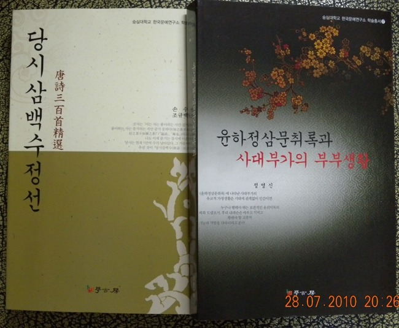

한국문예연구소 학술총서 17, 18 발간

xml:namespace prefix = o ns = "urn:schemas-microsoft-com:office:office" /

한국문예연구소에서는 이번에 정영신 박사(외국어대 강사)의 『윤하정삼문취록과 사대부가의 부부생활』을 학술총서 17로, 조규백 박사(숭실대 강사)의 『당시삼백수정선(唐詩三百首精選』을 학술총서 18로 발간했다.

이번에 발간한 『윤하정삼문취록과 사대부가의 부부생활』은 지금까지 국내에서 발견된 고전 소설 중 최 장편 대하 연작소설에 속하는 후편 ‘윤하정삼문취록’을 주 텍스트로 삼아서 연구한 저서이다. 『윤하정삼문취록』은 모두 105권으로 전편인 『명주보월빙』(100권)과 연작 관계에 있다. 『윤하정삼문취록』에는 윤 씨와 하 씨 정 씨 세 가문을 중심으로 5대의 인물들이 등장하며, 혼사장면만 124회가 출현한다. 또한 갈등 구조를 갖춘 혼사담이 38개나 존재하는데 이 혼사담 안에는 조선조 후기 당파싸움 등으로 정치적인 부침을 반복하던 상층 사대부가의 가문 지키기와 치열한 벌열화 욕망이 문학적으로 형상화 되어 있다.

『윤하정삼문취록』에는 38개의 혼사담을 중심으로 사대부가의 혼인에 대한 의식과 혼인을 통해 형성된 사대부가 부부를 중심으로 발생되는 가정 내, 가문 내, 가문 간의 갈등 양상들이 다양하게 표출되어 있다.

『윤하정삼문취록』에 나타난 사대부가의 유교적 가정생활은 시대에 관계없이 인간이면 누구나 행해야 하는 보편적인 윤리덕목의 체화 모델로서, 후대 대대 손손 배우고 익히고 행해야 할 교훈적 기능과 역할을 다하리라고 본다. 또한 이 책에는 조선조 후기 상층사대부가의 자존심, 욕망, 갈등, 가족애, 가문애, 임금과 국가에 대한 충성심, 주자가례에 의한 가문 내 의례의 실행 장면 등 다양한 유교적 일상생활의 보고들이 내재되어 있다.

이 책은 곧 조선조 후기 상층 사대부 계층의 사고와 언행을 볼 수 있는 거울이다. 그렇기 때문에 『윤하정삼문취록』에 나타난 사대부가의 부부생활은 교술성 높은 학문적 가치 외에도 영화나 드라마, 연극 등 문화콘텐츠 차원에서 원소스 멀티유즈로서의 가치도 무한하다. 앞으로 ‘윤하정삼문취록과 사대부가의 부부생활’에 대한 학계와 영화, 드라마제작자 등 전 국민적인 관심이 기대된다.

학고방, 2010, 값 24000원

조규백 박사의 『당시삼백수정선(唐詩三百首精選』은 청대(淸代) 손수(孫洙)가 편찬한 『唐詩三百首』를 역주(譯註)한 책이다. 이 책에는 오언고시 18수, 5언악부 2수, 칠언고시 5수, 칠언악부 2수, 오언율시 30수, 칠언율시 8수, 오언절구 16수, 오절악부 2수, 칠언절구 18수, 칠절악부 5수 등이 실려 있다.

손수는 “당시 삼백수를 숙독하다 보면, 원래 시를 읊지 못했던 사람도 시를 읊게 되리라”고 말했는데, 그가 이 책을 편찬한 목적은 아동들에게 당시(唐詩)를 가르치기 위한 입문서로 삼기 위함이었다. 번역자인 조규백 박사는 서문에서 다음과 같이 말했다.

기실 한시 전공자나 중국인이 아닌 외국의 독자로서는 삼백수도 분량이 너무 많아, 당시 삼백수를 3분의 1 분량인 106수로 정선한 것이 이 책이다. 물론 역자가 좋아하는 시를 중심으로 뽑았다. 좋아하긴 하지만 편폭이 너무 길어서 넣지 못한 시도 있다. 역자가 자연을 좋아하기에 자연에 관한 시가 많다. ‘인간과 인간의 화해(和諧)’, ‘인간과 자연의 화해’를 각별히 염두에 두었다. 당시 삼백수에는 술과 달, 그리고 낭만이 서려 있다. 인생의 소롯길이 있고, 만남과 이별 등 인간 사이의 정이 스며 있다. 바로 우리네 인생사가 함축되어 있다. 당시는 지친 일상에서 벗어날 수 있는 통로였다. 그래선지 당시를 읽는 것은 생활을 즐겁게 했다.

현대 교양인이라면 당시 삼백수 정도는 읽어야 하리라 본다.

학고방, 2010. 값 14000원.

공유하기

게시글 관리

**백규서옥\_Blog ver.**