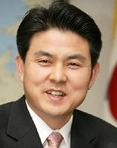

조규익

xml:namespace prefix = o ns = "urn:schemas-microsoft-com:office:office" /

영웅은 “지혜와 재능이 뛰어나고 용맹하여 보통 사람이 하기 어려운 일을 해내는 사람”을 일컫는다. 신은 아니로되, 인간 세상의 ‘신적인(능력을 갖는) 존재’가 바로 영웅이다. 인류역사의 물길을 바꿔놓는 존재가 바로 영웅인 것이다. 어느 시대나 힘을 갖지 못한 필부필부(匹夫匹婦)들은 영웅이나 영웅을 가장(假裝)한 술수꾼들 즉 가짜영웅의 지배를 받기 마련이었다. 이처럼 민중이 진정한 영웅을 만나기는 어려웠고, 지금도 미래에도 그럴 것이다. 아니, 어렵다기보다 아예 불가능한 일이다. 사실 진정한 영웅이란 민중들이 마음속으로 부조(浮彫)해낸 ‘형상(形象)’일 뿐이기 때문이다. 진정한 영웅을 지도자로 모신 민초들은 행복했고, 가짜영웅을 지도자로 모신 민초들은 불행했다. 예로부터 세상이 어지러울수록 가짜영웅들은 설쳤고, 민중은 그들에게 속아 많은 시련을 당하기도 했다. 그러나 따지고 보면 어떤 영웅도 처음부터 영웅의 표지(標識)를 달고 나오는 것은 아니다. 누구도 그 누군가를 영웅으로 인정할 권한을 갖고 있는 것은 아니다. 정도의 차이는 있겠으나, 누구든 영웅의 자질을 갖고 태어난다. 다만 그것을 꽃피울 수 있느냐 없느냐가 영웅과 범인(凡人)을 가르는 조건이다. 그래서 예로부터 영웅은 타고나는 것이 아니라 ‘만들어지는 것’이라고 하지 않는가?

\*\*\*\*

김태호 총리 후보자가 오늘 드디어 자진사퇴했다. 과연 나 같은 장삼이사(張三李四)들이 환호할만한 영웅이 과연 등장하는가. ‘가난한 농부의 아들’인 내가 ‘소장수의 아들’이 총리 되는 순간을 보게 되는 감격을 과연 누릴 수 있을까. 이 시대에 ‘개룡남’ 즉 ‘개천에서 용으로 뛰어오르는 남자’를 나는 과연 친견(親見)할 수가 있을까?

그러나 그 순간을 목격하기 위해 바쁜 가운데 며칠간 TV를 응시해온 나로서는 마냥 허탈할 뿐이다. 청문회를 보는 내내 그랬고, 청문회가 끝난 이후 자진사퇴를 선언한 지금까지 내 마음은 자못 혼란스러움을 금할 수 없다. 털어보면 마찬가지로 지저분하기만 한 여야 국회의원들에게 시달리며 쩔쩔매는 그의 모습이 매우 민망했다. 무슨 이유로 헤아릴 수 없이 많은 해외여행들을 통해 그 많은 외화를 써야 했는가. 어째서 도청의 직원을 당당하게 가사도우미로 써야 했는가. 그의 부인은 무슨 배짱으로 관용차를 제 차 쓰듯 했는가. 떳떳하지 못한 인사들과는 왜 어울렸으며, 그 사실을 왜 궁색한 거짓으로 부인하려 했는가. 직권남용의 오해를 불러일으킬 만한 일들은 왜 그리도 많이 저질렀는가.

관청의 직원을 가사 도우미로 보내면서, 부인의 나들이에 관용차를 보내면서 그는 ‘한 여자의 남편으로서’ 참 ‘체면이 서는’ 황홀감을 느꼈으리라. 그 부인은 남편 덕에 호강한다는 부러움을 주변 사람들로부터 오죽이나 받았을까. ‘누구 엄마는 도지사 남편 덕에 손에 물을 묻히지 않고 산다’거나 ‘도청에서 기사 딸린 차가 나와 행차 때마다 모시고 다닌다’는 시샘 섞인 부러움을 동창생이나 이웃 아줌마들로부터 무수히 받았으리라. 남편은 ‘용’에서 ‘미꾸라지’로 전락하는 줄도 모르고 그녀는 그 기분에 취해 한 세월 잘 살아왔으리라. 그러나 이 모든 것을 어찌 여자 탓으로만 돌릴 수 있으랴. 모든 것이 자업자득(自業自得)인 것을. 애당초 그의 근수(斤數)가 그것밖에 되지 않는 것을.

\*\*\*\*

예로부터 언젠가 정도령이 나타나 새로운 나라를 세우고 민중을 잘 살게 해준다는 믿음이 전해 내려왔다. 정도령은 영웅이다. 우리 역사상 정도령으로 착각할만한 영웅들은 무수히 많았다. 그러나 성공한 영웅은 하나도 없다. 과거의 그들 누구도 정도령은 아니었다. 예언에 맞추어 자신이 정도령이 되고자 애들을 쓰긴 썼을 것이다. 그러나 노력이 부족했거나 때를 만나지 못한 게 아닐까. 그들 중 상당수는 손톱만한 권력을 잡고서 착각과 기고만장으로 작은 공명심을 불태우다 자신들의 몸 전체를 불태웠을 뿐이다.

우리는 예로부터 영웅을 기르지 못하는 민족이다. 영웅은 아예 싹부터 도려내려고 애쓴다. 전국 도처에 ‘아기장수 설화’ 혹은 ‘용마 전설’이 전해지고 있다. 태어난 아기의 겨드랑이에 비늘이 달려 있으면, 그냥 죽여야 했다. 반역의 씨는 처음부터 없애야 부모형제 친지가 무사할 것이기 때문이었다. 지지리 못난 왕들은 전쟁에서 공을 세운 장수에게 반역죄를 덮어씌워 죽이는 것이 상례였다. 임금보다 유명하고 유능하면, 그 자체가 반역이었다. 그래서 능력 있는 인물이 자라날 수가 없었다.

49세의 김태호 후보. 비록 그에게 그런 흠결들이 없었다 해도 정계의 이른바 ‘노땅’들이 순순히 그를 총리로 밀어주진 않았을 것이다. 무슨 구실이라도 갖다 붙여 낙마시키려 애들을 썼을 것이다. 환갑 진갑 다 넘긴 늙은이들이 장죽을 물고 앉아 호령하는 것이 이 나라 정치판이다. 아니 육체적인 나이를 따질 필요도 없이 정신적인 면에서 이미 90, 100살의 덫에 갇혀버린 존재들이 이 땅의 이른바 ‘지도자 그룹’을 자처하는 군상이다. 미래에 대한 믿음이나 통찰력을 전혀 갖지 못한 루저들. 철학도 도덕심도 깡그리 잃어버린 그들이다. 그러니 그들이 ‘깨끗한 김태호’가 다시 나온다 한들 그를 총리로 대통령으로 옹립할 이유는 있을 리 없다.

\*\*\*\*

우리는 며칠 사이에 ‘때 묻은 아기장수’ 하나를 죽였다. 더욱 서글픈 것은 그로부터 그 ‘때’를 씻어낼 기회마저 박탈했다는 것이다. 그가 입은 상처의 크기를 감안하면, 앞으로 그가 재기하는 일은 불가능할지도 모른다. 우리가 그에게서 발견한 ‘더러운 때’는 사실 우리 모두의 얼굴에 덕지덕지 끼어있는 그것이다. 김태호 이전의 도지사들, 김태호 이후의 도지사들에게 묻건대, 그대들 가운데 부인에게 관용차의 호사를 안겨주지 않았거나 안겨주고 싶지 않은 자는 과연 누구인가. 관청의 직원을 가사도우미로 보내지 않았거나 보내고 싶지 않은 자는 과연 누구인가.

‘때 묻은 아기장수’를 죽인 것은 이 땅에서 살아왔고, 살아갈 우리 모두의 업보다. 그를 낙마시켰다고 기고만장하지 말라. 거꾸러진 그의 모습이 우리가 그간 열심히 그려온 우리 모두의 자화상임을 눈꼽만큼이라도 생각한다면, 참을 수 없는 부끄러움에 고개를 숙여야 마땅하리라.

2010. 8. 29.

공유하기

게시글 관리

**백규서옥\_Blog ver.**