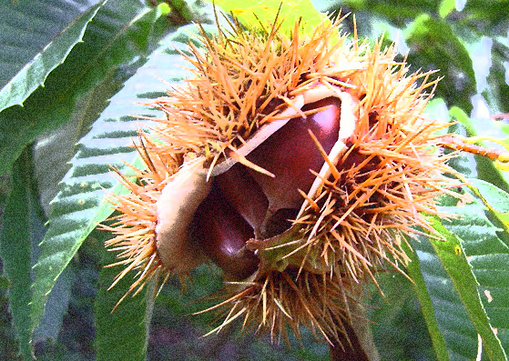

추석유감

xml:namespace prefix = o ns = "urn:schemas-microsoft-com:office:office" /

비가 내린다.

여름내 내리더니 추석 전날에도 내리고 있다.

쨍하는 가을볕에 뽀송뽀송 말린 마음으로 맞이하는 추석이라야 제격인데...

축축하게 젖어 썩은 내 풍기는 마음이 마를 겨를도 없이 다시 물에 퉁퉁 붇는다.

고요한 캠퍼스. 모처럼 즐기는 고적(孤寂)이라기엔 청승맞은 모습이라고들 수군 댈 것이다.

창밖으로 내다보이는 소나무, 은행나무, 단풍나무들이 쏟아지는 빗줄기들을 몹시도 성가셔 한다. 추석 전 날, 고향 찾은 우리네 이웃들의 설레는 마음과 달리 만상(萬象)은 차분하고 무겁다.

추석만큼 풍성하고 평화로운 명절이 있을까. 올 사람 없어도 기다려지고, 마땅히 갈 곳 없어도 두 발 동동거려지던 것이 추석을 맞던 내 유⋅소년기 추석의 서정이었다. 시골 집 앞길을 지나는 사람들의 얼굴엔 수심 대신 웃음이 번지고, 기름기 자르르 흐르는 햅쌀밥을 함께 하고 마주 앉을 가족들 생각에 등짐 진 어깨에 힘이 솟곤 하던 시절이었다. 서울로 인천으로 돈 벌러 나갔던 동네 처녀애들이 쪽 빼 입은 채 동구 밖으로 모습을 나타내면, 괜스레 가슴이 울렁거리기도 했다.

고향을 떠나며, 젊음도 울렁거리던 명절의 추억도 깡그리 잃고 말았다. 아니, 젊음이 흘러가니 고향을 떠나야 했고, 고향을 떠나니 명절도 사라졌다고 하는 게 옳을 것이다. 다만 빈 쌀독 밑바닥에 굴러다니는 몇 낱의 쌀알마냥 가끔씩 들여다보며 탄식하는 추억만 남아 있을 뿐이다. 버려두고 떠나온 고향집 뒤란의 감들은 올해도 익고 있겠지만, 그 감나무를 타고 앉은 무심한 까치들은 ‘오늘도 이 집 자식들이 찾아오려나?’하며 우짖어대겠지만. 그 까치소리마저 이젠 매년 이맘때쯤 한 번씩 나를 불러일으켜주는 ‘마음속의 따르릉 시계’로나 남아 있을 뿐이다.

다산 정약용은 송파마을에서 추석날 풍속을 보고 다음과 같은 시를 지었다.

<추석에 시골 마을의 풍속을 기록하다(秋夕鄕村紀俗)>

맑은 날씨의 시골 마을 떠들썩 즐겁구나(晴日鄕村樂意譁)

가을 동산의 풍미는 자랑할 만도 하네그려(秋園風味向堪誇)

들 집 지붕 위엔 넝쿨 말라 박통이 드러났고(枯藤野屋瓜身露)

산언덕엔 병든 잎 사이로 밤송이 짝 벌어졌군(病葉山坡栗腹呀)

지붕 위의 박을 굴려 내려 톱질 할 일도, 후두둑 밤을 털 일도 없는 중년의 추석.

그렇게 명절맞이 하러 모두들 떠나 쓸쓸해진 도심의 한 구석에서

쓰디쓴 커피 마시듯 삶의 또 한 도막을 ‘아작 내고 있는’ 한심한 영혼이다.

2010. 9. 21. 백규  
  

공유하기

게시글 관리

**백규서옥\_Blog ver.**