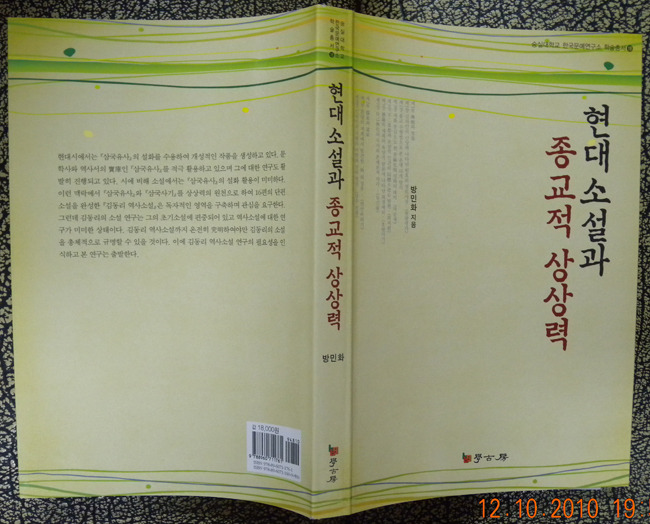

  
  
한국의 종교와 그 소설적 형상화에 대한 분석 『현대소설과 종교적 상상력』출간!!!   
  
그간 현대소설을 꾸준히 탐색해 온 국문학자 방민화 박사가 의미 있는 저서 『현대소설과 종교적 상상력』을 출간했다. 무교, 불교, 유교, 도교, 기독교 등 우리나라 종교들의 본질을 더듬어보고, 그것들이 작가 김동리의 소설에 어떤 양상으로 형상화되어 있는지를 분석한 결과다.   
 이 책은 제1부 ‘불교와 구경(究竟)[신라인의 신앙에 나타난 원효의 정토사상-<원왕생가>/불교 수행법으로 본 운명 타개 방식-<불화>⋅<정원>⋅<완미설>/새를 중심으로 한 보살화현(菩薩化現) 설화의 대비-<저승새>/불이사상(不二思想)과 보살적 인간의 동체대비심(同體大悲心) 발현-<최치원>/감통(感通)의 세계와 욕망적 담론에 나탄나 희생제의-<호원사기>/자기무화(自己無化)의 극치와 존재론적 자각-<등신불>], 제2부 ’유가(儒家)와 도가(道家)‘[환멸의 세계에서 발견한 ’선(仙전)‘의 징후-<먼산바라기>/신라인의 사랑의 미학과 선비정신-<강수 선생>/유가사상의 관점에서 본 태공망(太公望)의 삶-<용>], 제3부 ’무교(巫敎)와 화랑(花郞)‘[기우제의 가무, 그 승화된 사랑의 결정(結晶)-<수로부인>/화랑과 미륵신앙의 상관성 연구-<미륵랑>], 제4부 ’기독교와 작가의 종교의식‘[인간주의와 민족주의의 결합과 그 결실-『사반의 십자가』/성서적 모티브와 작가의 종교의식-<마리아의 회태>⋅<목공 요셉>⋅<부활>] 등 네 부분으로 구성되어 있다.   
 지은이는 “김동리 작품 뒤에 자리 잡은 관념”에 대한 자신의 지적인 관심이 이 책을 지은 동기라고 밝혔다. 근원에 대한 작가의 모색과 그 소설적 형상화를 확인하고 싶은 독자들이라면 꼭 읽어야 할 책이라고 보아, 일독을 권한다.   
  
방민화 지음, 학고방, 2010, 값 18000원/숭실대학교 한국문예연구소 학술총서 19

공유하기

게시글 관리

**백규서옥\_Blog ver.**