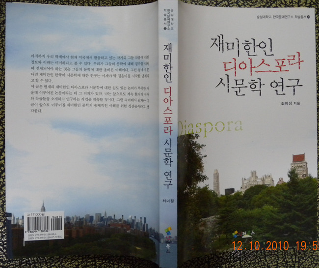

  
  
뉴욕에서 활약하는 한국 시인들에 관한 연구서 『재미한인 디아스포라 시문학 연구』 출간!!!   
  
 미국 뉴욕에서 살고 있는 한국문학 연구가 최미정 박사가 오랜 준비기간을 거쳐『재미한인 디아스포라 시문학 연구』를 출간했다.   
 이 책에는 김정기⋅최정자⋅김윤태⋅장석렬 등 우리나라 사람들에게는 약간 생소한 시인들의 작품이 분석⋅소개되어 있다. 김정기의 시에서는 ‘유배자의 고향희구’[추방된 자로서의 유배의식/모성공간의 희구와 근원지향/근원적 고향의 회복]를, 최정자의 시에서는 ‘외로운 영혼의 소통에의 염원’[현존의 확인을 위한 탈향과 소외의식/고향 만들기와 인간관계 회복]을, 김윤태의 시에서는 ‘이방인의 근원인식’[일시적 체류자로서의 손님의식/근원의 인식과 자존감 회복/사랑과 평화를 통한 자족과 감사]을, 장석렬의 시에서는 ‘부끄러운 자아와의 화해’[굴곡진 현실에서의 도피와 죄의식/애증의 이원적 공간에의 기억과 화해/또 다른 고향의 모색]를 각각 찾아냈다.   
 저자는 자기 스스로가 이민자의 한 사람으로서 누구보다도 이민자 문학을 잘 이해할 수 있다는 자심감에서 이 연구를 시작했다고 말한다. 재미 한인들의 이민문학에 대한 많은 정보와 전망들을 담고 있는 이 책이 한국의 학계에 큰 보탬이 되리라 믿으며, 독자 여러분의 일독을 권한다.   
  
        최미정 저, 인터북스, 2010, 17000원/숭실대학교 한국문예연구소 학술총서-20.

공유하기

게시글 관리

**백규서옥\_Blog ver.**