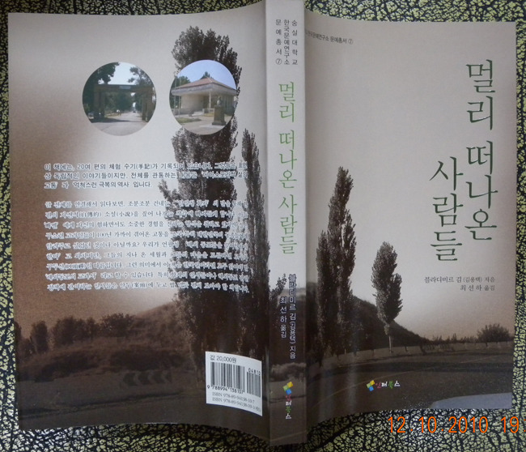

  
  
『우즈벡의 고려인이 들려주는 디아스포라 이야기  멀리 떠나온 사람들』출간!!!   
  
  
 우즈베키스탄 고려인 작가 블라디미르 김의 자전적(自傳的) 수기(手記)인 『멀리 떠나온 사람들』을 펴냈다. 이 책에는 이 책에는 20여 편의 체험 수기들이 기록되어 있다. 그것들은 표면 상 독립적인 이야기들이지만, 전체를 관통하는 내용은 ‘디아스포라적 삶의 고통’과 ‘억척스런 극복의 역사’다. 작가의 개인사에 그치지 않고 작가의 개인사를 통해 본 고려인들의 생활사라고 하는 것이 정확할 것이다. 뿐만 아니라 남북 분단의 민족 현실에 대한 아픈 지적과 함께 이념이나 체제경쟁에서 이겼다고 자만하는 우리에게 ‘무서운 일침(一鍼)’을 가한 점 또한 간과할 수 없다.   
 글 전체를 연결해서 읽다보면, 조분조분 건네는 ‘일인칭 화자’의 말을 통해 한 편의 자전적 소설(小說)을 짚어 나가는 착각에 빠져들게 한다. 아들 ‘빠벨’에게 자신의 험하면서도 소중한 경험을 전하는 형식을 취하고 있지만, 실은 구소련 고려인들이 100년 가까이 겪어온 고통을 조국 특히 대한민국의 동족들에게 알려주고 싶었던 것인지도 모른다.   
 우리가 언필칭 ‘해외 동포들을 끌어안아야 한다’고 외치지만, 그들의 지나 온 세월과 그들의 마음을 모른다면 모두가 구두선(口頭禪)일 따름이다. 그런 의미에서 이 책은 한국인이라면 모두 읽어야 할 ‘해외동포의 교과서’라고 할 수 있다. 특히 학계의 인사들이나 해외동포 관련 정책에 관여하는 인사들은 안두(案頭)에 두고 밥 먹듯 펼쳐 보아야 할 책이다. 우리 모두 작가가 대신 쏟아놓은 고려인들의 이야기에 부디 귀 기울일 필요가 있다. 이 가을, 우리는 이 책을 통해 해외동포들과의 의미 있는 만남 이룰 수 있으리라 믿는다.   
  
 \*블라디미르 김의 약력   
        1946년 우즈베키스탄 수도 타쉬켄트 근교 촌락인 ‘꾸일로크’에서 출생출생한 해에 부모와 함께 북한으로 가서 12세 까지 살았다. 당시 소련한인을 위해 평양에 개교한 학교에 들어가 러시아어로 공부했다. 한국전쟁 동안에는 중국에서 살았고,  15세 때에 타쉬켄트로 돌아와 석공, 미장공, 판석공 등 건설노동자로 일했다. 그동안 야간학교를 마치고 종합기술학교 산업 및 민간 건축공학과에 들어가 공부했는데, 1년 후 학업을 뒤로하고 군에 입대했다. 그곳에서 지역 군사 신문에 기사를 쓰기도 했다. 제대 후 타쉬켄트 국립대학 언론학부에서 공부했고, 이후 학생 및 청년 신문사에서 일해 책임비서까지 승진했다. 1979년 한국어로 발행되는 ‘레닌기치’ 신문의 책임자가 되었으며, 이후 타쉬켄트 통신사의 소장이 되었다. 타쉬켄트 국립대학에서 언론학을 강의했으며, 사범대학에서는 한국어를 가르치기도 했다. 한인으로는 처음으로 우즈베키스탄 공화국 ‘공로언론인’의 칭호를 받았다. 80년대 말에서 90년대 초에는 한국문화원 설립에 적극 참여하였다.   
  
  
      블라디미르 김 지음, 최선하 옮김,  인터북스, 2010, 값 20,000원/숭실대학교 한국문   
      예연구소 문예총서-7

공유하기

게시글 관리

**백규서옥\_Blog ver.**