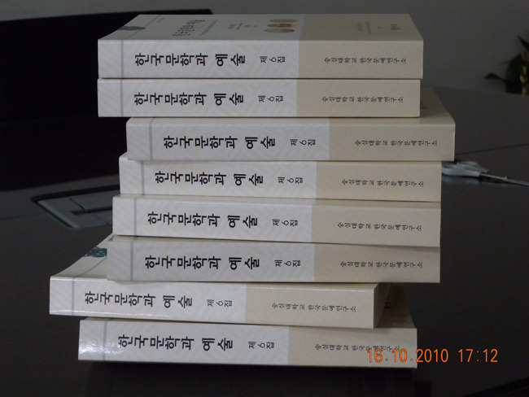

  

|  |
| --- |
| <<한국문학과 예술>> 6집[아리랑 특집호]이 발간되었습니다. 논문집의 규모가 540쪽으로 두툼할 뿐 아니라 내용도 상당히 알찬 듯 합니다. 특히 서경대학의 이복규 교수께서 새 편집위원으로 참여하여 주셨고, 특집논문 외에 '김성훈, 정연정, 정영문' 등 열심히 노력하는 학자들의 일반논문도 세 편이나 실렸습니다. 간단히 내용을 소개하면 다음과 같습니다.     <특집논문>     1. 아리랑 연구사 ---조용호    2. 유성기 음반(SP) 수록 대중가요 아리랑 텍스트의 반복과 변주-광복이전 자료를 중       심으로 - ------------장유정    3. 현대 대중예술의 아리랑 수용양상-------김동권    4. 현대시의 아리랑 수용양상-----------------박경수    5. 북한의 아리랑 축제와 민족예술의 가능성 모색------------전영선    6. 한인 디아스포라 <아리랑>의 음악학적 연구-북한, 독립국가연합을 중심으로-       -----------------김보희    7. '대중가요' 아리랑의 1945년 이전 동아시아 전파양상-----------이준희    8. 아리랑의 문화콘텐츠와 창작산업 방향--------------이창식     <일반논문>     1. '箴'에 나타난 言語觀 연구-言行을 경계한 작품을 중심으로--------김성훈    2. 몸의 생태시학--------------------정연정    3. 홍창한의 <<연행일기>> 연구-------------------정영문     <토론문>     1. 조용호의 '아리랑 연구사'에 대한 토론문 ---------신현규    2. 장유정의 '유성기 음반 수록 대중가요 아리랑 텍스트의 반복과 변주'에 관한 토론--    -----정영문    3. 김동권의 '현대 대중예술의 아리랑 수용양상'에 대한 토론문-------백로라    4. 박경수의 '현대시의 아리랑 수용양상'에 대한 토론문-----------------엄경희    5. 전영선의 '북한의 아리랑 축제와 민족예술의 가능성 모색'----------이경수    6. 김보희의 '한인 디아스포라 <아리랑>의 음악학적 연구'에 대한 토론문------안상경    7. 이준희의 '대중가요 아리랑의 1945년 이전 동아시아 전파양상'에 대한 토론문----    ----------이성훈    8. 이창식의 '아리랑의 문화콘텐츠와 창작산업 방향'에 대한 토론문--------김정석     <서평>     1. 탈근대적 사유의 기원, 니체 철학으로의 초대--김상환 외 8명의 <<니체가 뒤흔든       철학 100년>>(민음사, 2000)을 읽고-------------김미영    2. 끊임없이 이동하는 자만이 살아남은 실크로드--정수일의 <<초원 실크로드를 가다       >>(창비, 2010)를 읽고------신현규    3. 근거와 지향--조규익의 <<고전시가와 불교>>(학고방, 2010)를 읽고----이원희    4. 동양미술의 정수(精髓)를 밝히다-킴바라세이고(金原省吾)저, 민병산 역의 <<동양       의 마음과 그림>>(새문사, 2003)을 읽고--------김정숙    5. 출가(出稼) 해녀의 생애와 소리 총체적 조명--이성훈의 <<해녀 노 젓는 소리 연구       >>(학고방, 2010)를 읽고-------최은숙      <자료소개>         선구적 안목과 새로운 패러다임의 안출(案出)--고정옥(高晶玉)의 <<고장시조선주  (古長時調選註)>>에 대하여-----------------조규익        휘보     논문투고 규정     원고집필 요강     한국문예연구소 조직 |
|  |

공유하기

게시글 관리

**백규서옥\_Blog ver.**