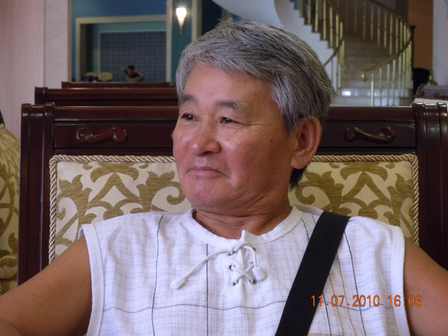

  
폭염(暴炎)이 불타오르던 칠월의 타쉬켄트.   
40도를 넘어가는 수은주에 우즈벡 사람들의 얼굴도 벌겋게 달아올라 있었습니다. 그러나 머언 천산산맥으로부터 불어오는 바람은 상큼하고도 달달했습니다. 시내를 가득 메운 씩씩한 나무들만이 그 바람과 더위를 즐기고 있었습니다.   
  
 타쉬켄트 대학에서 고려인들을 만났는데, 그 가운데 한 분이 블라디미르 김, 즉 김용택 선생이었습니다. 아담한 체구에 선량한 인상의 고려인 신사 김 선생께서는 고려인들의 중앙아시아 정착사(定着史)를 실감나게 말씀해 주셨습니다. 눈물 나게 하는 대목도, 두 주먹을 불끈 쥐게 하는 대목도 있었습니다만, 그 분 말씀의 핵심은  ‘끈질긴 민족혼’이었습니다. 그리고 초대 받아 간 김 선생 댁에서 이 원고를 받았습니다.   
  
 이미 오래 전에 썼고, 최선하 선생이 유려하게 번역까지 한 이 원고가 먼지를 뒤집어 쓴 채 널브러져 있는 모습을 보는 순간 제 마음은 참담해졌습니다. 대충 일별해 보니 고려인들이 구소련 치하에서 겪은 고난의 세월이 갈피마다 각인되어 있었습니다. 순간 저는 큰 감동과 함께 ‘이 원고가 드디어 임자를 만났구나!’라고 쾌재를 부르게 되었습니다. 이 책을 출판하여 우리의 피붙이들이 타국을 떠돌며 겪어 온 디아스포라의 고통을 대한민국 사람들에게 알려야겠다는 생각을 하게 된 것입니다.   
  
 김 선생을 만난 며칠 뒤 찾아간 김병화 꼴호즈에서 저는 김 선생 말씀의 진실을 얼마간 확인하게 되었습니다. 400여 호, 500여 명의 고려인들이 아직도 살고 있다는 그 마을엔 내가 어릴 적 고향 마을에서 보던 미루나무들이 하늘에 닿을 듯 서 있었습니다. 고려 말을 모르는 사람들이 대부분이었으나, 그 가운데 일부는 고려 말과 러시아 혹은 우즈벡 말이 반반씩 섞인 말들을 쓰고 있었습니다. 그 분들의 간절한 말씀을 들으며 대한민국에서 잘 살고 있는 우리가 ‘정말로 잘 해야겠구나!’ 라는 생각을 갖게 되었습니다. 그들은 할아버지의 나라 대한민국을 자랑스럽게 생각하고 있었습니다. 그 분들의 기대를 저버리지 않기 위해서라도 우리의 마음을 더 조이고 땀 흘릴 필요가 있다는 판단을 내리게 된 것입니다.   
  
      \*\*\*   
  
 이 책에는 20여 편의 체험 수기(手記)가 기록되어 있습니다. 그것들은 표면 상 독립적인 이야기들이지만, 전체를 관통하는 내용은 ‘디아스포라적 삶의 고통’과 ‘억척스런 극복의 역사’입니다. 김 선생 개인사에 그치지 않고 김 선생 개인을 통해 본 고려인들의 생활사라고 하는 것이 정확할 것입니다. 그 뿐인가요? 남북 분단의 민족 현실에 대한 아픈 지적과 함께 이념이나 체제경쟁에서 이겼다고 자만하는 우리에게 ‘무서운 일침(一鍼)’을 가한 점 또한 간과할 수 없습니다.   
  
 글 전체를 연결해서 읽다보면, 조분조분 건네는 ‘일인칭 화자’의 말을 통해 한 편의 자전적(自傳的) 소설(小說)을 짚어 나가는 착각에 빠져들게 합니다. 아들 ‘빠벨’에게 자신의 험하면서도 소중한 경험을 전하는 형식을 취하고 있지만, 실은 구소련 고려인들이 100년 가까이 겪어온 고통을 조국 특히 대한민국의 동족들에게 알려주고 싶었던 것이나 아닐까요? 우리가 언필칭 ‘해외 동포들을 끌어안아야 한다’고 외치지만, 그들의 지나 온 세월과 그들의 마음을 모른다면 모두가 구두선(口頭禪)일 따름입니다. 그런 의미에서 이 책은 한국인이라면 모두 읽어야 할 ‘해외동포의 교과서’라고 할 수 있습니다. 특히 학계의 인사들이나 해외동포 관련 정책에 관여하는 인사들은 안두(案頭)에 두고 밥 먹듯 펼쳐 보아야 할 책입니다.   
  
 오늘, 이 책을 대한민국 앞에 내어놓습니다. 김 선생이 대신 쏟아놓은 고려인들의 이야기에 부디 귀 기울여 주시기 바랍니다. 이 가을, 이 책을 통해 해외동포들과의 의미 있는 만남 이루시길 간절히 바랍니다.   
  
2010. 가을   
  
숭실대학교 인문대학 학장/한국문예연구소 소장 조 규 익

공유하기

게시글 관리

**백규서옥\_Blog ver.**