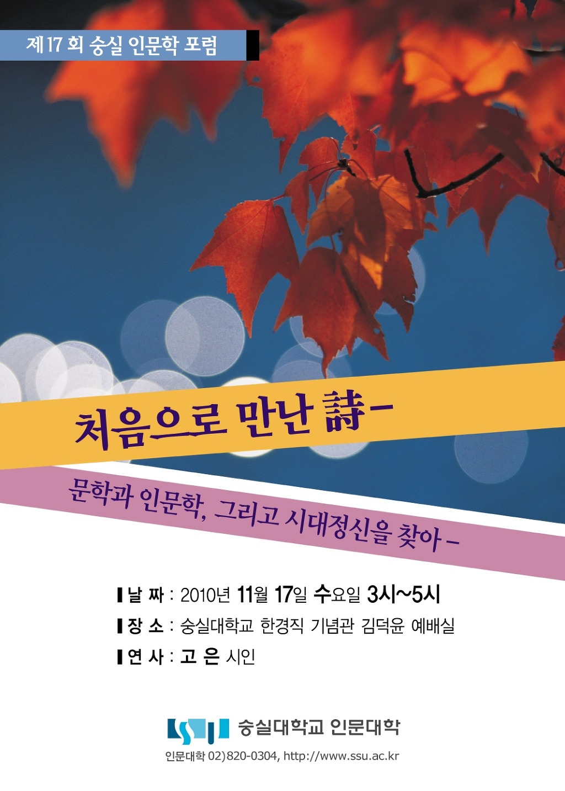
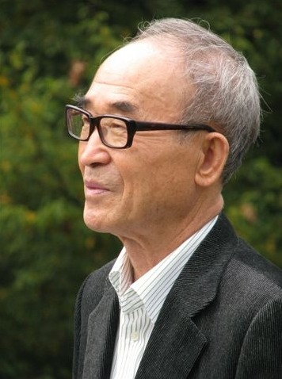

  
  
  
모시는 말씀  
  
여름내 가꾸어온  
우리의 꿈이 여물어  
야문 낱알들로 넉넉한 이 가을  
  
이 시대의 선명(善鳴) 고은 시인과 함께  
낭만의 따스한 연못에  
흠뻑 빠져보려 합니다.  
  
옷깃을 여미고  
캠퍼스를 거닐며  
시와 인생을 담론하는 자리에  
부디 오셔서  
우리의 꿈과 사랑을 이야기해 봅시다.  
  
경인년 11월 첫날  
뒹구는 낙엽을 바라보며  
인문대 학장 조규익 드림  
  
  
**일시 : 2010년 11월 17일 수요일 15:00~  
장소 : 숭실대학교 한경직 기념관 김덕윤 예배실  
연사 : 고은 시인  
연제 : 처음으로 만난 詩-문학과 인문학, 그리고 시대정신을 찾아-  
  
연락처 : 820-0304, 820-0326  [http://www.ssu.ac.kr](http://www.ssu.ac.kr/)**

공유하기

게시글 관리

**백규서옥\_Blog ver.**