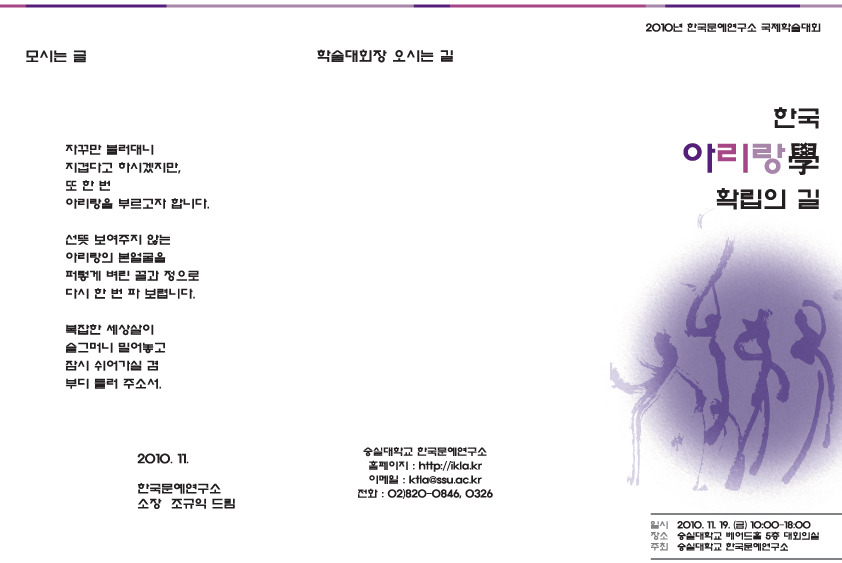
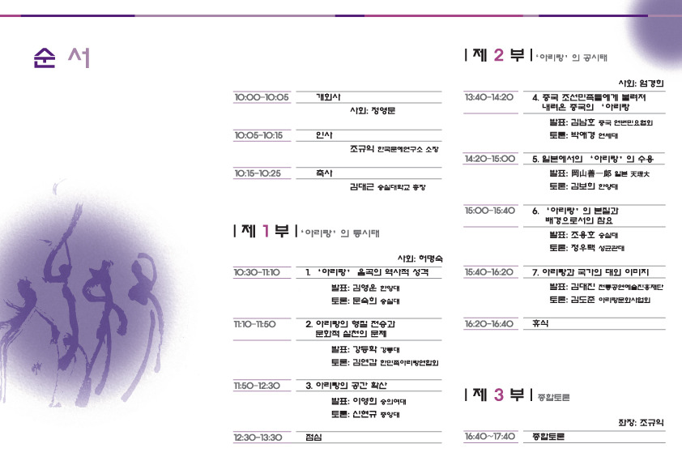

  

2010년 한국문예연구소 국제학술대회 “한국 아리랑學 확립의 길”

xml:namespace prefix = o ns = "urn:schemas-microsoft-com:office:office" /

숭실대학교 한국문예연구소(소장 조규익 교수)에서는 2010년 11월 19일 10:00~18:00, 숭실대학교 베어드홀 5층 대회의실에서 “한국 아리랑學 확립의 길”이란 주제로 2010년 국제학술대회를 갖는다. 이 날 발표될 논문과 발표자는 다음과 같다.

제1부

사회 : 허명숙

10:30~11:10 아리랑 음곡의 역사적 성격--발표 김영운(한양대)/토론 문숙희(숭실대)

11:10~11:50 아리랑의 형질 전승과 문화적 실천의 문제--발표 강등학(강릉대)/토론 김연

갑(한민족아리랑연합회)

11:50~12:30 아리랑의 공간확산--발표 이영희(숭의여대)/토론 신현규(중앙대)

제2부

사회 : 엄경희

13:40~14:20 중국 조선민족들에게 불려져 내려온 중국의 ‘아리랑’--발표 김남호(중국 연

변민요협회)/박애경(연세대)

14:20~15:00 일본에서의 ‘아리랑’의 수용--발표 岡山善一郞(일본 천리대)/토론 김보희(한

양대)

15:00~15:40 ‘아리랑’의 본질과 배경으로서의 참요--발표 조용호(숭실대)/토론 정우택(성

균관대)

15:40~16:20 아리랑과 국가의 대외 이미지--발표 김대진(전통공연예술진흥재단)/김도준(아

리랑문화사업회)

제3부

좌장 : 조규익

16:40~17:40 종합토론

공유하기

게시글 관리

**백규서옥\_Blog ver.**