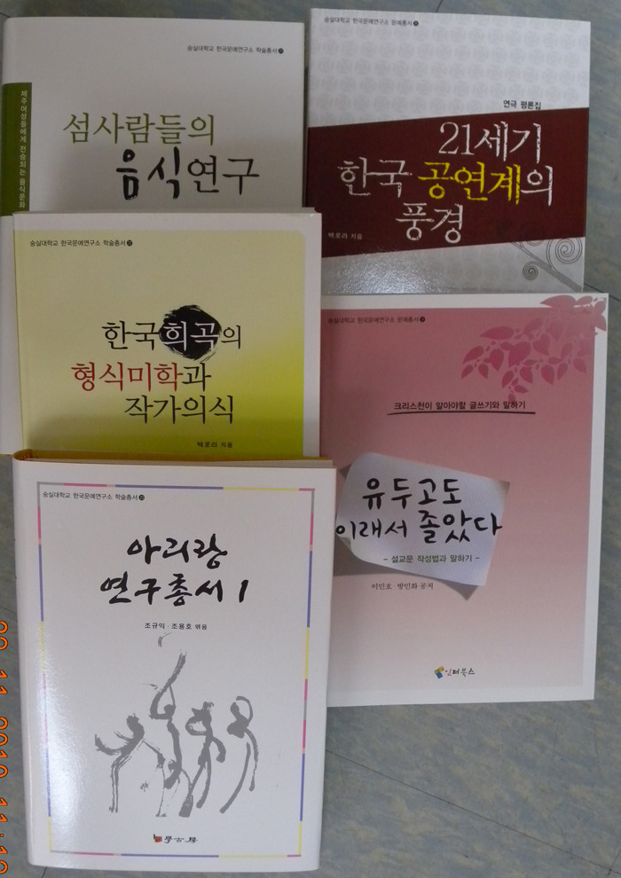

  

한국문예연구소 새 책 5권 발간!!!

xml:namespace prefix = o ns = "urn:schemas-microsoft-com:office:office" /

숭실대 한국문예연구소(소장 조규익 교수)는 최근 학술총서 3권과 문예총서 2권을 펴냈다.

『섬사람들의 음식연구』(문순덕 지음, 학고방)를 학술총서 21로, 『한국희곡의 형식미학과 작가의식』(백로라 지음, 학고방)을 학술총서 22로, 『아리랑 연구총서 1』(조규익⋅조용호 엮음, 학고방)을 학술총서 23으로 펴냈으며, 『21세기 한국 공연계의 풍경』(백로라 지음, 인터북스)을 문예총서 8로, 『유두고도 이래서 졸았다-설교문 작성법과 말하기』(이민호⋅방민화 공저, 인터북스)를 문예총서 9로 각각 발간했다.

『섬 사람들의 음식연구』는 총론 격인 ‘제주 전통음식의 의미, 제주 전통음식의 역사’와 각론인 ‘마라도 사람들의 음식, 비양도 사람들의 음식, 가파도 사람들의 음식, 우도 사람들의 음식, 추자도 사람들의 음식, 오사카 재일동포들의 음식’, 제주 전통음식의 전승 양상 등으로 이루어져 있다. 일제강점기 1910년부터 광복이후 최근 2000년대까지의 제주음식 문화를 조사하기 위해 저자 문순덕 제주발전연구원 책임연구원은 1930~40년대 출생자 40여명을 대상으로 설문 및 면접 조사를 펼쳤다. 특히 문 연구원이 주목한 점은 전통음식과 함께 살아남은 제주어다. 그는 “제주의 전통음식이 살아 남는다면 이를 부르는 음식용어 역시 살아남을 것”이라며 “조리법을 전수하면서 용어도 전승하려는 의지가 필요하다”고 강조했다.

『한국희곡의 형식미학과 작가의식』은 1부[질곡의 역사와 부조리한 세계에 대응하는 미적 구조], 2부[재일동포 한국어 극문학의 양식적 특성과 작가 이데올로기]로 구성되어 있는데, 1부에서는 송영, 오영진, 오태석, 박조열 등 탁월한 극작가들의 작품을 다루었고, 2부에서는 재일동포들의 가극, 시극, 극소품 등의 연극성⋅혁명성⋅대중성과 민족 이데올로기, 정체성 등 핵심적인 논점들을 분석했다.

『아리랑 연구총서 1』은 80년 아리랑 연구사를 정리하기 위한 작업의 첫 번째 결실이다. 총 10권으로 발간될 예정인 이 총서의 첫 책에는 이광수⋅김지연⋅고권삼⋅이병도⋅양주동⋅심재덕⋅정익섭⋅임동권⋅최재억⋅원훈의 등 아리랑 연구 첫 세대의 대표적인 글들이 실려 있다.

‘감각과 상상력을 자극하는 실험적인 무대/사실주의 연극의 다양화 혹은 심화/독창적인 연극 미학적 세계의 추구/번역극 및 해외 초청 연극/뮤지컬⋅마당극⋅탈장르적 공연예술’ 등 5부로 이루어진『21세기 한국 공연계의 풍경』에서는 ‘바로 지금’ 대중들을 상대로 공연되는 연극들을 생생한 필치로 설명함으로써 비전문가들이 연극을 가까이 하는 데 큰 도움을 주고 있다.

『유두고도 이래서 졸았다』라는 이색적인 제목의 이 책은 목회자들을 위한 설교문 작성의 길잡이다. 2천년 전 바울의 설교를 듣던 청년 유두고가 졸음을 참지 못하고 창틀에서 떨어져 죽은 사건이 있었다. 그러나 하나님의 은총과 바울의 연민으로 유두고는 재생했다고 한다. “이 책 한 권이 오늘날 교회에서 졸고 있는 수많은 유두고를 깨우는 기적이 되었으면 한다.”고 밝힌 저자들의 말처럼, 이 책은 신도들이 졸지 않도록 목회자들로 하여금 좋은 설교문을 쓸 수 있게 도와 줄 것이다.

공유하기

게시글 관리

**백규서옥\_Blog ver.**