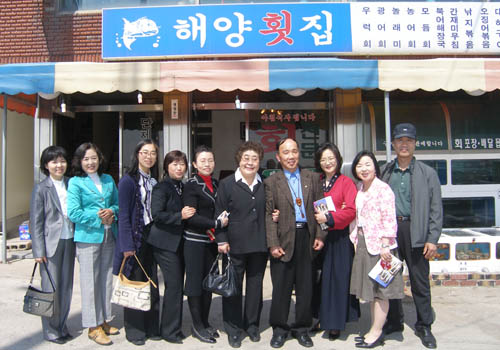
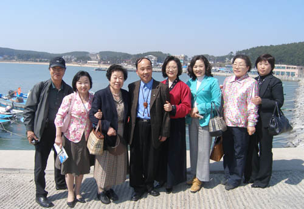

고향에서 만난 어제, 오늘, 그리고 내일  
  
                                                                             조규익  
  
내 고향 태안엔 샛별처럼 반짝이는 제자 난주시인이 살고 있다. 경남 산청 출신. 당차면서도 맑은 영혼의 여인이다. 경남대학의 전임으로 막 부임한 나는 스물여덟. 갓 스무 살 난 그녀는 학교의 문학 서클에서 시인에의 꿈을 키우고 있었다. 일상에 매몰되어 정신없이 바쁘게 지내던 나는 떠난다는 말도 없이 두 해만에 서울로 오게 되었다. 그 후 우연히 그녀가 내 고향으로 시집 와 산다는 말을 듣게 되었다. 그로부터 나는 부끄럽게도 잊고 있던, 아니 잃어버린 지 오래였던 고향을 다시 찾게 되었다. 척박한 내 고향에 문화의 불씨를 지피고 있는 그녀를 보며 스스로 부끄러워졌기 때문이다. 독서회, 시 낭송회, 논술·토론회 등, 문화의 모종삽을 들고 분주한 그녀. 그녀의 모습이 생소하면서도 신선했다.   
  
         \*\*\*  
  
유럽 여행기 <<아, 유럽!-그 세월 속의 빛과 그림자를 찾아>>를 펴내자마자 그녀로부터 연락이 왔다. 독서 모임 회원들을 위해 ‘저자와의 만남’ 시간을 갖겠다는 것. 그래서 태안도서관을 찾았다. 아, 그런데 그곳엔 올망졸망한 ‘초딩’들과 그 지역의 어른들이 뒤섞여 강의실을 채우고 있었다. 그러니 무슨 이야기를 할 수 있으랴? 그저 책에 목마르던 내 어린 시절의 이야기, 지금도 여전히 허기에 시달리며 무언가를 찾기 위해 동분서주하고 있다는 내 삶의 이야기나 들려줄 수밖에 없었다.   
여행과 독서! 그러고 보면 참으로 절묘한 일치였다. 무언가를 알기 위해, 찾기 위해 우리는 책을 읽는다. 마찬가지로 무언가를 찾거나 알기 위해 우리는 여행을 한다. 말하자면 우리가 찾아다니는 세상이나 우리가 읽는 책이나 무엇이 다르단 말인가. 유럽을 비롯 그간 내가 밟았던 곳들은 모두 내 공부를 위한 텍스트였던 셈이다. 태안의 사임당 독서회를 위해 난주시인이 내게 부탁한 것은 여행에 관한 이야기였다. 그래서 이야기 내내 ‘책 읽기’와 ‘여행하기’라는 두 영역을 왕래하게 되었다.   
         \*\*\*  
  
청중석에 앉아있는 어른들은 참으로 훌륭했다. 이런 시대에 책을 가까이 하는 어머니 아버지들이 있을 수 있다니! 모여 앉으면 부동산 이야기, 남 헐뜯기로 세월을 보낼 법 한데도 그 분들은 열심히 책을 읽고 정기적으로 만나 토론을 한다. 아이들에게 ‘공부하라, 책을 읽으라!’ 경을 읽을 필요가 어디 있을까. 아이들은 그런 부모를 보며 스스로 책을 읽고 사색에 빠질 것이다. 단 한 시간이라도 어머니가 책 읽는 모습을 보여준다면 아이들도 옷깃을 여미고 책상 앞에 달라붙는 것을. 어른들 자신들은 ‘먹자 마시자’로 일관하며 입으로만 경을 읽는다. 비극이다. 그런 점에서 내 고향 태안의 미래는 밝았다. 그곳은 내 고향 태안의 어제, 오늘, 그리고 내일이 함께 모인 자리였다.   
  

맛있는 주꾸미 샤브샤브로 태안의 풍미를 듬뿍 맛본 식당 앞에서

  
  
  
  
         \*\*\*  
  
차를 타고 떠나든, 책 속으로 떠나든 여행은 즐겁고 가슴 설레는 일이다. 새로운 사람들, 새로운 문화를 만나게 되고, 나와 다른 그것들을 통해서 나의 자아를 깨닫는다는 점에서 여행만큼 위대한 선생님도 없다. 역사상 위대한 사상가, 문학가, 예술가, 정치가 등은 모두 여행에 나선 사람들이었다. 그들은 여행을 통해 자아를 깨닫고 거듭 날 수 있었다. 그래서 나는 그 자리에서 ‘자식을 성공시키려면 일찍부터 여행을 시키라’고 강조했다. 다만, 여행을 떠나기 전 준비를 철저히 하고, 뚜렷한 목표를 세워야 한다는 것만은 잊지 말아야 할 일이다.   
  
         \*\*\*  
  
태안. 아름다운 봄꽃들이 만개한 그곳엔 은총처럼 햇살이 쏟아지고 있었다. 몽대 포구의 바닷바람도 이리저리 봄 내음을 흩어내고 있었다. 김영곤 시인의 시낭송과 조은숙 회장의 가곡 한 자락은 방파제를 넘어 햇살 반짝이는 물결 위로 파문처럼 번져갔다. 난주 시인의 해맑은 웃음이 그 사이를 수놓은 봄날 오후의 한 순간. 살아있는 내 고향의 한 장면이었다.

몽대포구의 따스한 봄바람을 맞으며

                                                                       2007. 4. 14.

공유하기

게시글 관리

**백규서옥\_Blog ver.**