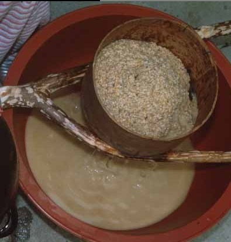

  
술    
  
                                                                                                                                                           조규익  
  
xml:namespace prefix = o ns = "urn:schemas-microsoft-com:office:office" /

어딜 가나 술이 있고, 술 때문에 문제도 생긴다. 성 추행범 등 파렴치범들을 붙잡아도 대개는 술 핑계를 대곤 한다. 난동을 부리고 나서도, 사람을 폭행하고도 술 핑계만 대면 된다고들 생각하는 현실이다. 그러니 애꿎은 술만 억울하게 생겼다.

\*\*\*

가뭄에 콩 나듯, 술자리에 참석할 기회가 있다. 술이 들어가면 사람들 사이의 벽이 허물어져서 좋고, 오랜만에 ‘큰소리, 흰소리’를 겁 없이 내뱉을 수 있어서 좋다. 심한 주사(酒邪)만 아니라면, 술 몇 잔에 ‘곱게 취할’ 정도의 주량이라면, 술이란 인생의 윤활유가 아닐까. 세상의 아내들은 남편들이 술자리에서 실수할까봐 속을 태운다. 술 마시고 들어온 남편에게 바가지를 긁는 이유도 바로 그 점에 있다. 게슴츠레한 눈으로 여자를 쳐다만 봐도 ‘성추행범’으로 몰리는 게 요즈음의 세태가 아닌가. 그러니 세상의 조신한 아내들이 늦은 시각에 남편 돌아오기만을 기다리며 조바심을 내는 것도 당연하다.

그러나, 세상의 아내들이여! 몇몇 ‘주태백’을 뺀 대부분의 남자들은 그저 취한 척할 뿐이란 사실을 알아주오. 그들은 값싼 술 몇 잔의 힘을 빌어 대낮에 뱉어내지 못한 ‘흰 소리, 큰소리’를 치며, ‘낙양성 십리허에~’로 시작되는 <성주풀이>나 목청껏 부르며 마음속의 찌꺼기들을 배설하고 있는 거라오. 그들의 흰 소리를 무슨 실정법으로 다스릴 수가 있겠소? 아니, 다스릴 필요가 있겠소? 세상에 남자로 태어나 술 마시고 흰 소리 한 마디 내뱉지 못한다면, ××두 쪽을 싹뚝 잘라버려야 하지 않을까요?

\*\*\*

중국의 주호(酒豪) 유령(劉伶)은 천하의 명문 「주덕송(酒德頌)」을 남겼는데, 그 중의 한 부분을 운문으로 바꾸어 놓으면 다음과 같다.

여기 대인 선생이 있다네.

태초 이래의 시간을 하루로 보고,

만세의 긴 세월을 잠시라 생각한다네.

해와 달을 빛을 비추는 창문쯤으로 생각하고,

넓디넓은 천지를 집안의 뜨락이나

동네의 네거리쯤으로 생각한다네.

마음대로 활보하고, 좁은 곳을 싫어하니

그에게 집이 있을 수 없다네.

하늘을 지붕 삼고 땅을 자리 삼아

마음 가는 어디에도 얽매이지 않는다네.

멈추면 작은 잔, 큰 잔 가리지 않고 술잔을 기울이네.

어디를 가도 술통과 술독을 끌어당겨 술 마시기를 힘쓰니,

그 나머지 일이야 어찌 알겠는가?

귀한 인사들과 귀족의 자제분들, 높은 벼슬아치와 처사들

서로 흥분하여 칼날을 세우듯 대인 선생을 나무라나

선생은 술단지와 술통의 술을 마시고

술에 젖은 수염을 쓰다듬으며 두 다리를 뻗고 누울 뿐,

누룩을 베개 삼고 술 찌게미를 자리삼아 누울 뿐이라네.

온갖 생각과 근심이 사라지고, 즐거움만이 도도하다네.

홀로 우뚝 취하고 황홀한 기분으로 술에서 깨어난다네.

고요히 귀를 기울여도 하늘을 찢는 우레 소리 들리지 않고,

아무리 눈을 떠도 태산의 형체 보이지도 않는다네.

살갗을 파고드는 한서(寒暑)의 고통도 없고

무엇을 즐기고픈 욕망도 사라진다네.

만물이 뒤섞여 있는 속세를 굽어보며

모든 것을 양자강에 떠 있는 부평(浮萍)처럼 생각하고

선생을 성토하는 무리들을 나나니벌이나 푸른 배추벌레쯤으로나 여긴다네.

얼마나 멋진 배포이냐? 술 마시며 패거리 짓고 죄 없는 이웃을 안주 삼아 씹어대는 요즘 세상의 좀팽이들과는 비교도 하지 말라!

우리에게도 주호(酒豪)는 있었다. 수주(樹州) 변영로(卞榮魯)의 음주행각은 철학 차원의 정신적 바탕을 갖추고 있었으며, 김동명(金東鳴)의 <술노래>는 만세토록 이어갈 만한 절창이다.

샛말간 유리컵에

흥건히 고인 호박 빛 액체,

나는 무적함대의 사령장관인양 자못 호기로이

나의 적은 해양을 응시한다.

동구란 해안선에

넘치는 흰 거품,

아하, 인류 百億 해의

역사가 서렸구나.

안개인양 자욱이 피어오르는 향기 속에

시간은 갈매기 같이 날으고,

나의 좌석은

갑판보다도 더욱 흔들거린다.

어허, 이것 봐라, 하늘이 도는구나

물매아미 같이 뱅글뱅글 하늘이 도단 말이,

저 놀랍고도 새로운 천문학적 진실 위에

세대의 윤리는 성좌 같이 찬연하다.

여보게, 나는 이제

이 호박및 액체가 주는 마술을 빌어

나의 새끼손톱으로

요놈의 지구덩이를 튀겨버리려네.

유령이 말한 ‘대인선생’보다 훨씬 호탕하고 그럴싸한 주호(酒豪)를 김동명은 그려냈다. ‘호박 빛 액체’라면 대충 막걸리와 유사한 술이었을 텐데, 대체 몇 말을 마셔야 하늘이 돌고 지구덩이가 손톱만큼 작아진단 말인가.

\*\*\*

가끔씩 막걸리 그득한 대접을 뚫어져라 응시해보기는 하지만, 새가슴처럼 작은 나의 배포로는 큰소리도 흰 소리도 못 치고, 기껏 기어들어가는 목청으로 ‘낙양성 십리허에 높고 낮은 저 무덤에~’를 웅얼거리며 인생의 허무함이나 달래볼 따름이니, 세상의 아내들이여! 혹시 남편들이 술자리에서 실수나 하지 않을까, 부디 전전긍긍하지 마옵소서!

공유하기

게시글 관리

**백규서옥\_Blog ver.**