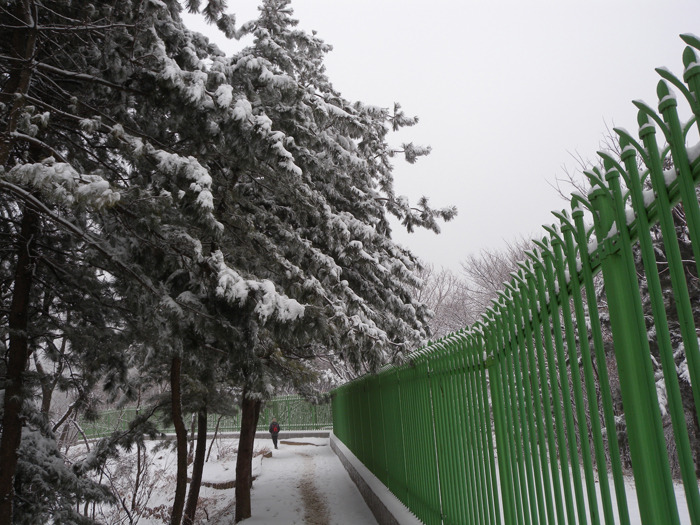

  

새해인사

xml:namespace prefix = o ns = "urn:schemas-microsoft-com:office:office" /

신묘년 새해 아침이 밝았습니다.

백규서옥을 찾아주시는 귀한 손님 여러분께 새해인사를 드립니다.

올해 더욱 건강하시고 뜻하시는 모든 일을 성취하시기 바랍니다.

지난해는 국가적으로 다사다난했었습니다.

천안함 격침과 연평도 포격사건 등 다시 떠올리고 싶지 않은 일들이 생각 있는 사람들로 하여금 나라의 장래를 근심하게 만들었습니다만, 그나마 그런 궂은일들을 통해서라도 우리가 정신무장을 다질 수 있어서 다행이란 생각이 듭니다.

개인적으로는 연구와 교육, 학장직 수행 등으로 분주하게 움직였습니다. 그러나 막상 결산해보니 움직임에 비해 소득은 그리 많지 않았던 것 같습니다. 논문이나 저서는 예년의 수준으로 발표했고, 프로젝트 건으로 우즈벡을 두 번 다녀왔으며, 학술발표와 학교 공무로 중국을 두 번, 학술답사 목적으로 대마도를 한 번 다녀왔습니다. 한국문예연구소를 통해 두 차례의 학술대회[국내/국제]를 비교적 성황리에 마쳤고, 두 차례에 걸쳐 논문집을 발간했으며, 10여권의 학술총서와 문예총서를 발간했습니다. 학장직과 관련한 굵직한 행사들도 몇 가지 있었습니다만, 숭실 시낭송축제, 고은 시인과 황지우 시인을 초대한 ‘인문학 포럼’ 등은 그 가운데서도 기억에 남는 일들입니다. 그러고 보니 깨닫지 못하는 사이에 적지 않은 일들을 수행했군요. 그러나 문제는 이런 일들을 여하히 우리의 내부적 역량으로 축적해 나가느냐에 있는 것 같습니다. 의미를 건지지 못한 채 그냥 흘려버린 시간들이 적지 않았던 과거를 떠올리면, 지난해에 많이 움직였으면서도 소득이 없었던 것처럼 여겨지는 것도 그럴만하다는 생각이 듭니다.

따라서 올해부터는 많이 움직이는 것보다 차근차근 의미를 확보하는 데 주력고자 합니다. 올해의 움직임을 내년의 더 큰 움직임을 위한 발판으로 만드는 것이 중요하다고 보기 때문입니다. 우리에게는 기회가 주어지면 주어지는 대로 잡고, 주어지지 않으면 일부러 찾아서라도 공동체의 삶을 발전시켜 나갈 의무가 있다고 봅니다. 그런 의미에서 지난해는 소득 못지않게 문제도 많았었습니다. 가장 큰 것은 연구비 수주액이 미미했다는 점입니다. 이 점은 향후 연구소 운영에 심각한 걸림돌이 될 수도 있으리라 보는데, 올해는 기필코 그 문제를 해결하는데 전력투구해야 하리라 봅니다. 많은 도움 주시기 바랍니다.

저는 동참해주시고 도움을 주신 여러분에게 고마움을 잊은 적이 없습니다. 올해도 변함없이 저희들을 지지해주시고 격려해주시리라 믿고 있습니다.

아무쪼록 늘 건강하시고, 가정에 큰 복이 함께 하시길 기도드리겠습니다.

고맙습니다.

신묘년 첫날 아침

조규익 드림

공유하기

게시글 관리

**백규서옥\_Blog ver.**