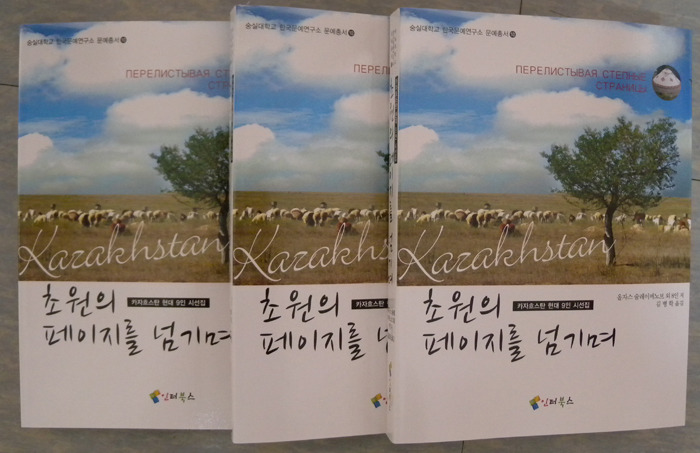

  
한국문예연구소 문예총서 10 『초원의 페이지를 넘기며』 출간!   
  
카자흐스탄의 현대 시인 9명의 시작품들을 번역하여 묶은 『초원의 페이지를 넘기며』가 한국문예연구소 문예총서 10으로 출간되었다. 이 책에 실린 시인들은 올자스 술래이메노브[13수], 예브게니 꾸르다꼬브[16수], 발레리 미하일로브[17수], 바흐트잔 까나삐야노브[14수], 나제즈다 체로노바[10수], 알렉산드로 슈미트[16수], 카이라트 박베르게노브[10수], 바흐트 까이르베꼬브[10수], 이 스따니슬라브[16수] 등 카자흐스탄 문단을 대표하는 9명이다.   
 시인이자 학자, 외교관, 사회 활동가로서 카자흐 국립대학을 1959년도에 졸업하면서 지질학기사가 된 올자스 술래이노브는 1955년부터 문학에 뜻을 두게 되었으며, 1958년 고리끼 문학대학 시 번역학과에 들어가 본격적으로 시 창작을 공부했다. 그의 시집과 저술들은 세계 여러 나라에서 출판되었으며, 많은 상을 받기도 했다. 그는 소비에트 체제에서 억압받는 카자흐인의 현실을 최초로 고발한 시인이다.   
 시인인 동시에 조각가, 인류학박물관 연구원 등 다양한 직업을 가진 예브게니 꾸르다꼬브는 15권의 시집과 산문집을 남긴 다작의 문인이다. 특히 중앙아시아 지방의 언어로 쓰인 문학작품들을 러시아어로 번역한 전문가이기도 하다. 그의 시들은 러시아적 서정과 사상적 깊이에서 현대 러시아 시문학의 최고봉으로 평가되고 있다.   
 현재 러시아 및 카자흐스탄 작가동맹의 회원으로 활약하고 있는 발레리 미하일로브는 20여 권의 시집과 저서들을 남겼다. 그의 시들에는 모순 많고 불합리한 세상에서 거룩함과 정결을 지향함으로써 구원을 얻고 거기서 삶의 궁극적 의미를 찾으려는 의지가 곳곳에 드러난다.   
 시인, 번역가, 시나리오 작가, 영화감독 등 다양한 작업을 해온 바흐트잔 까나삐야노브는 많은 시작품과 산문들을 발간했고, 20여 편의 영화를 감독하기도 했다. 그는 소비에트 체제 하에서 카자흐스탄인들의 민족성과 고유성이 파탄되어가고 있음을 폭로하는 작품성향 때문에 정치인들로부터 공격을 받아 출판을 하지 못하다가 1988년에야 빛을 보게 되었다.   
 시인, 번역가, 문예비평가 등을 겸해온 여류 문인 나제즈다 체르노바는 많은 작품들을 발표했으며, 『수염며느리밥풀』, 『존재의 그림들』등 여러 권의 시집을 출판했다. 그녀의 시에는 러시아 카자크 인들의 전통과 강인함이 들어 있으며, 시의 철학적 깊이와 높이도 두드러진다.   
 카자흐스탄 독일인을 대표하는 러시아어 시인 알렉산드로 슈미트는 많은 작품들을 발표한 대표적 디아스포라 시인이다. 그의 시들 가운데 <동굴>은 강제 이주 당한 소수민족들이 한 두 세대 후에 겪게 되는 정체성의 고민과 혼란을 전형적으로 드러냈다. 즉 러시아어를 통해서 자신의 정체성 문제를 풀어가고 있으며, 이를 통해 역으로 자기의 뿌리를 찾아가는 특이한 세대의 시인이다.   
 카자흐 러시아어 시인, 번역가, 영화감독, 극작가인 바흐트 까이르베꼬브는 카자흐스탄 작가동맹 회원으로서 현재까지도 왕성한 창작활동을 하고 있다. 『가을의 대화』등 9권의 시집과 2권의 시선집을 펴낸 그는 동시대 인텔리들처럼 소비에트 시대에 러시아化에 편입된 전형적 인물이다.   
 고려인 시인 이 스따니슬라브는 고려인 계몽철학자 박일과 러시아 시인 예브게니 꾸르다꼬브의 영향을 받아 문학의 길로 들어섰다. 1995년 첫 시집 『이랑』을 펴낸 이후 여러 권의 시집을 냈으며, 김병학 시인에 의해 『모쁘르마을에 대한 추억』이란 번역시집이 한국에서 출간되기도 했다. 뿐만 아니라 그의 시작품들은 유수의 문학지에 계속하여 소개되고 있으며  카자흐스탄 국정 교과서에도 실림으로써 그의 시작품들은 많은 젊은이들에게까지 알려져 있다.   
  
 올자스 술래이메노브 외 8인 저, 김병학 옮김, 『초원의 페이지를 넘기며』, 인터북스, 2010. 값 19000원. \*숭실대학교 한국문예연구소 문예총서 10

공유하기

게시글 관리

**백규서옥\_Blog ver.**