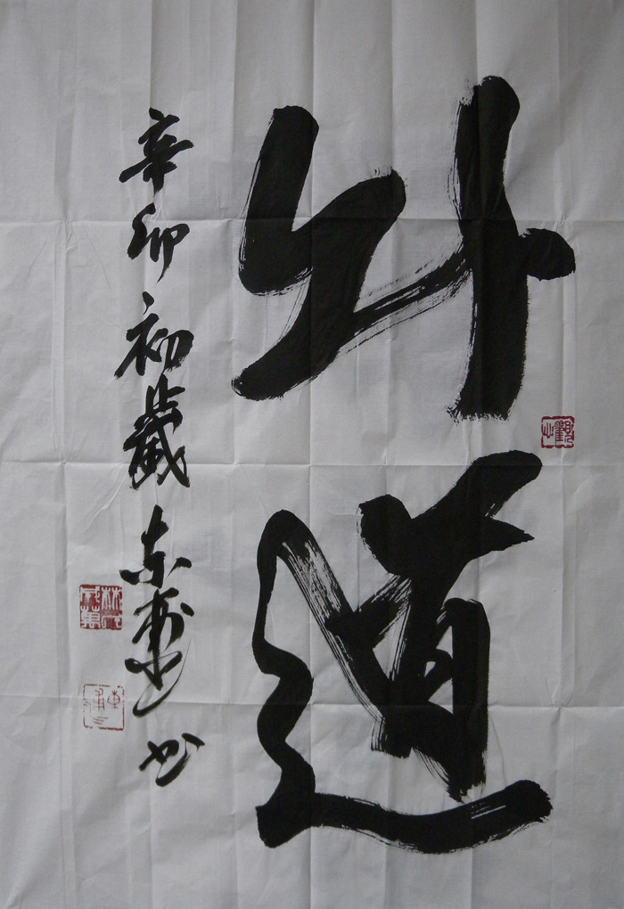

  
  

늘 그랬던 것처럼 이번 세밑에도 고향의 서예가 동포선생으로부터 신춘휘호가 도착했다.

두 글자로 되어 있는데, 첫 글자는 아무리 뜯어보아도 알 수가 없다. 한글이라면 ‘놔’로 읽을 수 있겠는데, 설마 신춘휘호 두 글자 가운데 첫 글자를 한글로 썼을 리가 없지 않겠는가. 그렇다고 한자(漢字)의 간체자(簡體字)로 볼 수도 없었다. ‘처(處)’나 ‘부(赴)’의 약자 혹은 간체자 비슷도 한데, 정확한 건 아니었다. 궁금함을 견디지 못한 나는 급기야 전화기를 들었다. “첫 글자를 뭐라고 읽어야 합니까?” 대답인즉슨 “한글로 ‘놔’요!” 하는 것 아닌가. “‘놔道’라니요?” 대답인즉슨 “놔두라는 말이지. 귀찮게 하지 말고 내 멋대로 살게 놔두라는 말이오, 하하!”

아하, 그렇구나. 동포선생은 ‘놔둬!’를 경상도식으로 ‘놔도!’로 표현했고, 뒷글자 ‘도’를 ‘도(道)’로 써서 ‘내 멋대로 살겠음’의 의지를 도의 차원으로 승격시키고자 한 것이 아닌가.

참으로 절묘하고, 때에 맞추어 잘도 고안해낸 용어 아닌가!

xml:namespace prefix = o ns = "urn:schemas-microsoft-com:office:office" /

\*\*\*

사실 요즘처럼 개인의 자유의지가 완벽하게 보장되는 듯 하면서도 철저하게 통제되는 시대는 일찍이 없었을 것이다. 젊은이들은 제멋대로 옷을 입고 다니는 것 같지만, 가만히 살펴보면 결코 그렇지 않다. 대부분의 젊은이들은 연예인들이나 패션모델들의 스타일을 모방하는데, 그런 패션이야말로 개인으로서의 젊은이를 가만 놔두지 않는 족쇄인 셈이다. 옷은 물론 머리 모양도, 신발도, 아니 심지어는 사고방식까지도 시대를 풍미하는 패션으로부터 자유롭지 못한 게 요즘의 세태다. 그 뿐인가. 어딜 가도 감시와 통제를 당한다. 핸드폰 없이는 한시도 살 수 없는 요즘 사람들. 자동적으로 위치가 추적되니 마음 놓고 일탈의 즐거움을 누릴 수도 없다. 해외여행 중 어느 지역엘 들어가니, 갑자기 로밍해온 핸드폰에 문자가 찍힌다. “그 곳은 여행 위험지역이니 즉시 그곳을 벗어나시오!”라는 명령이 대한민국 외교부로부터 날아오는 게 아닌가. 대체 그들은 내가 이곳에 들어온 지를 어떻게 알았단 말인가. 국민을 보호하고자 하는 배려가 느껴지기 전에 ‘참, 귀찮게 따라다니며 감시하고 통제하는구나!’라는 생각이 들자, 갑자기 내가 누군가에게 사로잡혀 있다는 구속감이 나로 하여금 힘 빠지게 하는 것이었다. 그러니 요즘 사람들의 입에서 ‘날 좀 제발 내버려둬!’라는 절규가 시도 때도 없이 터져 나오는 거나 아닐까.

\*\*\*

고대 그리이스에 디오게네스(Diogenes)란 철학자가 살고 있었다. 퀴닉학파(犬儒學派)에 속하던 그는 금욕적 자족을 강조하고 향락을 거부하며 일체의 세속적인 습관이나 형식 등을 무가치한 것으로 여긴 인물이다. 그에 관한 전설은 많지만, 알렉산더 대왕과의 일화는 ‘놔道’와 관련이 깊다.

그는 평소 통 속에서 살았다고 한다. 당시 그리이스 땅 전체를 정복하여 위세를 떨치던 알렉산더 대왕이 디오게네스에 대한 소문을 듣고 그를 불렀다. 그러나 그는 왕에게 가지 않았다. 하는 수 없이 알렉산더 대왕은 몸소 그를 찾아갔다. 그 때 그는 통 속에 앉아 볕을 쬐고 있었다. "나는 알렉산더 대왕이오. 뭐 원하는 일이 있으면 말해 보시오." 그는 대왕의 말에 다음과 같이 대답했다. "저쪽으로 비켜 서 주시겠습니까? 해가 가려 그늘이 지는군요."

하릴없이 발길을 돌린 알렉산더는 왕궁으로 돌아오며 다음과 같이 중얼거렸다. “만약 내가 알렉산더가 아니었더라면, 저 디오게네스가 되었을 것이다.”라고 말이다.

디오게네스는 왕은 물론 천하의 누구로부터도 통 속에 들어앉아 볕을 쬐고 있는 자기의 자유를 방해받고 싶지 않았다. 세속의 권력보다 더 중한 것이 자신의 자유라는 점을 그는 몸소 실천하고 있었다. 이게 바로 ‘놔道’ 정신의 본질이 아닌가.

\*\*\*

1970년 5월 'Get Back'이란 이름으로 출시되었던 비틀즈(Beatles)의 마지막 음반 'Let It Be'의 Side2에 실린 노래들 가운데 하나인 <Let It Be>. 당시 이 노래 한 소절 못 부르면 간첩이란 소리를 들을 정도로 세계 모든 나라의 젊은이들을 매료시켰다. 특히 내 학부시절이었던 70년대 중반에는 왠지 모르게 이 노래의 음울하면서도 저항적인 멜로디가 그러잖아도 억눌려 있던 우리의 감성을 콕콕 쑤셔대곤 했다. 사실 비틀즈의 로큰롤은 60년대에 전염병처럼 퍼지기 시작한 히피문화에 노래라는 날개를 달아준 셈이다. 히피의 성향을 한 마디로 규정할 수는 없지만, 그것들 가운데 내가 주목하는 것은 ‘(소극적) 저항, 탈권위주의, 산업사회로부터의 일탈’ 등이다. 그렇다면 ‘let it be'의 뜻을 어떻게 해석할까. 보는 관점에 따라 여러 해석들이 있을 수 있겠으나, ’그냥 내버려둬!‘→’내비둬‘ 쯤으로 푸는 게 어떨까?

전체 42행의 리릭(lyric) 가운데 21행이 ‘let it be'라면 그들이 전하고자 한 핵심은 그곳에 있을 것이다. 그러니 권위주의로부터 자신들의 영혼이 자유로워지길 바란 것이나 아닐까. 아니 소극적이지만 기존의 권위나 물신(物神)의 지배로부터 자유로워지고자 한 ’인간의 선언‘ 쯤으로 보아야 하지 않을까.

When i find myself in times of trouble 내가 고통의 시간 속에 있을 때

Mother Mary comes to me               성모는 내게 다가와

Speaking words of wisdom              지혜의 말씀을 전해주시네

Let it be                                        ‘내비 둬’ 라고

비틀즈의 입장에서 연약한 인간을 보듬어 주는 성모는 권위의 존재 아닌 ‘탈권위’의 기호로 인식했음직하다. 누구의 간섭으로부터도 자유로워지고 싶은 영혼의 외침. 그래서 'let it be' 즉 ‘내비 둬’는 동양으로 올 경우 ‘놔道’로도 통할 수 있을 것이다.

\*\*\*

그래서 나도 올 한 해 ‘놔道’를 실천해보려 한다. 비록 몇 발 못 가 공동체로부터 추방될 위험이 농후하긴 하지만...

공유하기

게시글 관리

**백규서옥\_Blog ver.**