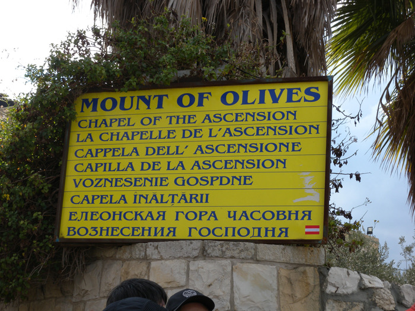
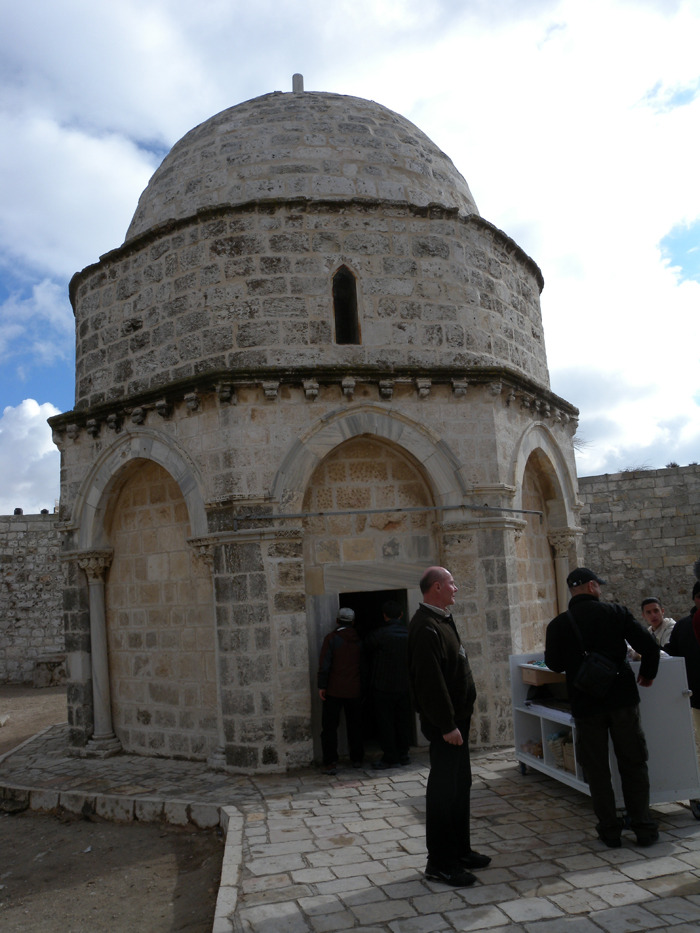
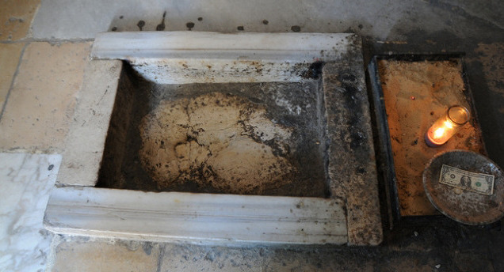
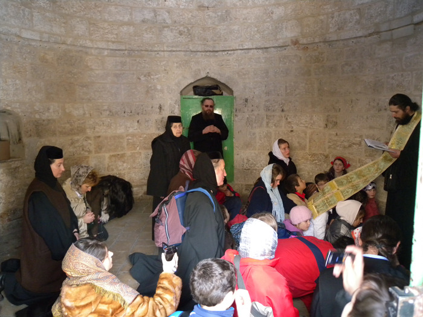
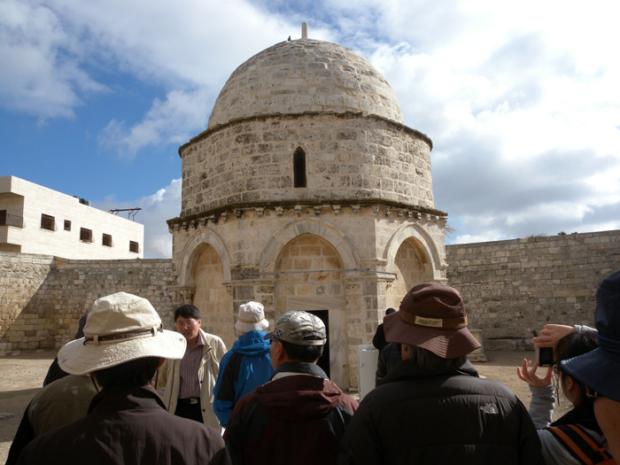
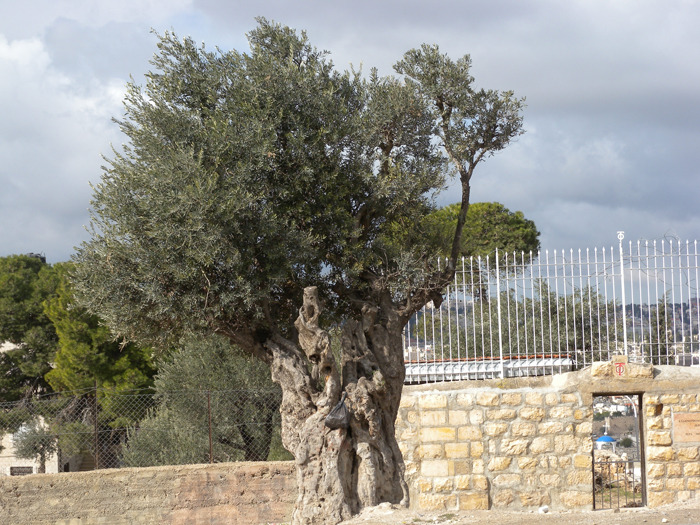
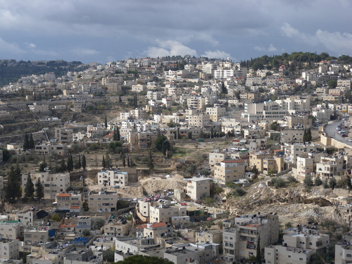
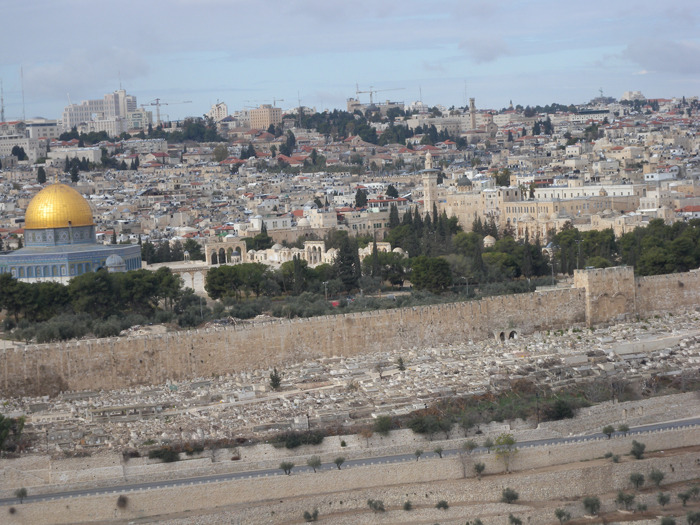
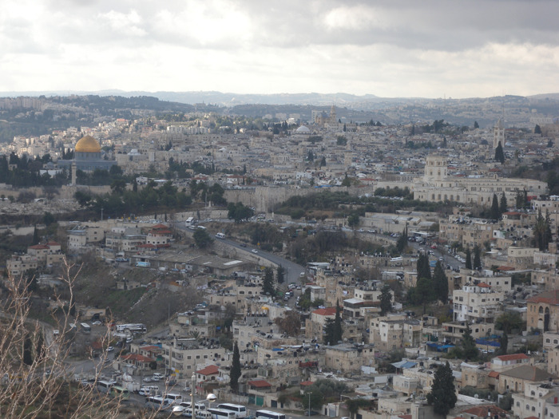
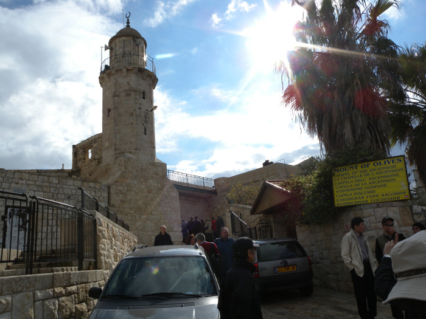

  <올리브산 예수승천교회 표지판>  
  

  <예수승천교회 모습>  
  

  <예수님이 밟고 승천하셨다는 돌>  
  

<교회 안에서 예배를 드리는 순례객들>  
  

 <승천교회 문 앞에서 설명을 듣고 있는 순례객들>  
  

  <교회 앞 길가에 서 있는 올리브 고목>  
     

  <승천교회에서 주기도문 교회 가는 도중에 만나는 계곡의 민가들>  
  

  <올리브산 쪽에서 예루살렘 성 방향으로 내려가며>  
  

  <올리브산에서 건너다 본 예루살렘 성 안과 밖의 풍경>   
   

  <승천교회 입구>  
  
  
이스라엘 제1신 : 올리브산, 그 초월과 극복의 공간  xml:namespace prefix = o ns = "urn:schemas-microsoft-com:office:office" /

2011년 1월 9일, 이스라엘에서의 첫날. 쌀쌀한 날씨 속에 올리브산을 찾았다. 전망산, 시온산[성전산]과 함께 기독교 상징의 극치를 보여주는 올리브산. 그 정상에 자그마한 성전[예수 승천교회]이 아랫마을들을 내려다보며 서 있었다. 예수님이 돌아가신 뒤 사흘 만에 부활하시고 승천하신 증거의 자리를 드디어 만나는 순간이었다.

“예수께서 그들을 데리고 베다니 앞까지 나가시어 손을 들어 그들에게 축복하시더니, 축복하실 때에 그들을 떠나 하늘로 올려지시니, 그들이 예수님께 경배하고 큰 기쁨으로 예루살렘에 돌아가 늘 성전에서 하나님을 찬송하니라.”<『누가복음』(24장 50~53절)>는 기록으로 나타난 곳. 바로 승천교회였다. 올리브 이파리들은 쌀랑한 바람에 흔들리고, 밀려드는 순례자들은 비좁은 교회 내부 한 복판의 돌에 연신 친구(親口)의 예를 행하고 있었다. 예수님이 승천하실 때 발을 디디셨다는 바위. 위쪽엔 이슬람 세력이 씌웠다는 둥근 돔이 하늘을 막았고, 돌 벽의 창틈으론 비둘기들이 들락거렸다. 문밖에는 아랍 청년으로 보이는 노점상이 순례자들의 눈치를 살피고 있고, 주변은 돌투성이의 황무지였다. 대체 예수님의 말씀이 저 척박한 돌들 사이에서 어떻게 싹을 틔우고 뿌리를 내려 세상 사람들을 불러 모으는지, 경이로운 일이었다. 검은 옷을 입은 정교회 사제가 순례에 나선 한 무리의 아이들을 이끌고 들어와 예배를 집전한다. 그의 무겁고 둔탁한 표정이 사방의 돌들에 햇살로 부서지는 성령을 받아들인 것인지, 자못 빛을 발하고 있었다.

교회 밖으로 나오니 늙은 올리브 나무가 한 그루 서 있고, 그 아래쪽과 건너편 예루살렘 성 밖은 온통 석관들이 할 말 많은 자신들의 존재를 과시하듯 열 지어 누워있었다. 지금까지 양지 바른 언덕에 누운 저 석관들의 수를 과연 헤아려본 자가 있었을까. 건네다 보이는 예루살렘의 성채는 말없이 세상을 안과 밖으로 나누고 서 있는데, 그 안과 밖은 말하자면 삶과 죽음의 공간이었다. 성 안은 산 사람들의 세계, 성 밖은 죽은 자들의 세계라고나 할까.

유독 황금사원이 두드러져 보였다. 지금은 이슬람 세력이 차지하여 무슬림 외에는 들어갈 수 없다는 그곳이 그들에겐 3대 성지 가운데 하나라고 한다. 그 황금빛이 너무 강렬하여 눈에 거슬리기는 하나, 어쨌든 성 안은 살아있는 생명의 공간이었다. 이승의 삶을 마감하면 분문(糞門)을 통해 양지 바른 성 밖의 공동묘지로 나아가 누운 채 부활과 영생을 기원하는 또 다른 삶을 시작하는 것이다. 그것은 우리네 서민들이 술 한 잔 거나해지면 부르는 노래 <성주풀이>의 또 다른 버전이었다. 고금을 통해 “낙양성 십리허에~ 높고 낮은 저 무덤에 영웅호걸이 몇몇이며 절세가인이 그 누구냐? 우리네 인생 한 번 가면 저기 저 모양 될 것이니 엘화 만수 엘화 대신이야!”라는 노래만큼 인생의 허무함에 대한 절절한 아우성이 또 있을까. 중국의 북망산(北邙山)은 낙양성에서 10리쯤 떨어진 곳에 있었다던가. 그러나 예루살렘의 경우는 성문을 열자마자 그곳이 바로 북망산이었다. 이곳 사람들도 이승에서의 삶을 마감하며 불가지(不可知)의 세계인 저승을 꺼렸으리라. 이왕이면 여럿이 함께 누워 두려움들을 덜어보려 했을까. 베이지색에 가까운 석관들은 햇살을 받아 빛나고 있었다. 제자들과 마지막 밤을 보내신 이곳 올리브산에서 그 모습을 건너다 보시고 예수님은 하염없이 눈물을 흘리셨으리라. 곧 무너질 예루살렘 성을 생각하시면서 눈물을 흘리셨다고는 하지만, 그보다 먼저 욕망의 삶에서 허우적대는, 어리석은 인간들에 대한 연민 때문이었을 것이다. 그 올리브산 정상에서 5~6분 걸어내려 간 자리에 눈물교회가 조용한 자태로 서 있었다. 제자들이 잠든 모습을 보시며 잠시 후 로마군에 체포될 자신의 운명을 예감하며 안타깝게 기도하던 바위. 그 위에 세워진 만국교회도 있었다. 한 치 앞을 내다보지 못하는 인간의 어리석음을 질타하신 유적들이 나그네의 마음을 처연하게 만들고 말았다.

세속의 권력에 죽음을 당하신 예수님이 부활을 통해 인간의 어리석음을 깨우치고 승천하신 공간에 그득하게 남아있는 실체는 과연 무엇인가. 바로 예수님이 보여주신 그 증거의 한 끝이나마 잡을세라 줄줄이 누운 시신들이었다는 것. 인간의 어리석음이 만발한 욕망과 허무, 그러나 끝내 초월과 극복의 기적으로 모습을 드러낸 승리의 현장이었다.

공유하기

게시글 관리

**백규서옥\_Blog ver.**