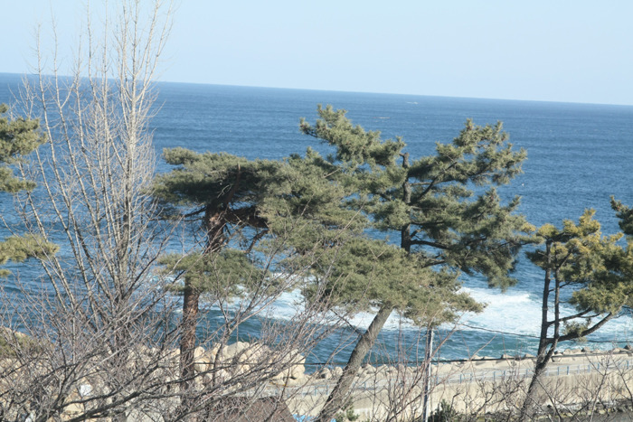

‘말씀의 힘’

‘작년에 왔던 각설이’ 올해 또 왔다고 낙산 비치호텔 앞 소나무는 꿍얼거릴 것이다. 작년처럼 올해도 어김없이 찾아온 낙산 비치호텔의 신앙수양회. 기독교 대학에 20년 넘게 봉직하며 매년 겨울 한 차례 ‘성령’의 폭포수에 몸을 담그곤 한다. 그러나 대부분 그 때 뿐이었다. 솔잎 사이로 맑은 바람 빠져 지나듯, 의미 없는 만남의 반복이었다. 습관처럼 차려지는 행사장에 돌덩어리처럼 앉아 있다 빠져 나오곤 하던 지난날들이었다. 정열이 활화산처럼 끓어올라 물불을 가리지 못할 때는 그나마 몰랐다. 쥐꼬리만한 지식과 팽팽해진 자의식이 오만의 근원임을 모르던 시절이었다. 그것으로 세상을 그럭저럭 살아갈 수 있으려니 믿고 지내던 무명(無明)의 시간대였다. 그러나 화살처럼 달려 나가는 시간의 가차 없이 차가운 결을 비로소 느끼게 된 지금. 내게 밀물처럼 찾아왔다가 아무 대답도 듣지 못한 채 내년을 기약하며 밀려가는 바닷물처럼 ‘말씀들’을 그냥 흘려보내지 말아야 한다는 깨달음이 생긴 것이다. 그간 독실한 신앙인들을 내심 ‘도그마에 붙들려 자의식을 잃은 한심한 영혼’으로 여겨오지는 않았는가. 옳건 그르건 자신의 신념을 지키기 위해 부귀영화와 목숨까지 바치는 사람들을 ‘융통성 없고 못 말리는 꼴통들’로 슬그머니 비하하며, 나 자신의 ‘중심 없음’을 ‘이념의 굴레에서 벗어난 지식인의 자유혼’ 쯤으로 합리화해온 것이나 아닌가.

xml:namespace prefix = o ns = "urn:schemas-microsoft-com:office:office" /

\*\*\*

예수님의 말씀과 생각을 자신의 말로 쉽게 풀어 우매한 내게 전해주려 애쓴 김지철 목사[소망교회 담임]의 ‘말씀’과 만났다. 그 ‘말씀’을 들으며, 어린 영혼들에게 무수한 말을 들려주며 살아 온 내 지난 세월이 파노라마처럼 돌아갔다. 김 목사는 이스라엘인들이 신봉하던 ‘말의 힘’이 바로 ‘하나님 말씀의 힘’이라 했다. 그 분이 지적한 말은 바로 생명을 담은 말이었다.

그런데 나는 그동안 말에 대하여 너무 부정적으로만 생각해온 것은 아닌가. 말로 밥을 먹고 살면서도 ‘묵언(黙言)’을 숭상해온 내 진심은 과연 어디에 있는 것일까. 말을 많이 한 날들은 밤새 잠들지 못했다. 허공에 날려버린 ‘한없이 가벼운’ 말들의 펄럭임 때문에 헤아릴 수 없는 불면(不眠)의 밤들을 보내야 했다. 어느 가수의 노래처럼 ‘어떻게 하면 말 안 하고’ 살 수 있을까를 화두로 몇 날을 보낸 적도 있었다. 그러나 습관처럼 아침밥을 먹으며 준비운동을 시작하고 강의실에 들어가서 준비된 입으로 무언가를 지껄이는 일상이 바로 내 생활이었다.

\*\*\*

문제는 진실성이었다. 예수님의 말씀이 사람들에게 영향을 미칠 수 있는 것은 그 분의 말과 행위가 일치되었기 때문이라고 김 목사는 강조했다. ‘말씀 없는 신비주의’나 ‘말씀 없는 도덕적 행동주의’는 신앙의 겸손을 앗아갈 수도 있다는 것, 바리새인들처럼 문자에 얽매여 지낸다면 말씀이 갖고 있는 생명력을 잃어버릴 수 있다는 것, 하나님 말씀의 능력을 회복받기 위해서 사람들은 주일마다 교회에 간다는 것 등등. 마치 들여다보고 있었다는 듯이 김 목사는 그간 말에 대하여 갖고 있던 내 콤플렉스를 체험적으로 풀어주시는 게 아닌가. 그 뿐 아니다. ‘말의 힘을 가장 크게 신뢰하는 사람들이 교수’라는 그 분의 말씀은 유일한 수단이면서도 말의 권능을 부인해오던 내게 충격이었다. ‘교수의 필수적인 능력은 요약하는 능력과 부연하는 능력’이라는 그 분의 말씀은 내게 큰 부끄러움을 안겨주었는데, 그 말 속에는 ‘교수들 능력이라 해봤자 요약하는 능력과 부연하는 능력 뿐’이라는 속뜻이 숨겨져 있기 때문일 것이다. “십계명은 크게 보아 요약인데, 그것을 또 요약하면 ’하나님의 사랑‘과 ’이웃사랑‘”이라는 김 목사의 설명이 자신의 말을 듣고 가졌을지도 모르는 교수들의 부끄러움을 약간 덜어준 효과가 있긴 했으나, 그래도 부끄러움은 가시지 않았다. 그래. 그간 내가 해온 일이라야 텍스트의 요약이나 이론의 부연 혹은 생명 없는 말의 전달밖에 더 있었겠는가. 그걸 반복하면서 지식사회의 일원이랍시고 오만에 젖어온 존재가 바로 나 아닌가. 남들이 토해 내는 ‘생명의 말씀들’을 귓전으로 들으며 ‘생명 없는 말의 허위’를 진실로 강변해온 것이나 아닌가.

\*\*\*

그동안 나는 말의 겉만을 보았지, 말 속에 살아 움직이는 생명을 보지 못하고 있었음을 비로소 깨달았다. ‘언어는 존재의 집으로서, 인간은 언어의 주택 속에 산다’는 하이데거(M. Heidegger)의 말조차도 그다지 절실하게 여겨오지 않던 나인지라, 목사님들이나 선생들이 목청껏 외쳐대는 ‘생명의 말씀들’을 그저 귓가에 스치는 바람결로 들어온 것이나 아니겠는가.

오늘 풍광 좋은 낙산의 해변에서 김목사님의 절절하신 말씀을 들으며 바람처럼 흘려보낸 내 풋풋했던 날들을 반추한다. 내 젊은 날의 오만을 조상(弔喪)하며... <2011. 2. 10.>

조규익(숭실대 교수)

공유하기

게시글 관리

**백규서옥\_Blog ver.**