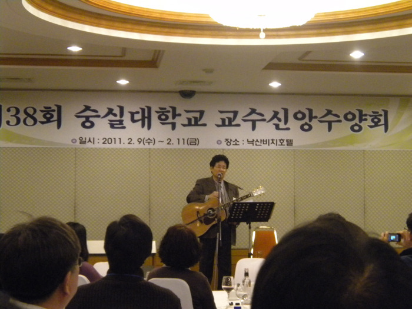

아, 윤형주!

xml:namespace prefix = o ns = "urn:schemas-microsoft-com:office:office" /

내 10대 중반에서 20대 초반에 걸쳐 있던 70년대는 온통 회색빛 시간대였다. 독재정치와 매판자본(買辦資本)에 의한 산업화가 우리 사회를 짓누르던 그 시절. 우울한 내 청춘에 따스한 햇살이 비집고 들어올 틈은 조금도 없었다. 그 때 윤형주, 송창식, 김세환, 조영남, 양희은, 박인희, 이장희 등이 동분서주하며 가난하던 내 심령을 토닥여주었다. 그들이야 삶의 방편으로 자신들이 좋아하던 노래를 열심히 불렀겠지만, 나는 그런 노래를 들으며 새로운 세상과 삶을 상상하곤 했다. 지금 가요계 아이돌들의 노래는 체험의 세계로부터 한 발짝도 못 나가지만, 당시 그들의 노래는 우리를 ‘꿈꾸게 하는’ 마력을 갖고 있었다.

그 때 윤형주는 젊은 여성들의 로망이었다. 당시 우리 인구가 3천만이라 했다. 그 중 반은 1500만의 여자, 그 중의 반에 해당하는 750만의 젊은 여성들은 모두 윤형주의 팬이었다. 전 인구의 4분지 1이 윤형주를 바라보며 가슴앓이를 하던 형국이었으니, 그로서 무엇 때문에 대통령을 부러워했으랴? 같은 남자로서 그의 여성적인 목소리를 그다지 좋아하지는 않았으나, <하얀 손수건>ㆍ<축제의 노래>ㆍ<웨딩 케익>ㆍ<슬픈 운명>ㆍ<비와 나>ㆍ<조개껍질 묶어>ㆍ<비의 나그네>ㆍ<두개의 작은 별>ㆍ<우리들의 이야기>ㆍ<바보>ㆍ<고백>ㆍ<사랑스런 그대>ㆍ<어제 내린 비> 등 무수한 히트곡들은 어쩌면 그리도 무딘 내 감성을 못 견디게 긁어대던지! 지금도 노래방에서 마이크를 잡으면 나는 어김없이 <어제 내린 비>를 첫 노래로 부른다. 부드러운 멜로디가 내 목을 가다듬는데 효과적일 뿐 아니라, 추적추적 내리는 봄비가 내 몸과 마음을 흠뻑 적셔주는 느낌이 들기 때문이다. 내 청춘의 일부를 지배해온 윤형주가 이 나이 먹도록 내 감성의 한 부분을 휘어잡고 있음을 새삼 확인하는 요즈음이다.

\*\*\*

그 윤형주를 낙산의 바닷가에서 처음으로 만났다. 간헐적으로나마 방송매체들을 통해 수십 년 간 만나온 그를 이번에는 바로 수m 앞에서 육성으로 만나게 되었다. 가수 아닌 장로의 직함을 갖고, 우리에게 달려온 그였다. 통기타를 멘 60대의 장로님. 그러나 그의 해맑은 얼굴과 음성은 젊은 시절 그대로였다. 청중석에 앉은 30대에서 60대까지의 교수들은 숨죽인 채 그의 일거수 일투족을 응시했다. 그가 1947년생이라니 올해로 만 64세. 나이로 치면 청중석의 원로교수들과 동렬이었지만, 청중들은 모두 40년 전인 20대로 돌아가 20대 청춘인 그의 손끝과 입술을 주목했다. 조분조분한 미성(美聲)으로 자신의 삶을 말하고, 간간이 노래를 섞었다. 열린 무대 위에서 ‘말과 노래’를 적절히 엮어가며 자신의 일생을 서사적으로 짜 나갔으니, 말하자면 그를 일러 현대판 ‘판소리’의 창자(唱者) 혹은 광대(廣大)라고나 할 수 있을까. 그렇게 그는 장시간 청중을 휘어잡는 마력을 발휘하는 것이었다.

무식했던 나는 그가 단순히 뛰어난 아티스트인줄만 알았다. 그러나 식민 상황 아래 북간도에서 시작된 그의 집안 내력을 듣는 순간, 갓난 윤형주를 안고 찬송가를 자장가처럼 들려주시던 그의 모친 이야기를 듣는 순간, 그가 이 시점에 어떻게 장로의 직함으로 많은 사람들에게 영혼의 위안을 제공하는 정신적 아티스트가 되었는지를 깨닫게 되었다. 그와 함께 사촌형 윤동주 시인이나 동경에서 시인과 함께 공부했다는 부친[중문학자 윤영춘 박사]의 사연을 듣고는 그의 서정적 감수성이 어디서 발원했는지 확인할 수 있었다. 함께 새로운 음악세계를 열어간 동료, 후배들과의 교분을 통해 그가 지닌 감성의 온도까지 느낄 수 있었다. 끈끈한 인간적 교분으로 마지막 가는 길을 찬송으로 배웅해드린 미당 서정주 시인을 언급하면서 반짝 보인 눈물이나 카네기 홀에서의 성공적인 가족 음악회를 언급하면서 살짝 보여준 달뜬 표정 등은 아름다운 목소리 저 너머에서 빛을 발하는 일종의 후광(後光)인 셈이었다.

압권은 자신이 발견한 절대자의 존재를 말할 때였다. 뜻하지 않게 얽혀 들어간 감옥에서 만난 하나님. 그러나 그건 태아시절부터 어머니로부터 받은 신앙의 힘이었음을 그는 힘주어 말하고 있었다. ‘물에 빠진 자가 스스로의 머리털을 잡아 올린다고 구원받을 수 없듯이 누군가가 나를 구원해 줄 때 비로소 구원받을 수 있다는 것, 스스로 간절하게 찾아야 구원자가 나타난다는 것, 간절하게 찾는 이웃들에게 도움을 주어야 한다는 것.’ 그의 나직하면서도 힘 있는 말들은 감미로운 선율과 함께 낙산의 해변에 밀려드는 동해바다 파도보다 훨씬 강하고 무겁게 내 마음을 적셨다. 내 청춘의 한 부분에 남아있던 아티스트 윤형주와의 첫 만남은 희미해진 내 마음 속 윤형주의 이미지를 새롭게 색칠해줄 것이다. 그리고 그 추억은 새롭게 한동안 이어질 것이다. <2011. 2. 10.>

조규익(숭실대 교수)

공유하기

게시글 관리

**백규서옥\_Blog ver.**