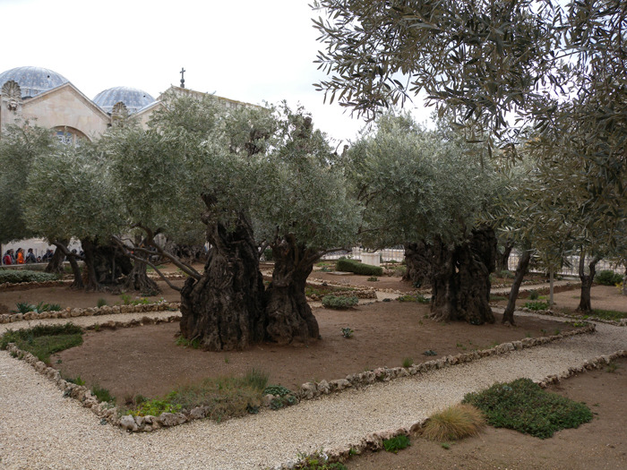
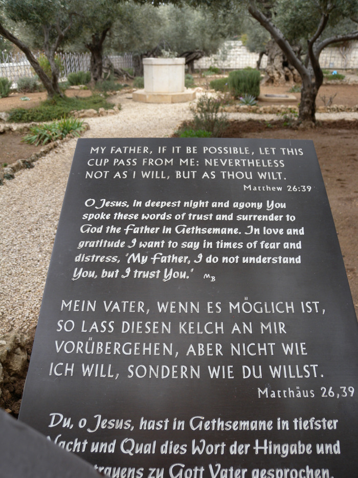
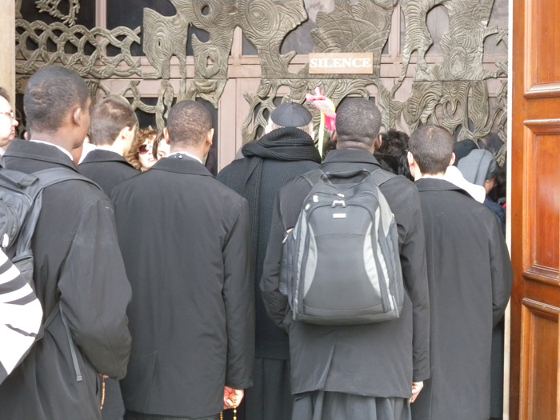
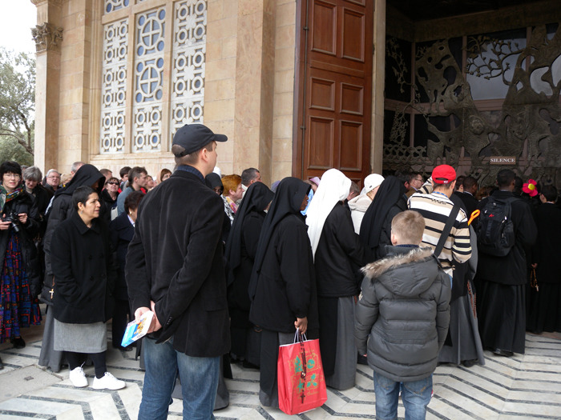
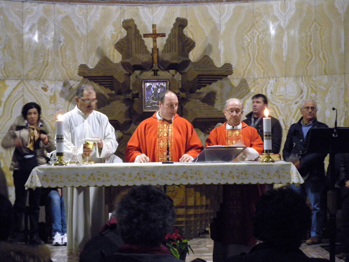

  
눈물교회에서 몇 분을 걸어 내려오자 올리브 고목들의 이파리가 삐져나온 담장이 보였는데, 그곳이 바로 어릴 적부터 귀에 박히도록 들어온 겟세마네(Gethsemane) 동산이란다. 올리브산 서쪽 기슭으로 프란체스코 수도사들이 4세기 경 기존의 교회 터에 세운 ‘만국교회’라는 이름의 라틴 교회가 서 있었다. 많은 순례객들이 밀물⋅썰물처럼 좁은 동산을 밀려 다녔고, 구멍이 숭숭 뚫린 올리브 고목들만 그 광경을 물끄러미 쳐다보고 있었다. 밀려드는 인파의 피부색은 다양했으나, 인간의 입장에서 참을 수 없는 배신의 고통을 이곳에서 겪은 예수님의 마음을 새겨보려는 듯 비장감 일색이었다. 겟세마네의 원래 뜻은 ‘기름 짜는 기계’란다. 수천 년을 견뎌낸 것처럼 보이는 올리브 나무들이 건재한 것으로 보아 아마도 그 옛날엔 이곳에 올리브 기름 짜던 기계가 설치되어 있었으리라. 어쩌면 지금보다 훨씬 많은 올리브 나무들이 빽빽하게 들어차 있었을 것이고, 그 가운데 몇 그루가 이곳 교회의 앞뜰에 살아남아 지나온 시간들을 증명하고 있는 듯 했다. 만국교회 문 앞에서 건너다보니 기드론 계곡이 손에 잡힐 듯 가까웠다. 겟세마네는 대략 길이 1.6㎞ 가량의 산마루로, 예루살렘 동부지역과 나란히 뻗어 있는 모습이 아름다웠다. 예수님이 십자가에 못 박혀 돌아가시기 전날 밤 최후의 만찬을 끝낸 뒤 제자들과 함께 고뇌의 기도를 드렸고, 제자인 유다의 배신으로 로마 군인들에게 잡힌 곳이 바로 이곳 겟세마네다.

인파에 밀려들어간 교회 안에서는 라틴 교회 성직자들이 예배를 집전하고 있었고, 많은 순례객들이 참여하고 있었다. 예수님의 수난이 시작된 이곳에서 세계 곳곳으로부터 찾아온 순례객들과 함께 예수님의 마음을 헤아려 보는 순간이었다. 인간이 경험하는 고통은 찰나이지만, 그 고통이 남긴 교훈은 영원함을 비로소 깨닫게 된다. 그 깨달음의 순간 올리브 고목들 사이에 누워있는 석판의 성경 구절[마태복음 26:39]은 그대로 내 마음에 메아리로 울려왔다.

xml:namespace prefix = o ns = "urn:schemas-microsoft-com:office:office" /

"그 때에 예수께서 제자들에게 이르시되 오늘밤에 너희가 다 나를 버리리라 기록된 바 내가 목자를 치리니 양의 떼가 흩어지리라 하였느니라<마태복음 26:31> 그러나 내가 살아난 후에 너희보다 먼저 갈릴리로 가리라<32절> 베드로가 대답하여 이르되 모두 주를 버릴지라도 나는 결코 버리지 않겠나이다<33절> 예수께서 이르시되 내가 진실로 네게 이르노니 오늘 밤 닭 울기 전에 네가 세 번 나를 부인하리라<34절> 베드로가 이르되 내가 주와 함께 죽을지언정 주를 부인하지 않겠나이다 하고 모든 제자도 그와 같이 말하니라<35절> 이에 예수께서 제자들과 함께 겟세마네라 하는 곳에 이르러 제자들에게 이르시되 내가 저기 가서 기도할 동안에 너희는 여기 앉아 있으라 하시고<36절> 베드로와 세베대의 두 아들을 데리고 가실새 고민하고 슬퍼하사<37절>이에 말씀하시되 내 마음이 매우 고민하여 죽게 되었으니 너희는 여기 머물러 나와 함께 깨어 있으라 하시고<38절> 조금 나아가사 얼굴을 땅에 대시고 엎드려 기도하여 이르시되 내 아버지여 만일 할 만하시거든 이 잔을 내게서 지나가게 하옵소서. 그러나 나의 원대로 마옵시고 아버지의 원대로 하옵소서 하시고<39절> 제자들에게 오사 그 자는 것을 보시고 베드로에게 말씀하시되 너희가 나와 함께 한 시간도 이렇게 깨어 있을 수 없더냐<40절> 시험에 들지 않게 깨어 기도하라. 마음에는 원이로되 육신이 약하도다 하시고<41> 다시 두 번째 나아가 기도하여 이르시되 내 아버지여 만일 내가 마시지 않고는 이 잔이 내게서 지나갈 수 없거든 아버지의 원대로 되기를 원하나이다 하시고<42절> 다시 오사 보신즉 그들이 자니 이는 그들의 눈이 피곤함일러라<43절> 또 그들을 두시고 나아가 세 번 째 같은 말씀으로 기도하신 후<44절> 이에 제자들에게 오사 이르시되 이제는 자고 쉬라 보라 때가 가까이 왔으니 인자가 죄인의 손에 팔리느니라<45절> 일어나라 함께 가자 보라 나를 파는 자가 가까이 왔느니라<46절> 말씀하실 때에 열둘 중의 하나인 유다가 왔는데 대제사장들과 백성의 장로들에게서 파송된 큰 무리가 칼과 몽치를 가지고 그와 함께 하였더라<47절> 예수를 파는 자가 그들에게 군호를짜 이르되 내가 입맞추는 자가 그이니 그를 잡으라 한지라<48절> 곧 예수께 나아와 랍비여 안녕하시옵니까 하고 입을 맞추니<49절> 예수께서 이르시되 친구여 네가 무엇을 하려고 왔는지 행하라 하신대 이에 그들이 나아와 예수께 손을 대어 잡는지라<50절> 예수와 함께 있던 자 중의 하나가 손을 펴 칼을 빼어 대제사장의 종을 쳐 그 귀를 떨어뜨리니<51절> 이에 예수께서 이르시되 네 칼을 도로 칼집에 꽂으라 칼을 가지는 자는 다 칼로 망하느니라<52절> 너는 내가 내 아버지께 구하여 지금 열두 군단 더 되는 천사를 보내시게 할 수 없는 줄로 아느냐<53절> 내가 만일 그렇게 하면 이런 일이 있으리라 한 성경이 어떻게 이루어지겠느냐 하시더라<54절> 그 때에 예수께서 무리에게 말씀하시되 너희가 강도를 잡는 것 같이 칼과 몽치를 가지고 나를 잡으러 나왔느냐 내가 날마다 성전에 앉아 가르쳤으되 너희가 나를 잡지 아니하였도다<55절> 그러나 이렇게 된 것은 다 선지자들의 글을 이루려 함이니라 하시더라 이에 제자들이 다 예수를 버리고 도망하니라<56절>"

예수님은 제자들의 행동을 통해 인간의 사악함과 나약함을 보여주려 하신 것일까. 눈물교회로부터 겟세마네에 이르는 동안 ‘깨어 있으라’시던 예수님의 당부를 지키지 못한 베드로의 ‘졸음터’를 보았다. 뜻하지 않게 배신을 하고, 또 배신을 당하면서 삶을 이어가는 우리네 세상살이를 이처럼 극적으로 보여주는 말씀과 장소가 또 어디에 있단 말인가. ‘이 잔을 내게서 지나가게 해 달라’는 간구야말로 배신을 통해 죄인들의 손에 목숨을 내어주어야 하는 굴욕의 비참함을 면하고자 한 ‘예수님 최후의 인간적 고백’이 아니었던가. 그러나 그런 수모를 피할 수 없음이 ‘섭리’에 의해 예정되어 있음을 예수님은 이미 알고 계셨던 것이다. 그 극적인 장소가 바로 겟세마네였다. 겟세마네의 수모를 거쳐 도달하게 된 빌라도 법정의 또 다른 수모는 예수님의 성성(聖性)을 구현하기 위해 예정된 통과제의, 아니 희생제의였던 것이다. 만국교회의 순례객들과 올리브 고목들의 눈물겨운 조화는 예수님께서 2천년 전에 마련하신 겟세마네의 아름다운 메타포였다. 나는 겟세마네에서 예수님이 걸으신 수난의 발자취, 그 출발선을 드디어 발견하고야 말았다.

  \*사진 위로부터  1. 겟세마네 동산의 올리브 나무들,  2. 올리브 나무 사이에 있는 석판[마태복음 26장 39절], 3 4. 순례객들, 5. 예배를 집전하고 있는 사제들

공유하기

게시글 관리

**백규서옥\_Blog ver.**