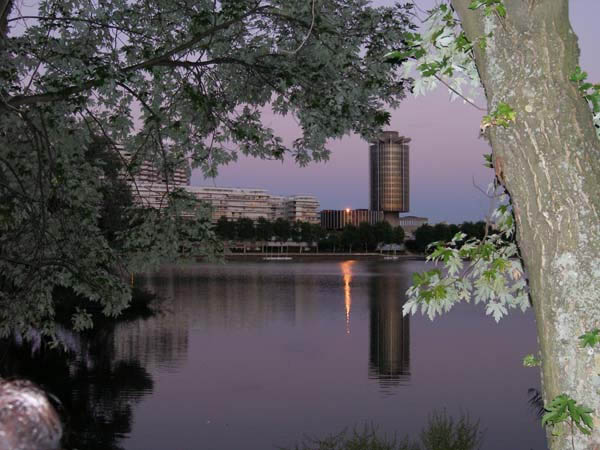
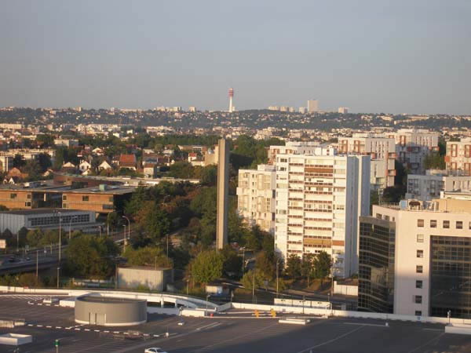

선입견과 감동의 착종(錯綜)(프랑스1신)  
  
             [1] 도착  
  

  
  
9월 2일. 이곳 시각 오후 3시50분에 도착, 5시 넘어 빠져나온 샤를 드골 공항은 비교적 한산했다. 밖엔 따가운 늦여름 혹은 초가을의 햇살이 우리를 반겼고. 파리 근교 끄레뗄(Creteil)의 숙소로 가는 길, 멀지 않은 길을 한 시간 넘게 달렸다. 그리 낯설지 않은 ‘교통체증’ 때문이었다. 거리를 가득 메운 소형차들, 그리고 그들의 사이를 요리조리 뚫고 달리는 오토바이족들이 우리를 깜짝깜짝 놀라게 했다. 달리는 자동차들의 차창을 통해 프랑스인들의 다혈질이 뿜어져 나왔다.   
파리의 전주곡(前奏曲)이라고나 할까. 끄레뗄은 아름다운 도시였다. 16층 아파트 발코니에서 바라다 보이는 ‘일망무제(一望無際)’의 평원. 그 위로 아름답게 디자인된 건물들이 늘어서 있고, 그 너머로 해가 지고 있었다. 아파트 아래쪽엔 호수가 펼쳐져 있고, 형형색색의 꽃밭과 무성한 나무숲이 그 호수를 두르고 있었다. 그 사이로 달리는 사람들, 산책하는 사람들, 풀밭에 누워 책을 읽거나 담소하는 사람들. 자연과 조화를 이룬 인공이 눈부시게 아름다웠다.   
  
  
2005. 9. 2. 밤  
  
백규  
  

  
  
  
         \*위의 사진은 우리가 지금 묵고 있는 숙소와 주변의 호수 사진입니다. 어두운 색깔 건물 바로 왼쪽이 제가 묵고 있는 숙소이지요. 그리고 아래 사진은 그 숙소 창밖으로 내다 보이는 끄레뗄 시내 모습입니다.

공유하기

게시글 관리

**백규서옥\_Blog ver.**