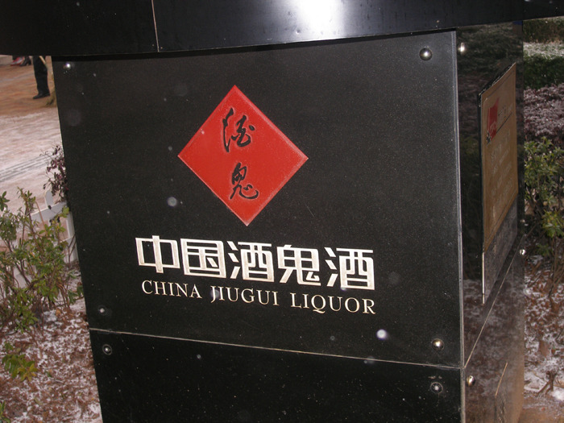
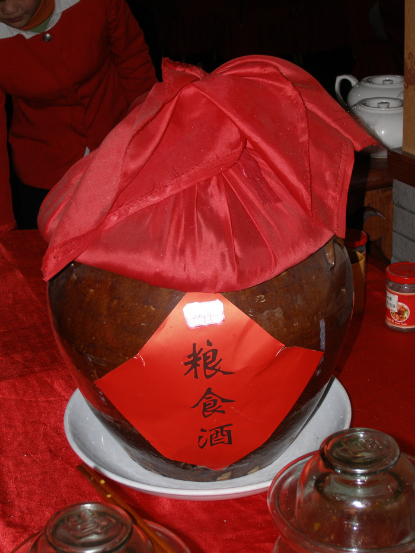

                      <중국 호남성 장사시의 거리에서 만난 술(酒鬼酒) 기념 표지석>              
  

                                     <중국 호남성의 한 식당에서 맛본 술>  
  
  
  
한국인이 본 중국의 술 문화  
  
                                                                                                                                                       조규익  
  
내가 중국에 첫발을 디딘 것은 1995년,  연변대학의 학술발표대회 자리였다. 발표가 끝나 점심식사 자리에 가니 푸짐한 음식이 차려 져 있었고, 자리에 앉자 맥주 잔 반 정도가 채 안 되는 크기의 술잔이 돌았다. 말로만 듣던 중국의 음식과 술이었다. 당시 좌장(座長)이던 권철 교수가 술을 따랐고, 좌중의 참석자들은 권 교수의 선창(先唱)에 따라 ‘깐뻬이(干杯)!’를 화답(和答)하며 잔을 비웠다. 나 역시 그에 따랐고, 잔을 내려놓기 무섭게 술이 채워졌다. 그곳의 주도(酒道)가 그러려니 하면서 주는 대로 벌컥벌컥 마셔댔다. ‘까짓것 중국술이라 해도 별 수 있겠나?’ 라는 배짱이 발동(發動)한 것일까. 소주 두 병 정도의 평소 주량과 젊음에 대한 과신(過信), 그리고 술에서 중국인들에게 지고 싶지 않다는 미련한 오기(傲氣) 때문이었을 것이다. 넉 잔까지는 아무 기별도 없었다. 그러나 다섯 잔 째 들어가니 기분이 좋아지기 시작했고, 여덟 잔쯤 들어가자 눈앞에 이상한 물체들이 보이기 시작했다. 열 잔이 들어가자 옆 사람들의 동작이 어항 속의 물고기들처럼 슬로우모션(slow motion)으로 보였고, 열두 잔 째 드디어 필름이 끊어지고 말았다. 다음 날 호텔에서 간신히 일어나 위문 차 찾아온 중국의 교수에게 ‘어제 그 술 몇 도 쯤이나 되우?’ 하고 묻자, 그는 아무렇지도 않게 ‘58도!’란다. 나는 깜짝 놀라고 말았다. 25도짜리 한국 소주 두 병 정도의 주량인 내가 58도짜리 중국술을 벌컥벌컥 마셔 댔다니! 함께 독한 술을 마시고도 취하지 않은 중국 사람들을 생각하면서 나의 미련한 호기(豪氣)가 심히 부끄러워졌다. 그렇게 중국의 술을 만났고, 그 후 지금까지 중국을 방문할 때마다 중국술에 대한 집착을 버리지 못해 곤경을 치르곤 한다.  
  
백주(白酒), 모태(茅台), 오량액(五粮液), 죽엽청(竹葉靑), 수정방(水井坊), 이과두(二锅头), 공부가주(孔府家酒), 고량주(高梁酒), 검남춘(劍南春), 서봉주(西凤酒), 노주노교(泸州老窖) 등 진짜인지 짝퉁인지 알 수는 없으나, 4천여에 달한다는 중국 술 가운데 마셔본 것만 10여종이 넘는다. 그런데 이런 중국술들은 반드시 기름 진 중국의 음식과 함께 해야 제대로 된 맛을 느낄 수 있다는 점이다. 중국의 반주(飯酒)문화도 여기서 나왔을 것이다. 밥상에는 대부분 술이 따른다. 그런데 중국의 술들은 대부분 알코올의 도수(度數)가 높아, 기본적으로 한국의 주당(酒黨)들은 중국의 주당들을 이길 수 없다. 중국 내에서도 북방 사람들이 남방 사람들에 비해 훨씬 독한 술을 다량으로 즐겨 마시는 것 같다.  
  
그런데 이러한 중국의 술 문화는  역사가 길다. 고대로부터 중국의 각종 문헌이나 문학, 예술 등에 남아 있는 술의 자취들은 헤아릴 수 없이 많다. 도연명(陶淵明)⋅이백(李白)⋅백거이(白居易)⋅소동파(蘇東坡)⋅이하(李賀) 등의 시인, 죽림칠현(竹林七賢) 중의 주호(酒豪) 유령(劉伶), 문인(文人)이자 정치가(政治家) 구양수(歐陽脩) 등은 자타가 공인하던 고금(古今)의 술꾼들이었다. 이 가운데 이하(李賀)의 <장진주(將進酒)>, 이백(李白)의 <월하독작(月下獨酌)>, 유령(劉伶)의 <주덕송(酒德頌)> 등은 중국인들의 술 문화를 극명하게 보여준다. 이하의 <장진주>를 살펴보자.   
  
  <前略>               <전략>  
況是靑春日將暮     하물며 청춘의 하루가 장차 저물려 하는데  
桃花亂落如紅雨     복사꽃 어지러이 떨어져 붉은 비 내리는 듯  
勸君終日酩酊醉     그대에게 권하노니, 종일토록 얼큰히 취하게나  
酒不到劉伶墳上土   술이란 무덤 위의 흙까지 따라가는 게 아닐 것이니.   
<將進酒>의 뒷 부분-  
  
덧없는 인생에 대한 허무감과, 술에 기대어 이를 극복하고자 하는 소망(素望)이 이 시에는 나타나 있다. 시 속의 화자(話者)가 잔을 건네는 상대는 아마도 자신처럼 젊은 친구일 것이다. 복사꽃 어지러이 붉은 비처럼 떨어지듯 자신들의 청춘도 곧 지나갈 것이니 얼마나 허무하냐는 것이다. 그래서 하루 내내 취하도록 술을 권한다고 했다. 유령(劉伶)처럼 술을 좋아하던 인간도 죽은 뒤엔 다시 술을 마시지 못하니, 죽기 전에 마음껏 마시자는 말이다. 27세의 젊은 나이로 죽은 이하(李賀)였다. 열매 맺지 못하고 져버린 복사꽃처럼 아름다운 나이에 죽은 이하는 어린 나이에 인생의 무상을 느낄 만큼 그는 감성적으로 출중했을 것이다.   
이백의 <월하독작(月下獨酌)>은 또 다른 차원에서 중국인들의 술 문화를 보여준다.   
  
花間一壺酒   꽃 사이에 한 병 술을 놓고  
獨酌無相親   홀로 잔질하니 서로 권할 친구가 없네  
擧杯邀明月   잔 들어 밝은 달 바라보니  
對影成三人   그림자를 대하니 도합 세 사람이 되었구나  
-<월하독작>의 첫 부분-  
  
술은 권해야 맛이고, 술잔을 주고받는 사이에 좋은 인간관계는 형성된다. 중국인들은 상대방에게 술 권하기를 즐겨하고, 오고 가는 술잔을 통해 좋은 벗이 생긴다는 믿음을 갖고 있는 것 같다. 그러나 이 작품에는 잔을 건넬 벗이 없는 외로운 상황이 그려져 있다. 꽃 사이에 한 병의 술을 놓고 홀로 술을 마신다는 것이다. 대체로 서양 사람들은 혼자 술을 마시는 경우도 적지 않다. 그러나 중국이나 한국 사람들은 거의 대부분 여럿이 함께 마신다. 그래서 시 속의 화자는 궁여지책(窮餘之策)으로 밝은 달을 벗으로 끌어들인다. 그런데 달이 자신을 비추어 땅 위에 그림자까지 만들었다.  그래서 자신과 달, 그리고 자신의 그림자 등 ‘세 사람의 벗’이 생겨난 것이다. ‘그림자도 마주하여 세 사람이 되었구나!’라는 부분에는 시인의 행복감이 표출되고 있다. 중국 사람들이 술자리에서 얼마나 함께 마실 벗을 중시해왔는지를 잘 보여주는 시작품이다. 이하(李賀)도 이백(李白)도 두주불사(斗酒不辭)의 주호(酒豪)들이었다. 또한 그들은 일세(一世)를 울리던 시인들이었으므로, 인생에서 갖게 되는 허무감을 적절하게 표현할 수 있었을 것이다. 두 사람은 평균적인 중국인들이 갖고 있던 허무감이나 술과 벗에 대한 사랑을 적절히 배합하여 절묘하게 표현한 셈이다.   
  
중국문화가 세계로 확산되면서 중국의 술 문화 또한 세계인들을 매료시킬 것이다. 술은 벗과 함께 마셔야 한다는 관습도 세계인들을 움직일 것이다. 자, 중국의 주당(酒黨)들과 그들의 멋진 술 문화를 위해 ‘깐뻬이!’.  
  
  
一个韩国人眼中的中国酒文化  
文/曹圭益  
  
我第一次踏上中国国土是在1995年，当时是参加延边大学的学术研讨会。  
那天，学术会结束后，我跟中方教授们共进了午餐。就座后，一盘盘丰盛的菜肴摆满桌子，一个个比啤酒杯的一半还稍小一点的白酒酒杯摆了一圈，这大概就是传闻中的中国酒桌了。当时由担当主陪的权哲教授倒酒后，只见其他参宴者随和着权教授，齐喊“干杯”之后，很爽快地干掉了杯中酒，我当然也不例外地跟着干了。可没等酒杯落桌，空杯又被斟满。或许这是当地的酒道吧！心里这样想着，我也就一杯接一杯地喝着。“中国酒也不过如此嘛？”不知道是酒多壮胆后口出狂言，还是对平日两瓶烧酒的酒量和自己的年轻过于相信，总之是缘于那份不想在酒桌上输给中国人的傲气才冒出这么个想法。4杯下肚后还没什么感觉，到第五杯时已经开始有点飘飘然，到了第八杯，眼前就开始出现奇异景象，第十杯喝下去，身边的人就像鱼缸中游来游去的鱼儿，上演着各种各样的慢动作，而第十二杯时，脑海中记忆的胶卷已经中断了……第二天艰难起床后才发现，自己不知道什么时候被送到入住的酒店。当向前来问候的中国教授打听“昨天的酒有多少度”时，他不以为然地答道：“58度！”我着实一惊。要知道，当时我的酒量是25度的韩国烧酒两瓶，竟然畅饮58度的中国白酒！我自己都不敢相信。回想前晚一起痛饮烈酒而不醉的那几位中国人，我那愚蠢的豪气顿时变成一种羞愧。  
我跟中国酒就是这样相识的，直到今天，每次访问中国，都无法摆脱对它的那份执着，以致时常陷入困境。  
在中国4000多种白酒中，我仅喝过茅台、五粮液、竹叶青、水井坊、二锅头、孔府家酒、高粱酒、剑南春、西凤酒、泸州老窖等十几种。不过我总结出一点：中国酒一定要配油腻的中国菜，那样才能喝出味道。中国的饮酒文化也是从这里开始的：饭桌出现的地方，差不多都会有酒。但是中国酒大部分度数很高，尤其是北方地区，相比南方，酒精度数更高。所以，一般韩国“酒党”（能喝酒的人）难以胜过中国“酒党”。  
中国酒文化历史悠久，从古代流传下来的诸多文献、文学和艺术中都留有酒的痕迹。陶渊明、李白、白居易、李贺、苏东坡等诗人，竹林七贤之一的酒豪刘伶，既是文人又是政治家的欧阳修等，都是古今公认的“酒鬼”。其中，李贺的《将进酒》、李白的《月下独酌》、刘伶的《酒德颂》等更是把中国人的酒文化表现得淋漓尽致。先让我们来欣赏一下李贺的《将进酒》。  
“……况是青春日将暮，桃花乱落如红雨。劝君终日酩酊醉，酒不到刘伶坟上土。”  
诗人对如同白驹过隙一样短暂人生的空虚感和试图以酒消愁的心理，从诗中自然地流露出来。看到桃花像红雨一般无序地散落下来，联想到自己的青春亦将匆匆流逝，该有多么空虚？诗中主人劝酒的对象或许是跟诗人一样年轻的朋友，所以“终日”“劝君”，直到“酩酊醉”。即使像刘伶一样喜欢酒的人，死后不也是不能再喝。所以诗人劝道人们生前一定要尽情畅饮。这就是27岁年纪就离开人世的李贺。就像还没来得及结果就凋谢的桃花，在最美好的年纪便结束了人生，由此可见，李贺对人生的无常已经看得非常透彻。  
而李白的《月下独酌》却是中国人酒文化表达出的另一番景象。  
“花间一壶酒，独酌无相亲。举杯邀明月，对影成三人……”  
酒要敬才有情调，觥筹交错间，就结成了良好的人际关系。中国人喜欢敬酒文化，他们相信在酒盏的你来我往之中，能交成好朋友。但是，在这首诗中，诗人没有可敬酒的对象，只好孤独一人，在花丛中自斟自饮。其实，西方人独自饮酒的情形不在少数，但是中国人和韩国人大都喜欢与他人共饮。所以，诗人百般无奈之下，只好邀天上的明月和月光下自己的身影做酒友，如此一来，三“人”同饮，诗人的幸福感便从字里行间情不自禁地表露出来。由此可见，中国人十分重视酒桌上一起喝酒的酒友。  
李贺也好，李白也罢，不仅是“斗酒不辞”的酒豪，还是名噪一时的大诗人。因此，他们能把大部分中国人都会感到的空虚与对酒和酒友的热爱恰当地结合在一起，通过诗句，把人生中的空虚巧妙地表达出来。  
中国文化在不断向世界传播的过程中，中国酒文化也錚醉着地球人。而酒要和朋友一起分享的习惯也逐渐受到世界各国人的认可。让我们为中国的“酒党”和精彩的中国酒文化“干杯！”  
  
（本文作者：文学博士、崇实大学国语国文系教授、人文大学学长、韩国文艺研究所所长）

공유하기

게시글 관리

**백규서옥\_Blog ver.**