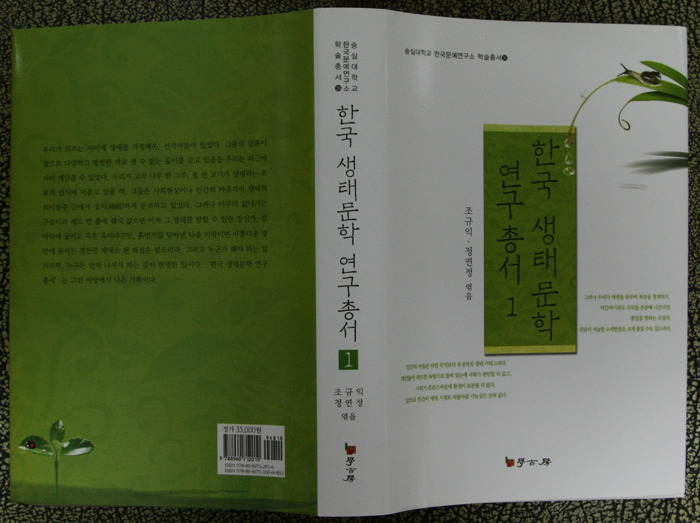

  
  
소개문  
  

‘생태담론’이 21세기의 대표적인 화두로 떠오르긴 했지만, 아직 실천적 담론으로까지 확대되지는 못한 실정이다. 이러한 상황에서 현대인에게 절실한 것은 생태주의에 대한 인식의 전환과 내면화 과정이다.

시대 상황의 반영과 진단이 문학의 중요한 역할이며 책임인데, 생태문학이라고 예외일 수는 없다. 최근 한국의 생태 문학은 세계 생태문학사의 전개와 발맞추어 당대의 시대적 요청에 부응하는 성과를 산출해가고 있다. 그러나 여타의 분야들에 비해 한국 생태 문학에 관련한 연구들은 제대로 정리되지 못하고 있는 것이 문제적 현실이다. 작금의 생태계 위기 시대에 생태 문학에 대한 관심을 증폭시키는 데 한계를 지니고 있는 것도 그 때문이다.

이런 현실인식을 바탕으로 숭실대학교 한국문예연구소에서는 그동안 여기저기 흩어져 있는 생태문학에 대한 학술연구를 한자리에 모아『생태문학연구총서』를 기획⋅발간하고자 하며, 그 첫 결실로 1권을 펴낸다. 1권에는 생태문학에 대한 일반론부터 한국전통생태사상과 작가작품론, 한국현대생태시 작가작품론, 한국현대생태소설 작가작품론, 해외생태시 작가작품론, 해외생태소설 작가작품론까지 모든 생태문학연구의 대표적인 업적들을 실었다.

이 총서가 완간될 경우 향후 생태문학 연구자들에게 적지 않은 편의를 제공할 뿐만 아니라 학제 간의 융합 연구에도 많은 도움이 될 것이다. 연구자들의 편의를 위하여 지면상 싣지 못한 필자들의 생태문학 관련 여타 논문들의 서지사항과 생태문학에 관한 저서들을 밝혀 연구자들로 하여금 이 총서를 통하여 해당 자료를 쉽게 확보할 수 있도록 하였다. 관심 있는 학자들과 교양인들의 일독을 권한다.

조규익⋅정연정 엮음,

공유하기

게시글 관리

**백규서옥\_Blog ver.**