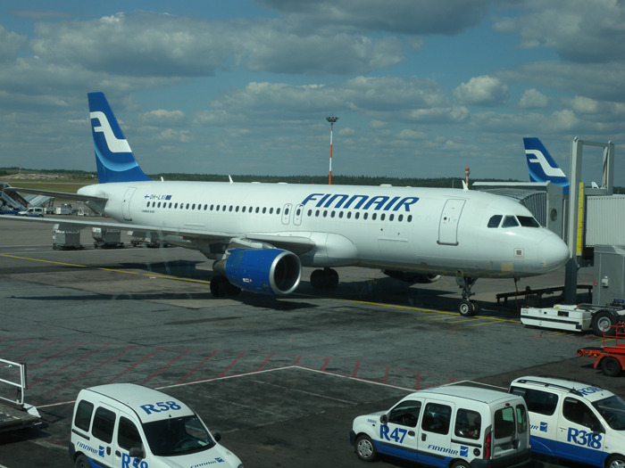
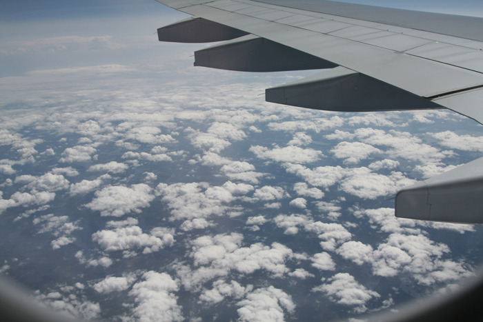
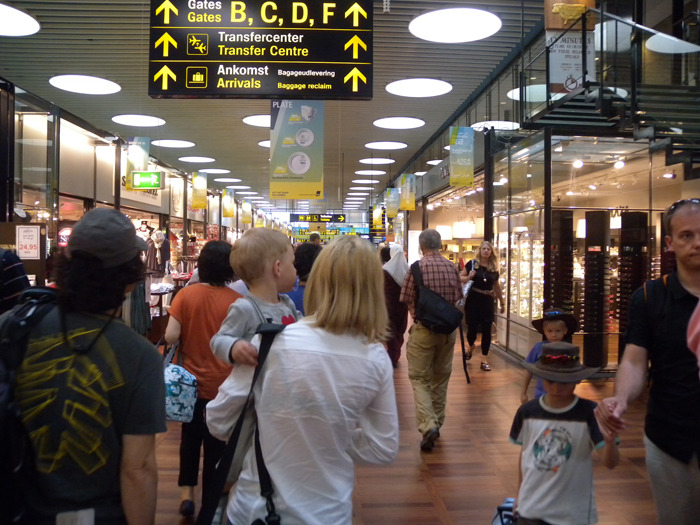
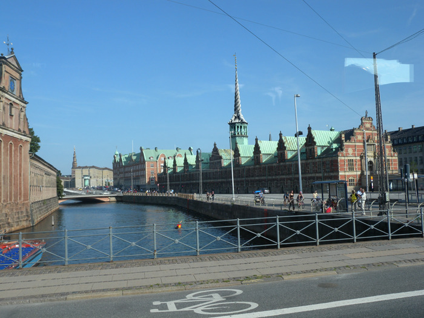

내게 북유럽은 늘 낯설고 먼 곳이었다. 깔끔하게 디자인된 도시들과 조화를 이룬 전통, 비싸게 유지되는 맑은 공기와 자연, 복지를 떠받치는 경제, 늘 모자라는 햇볕 등등. 참으로 존경스러우면서도 섣불리 다가가기 어려운 면모들을 고루 갖춘 곳. 스칸디나비아 반도 [Scandinavian Peninsula]를 간다.

중국과 러시아를 거쳐 발트해를 건너는 9시간여의 비행 끝에 헬싱키 공항에 잠시 머물렀고, 다시 1시간여의 비행 끝에 도착한 코펜하겐. 유럽 북서쪽 끝의 발트 해를 낀 스칸디나비아 반도는 북쪽의 러시아와 핀란드를 기점으로 남쪽의 덴마크까지 인상적인 모양으로 누워 있는 지역이다. 스칸디나비아 산맥을 기준으로 서쪽에 노르웨이, 동쪽에 스웨덴이 있는 곳. 우리가 도착한 미항(美港) 코펜하겐은 반도 최남단의 거점이다. 현대와 전통이 적절하게 어우러진 시가지 곳곳, 질펀하게 흐르는 도시의 운하들에선 안데르센의 숨결이 느껴진다. 생수 한 병에 17크로네[1크로네는 대략 우리 돈으로 200원]나 하는 살인적인(?) 물가가 조용한 시가지의 이면에 꿈틀대는 현실로 다가왔지만, 안데르센의 동화적 세계를 품고 있는 그들이기에 그런 엄혹한 현실 또한 극복해 나올 수 있었던 것은 아닐지.

내일부터 그 숨결을 느껴볼 것이다. 수난과 영광의 역사를 직조(織造)해나온 그들 역사의 저력은 어디에 있는 것인지. 문학과 예술, 그리고 산업의 조화를 통해 삶의 질을 관리해 나온 그들의 지혜는 과연 어디로부터 나온 것인지. 풍족한 삶을 바탕으로 한 자기절제의 정신적 근원은 무엇인지 등을 스칸디나비아의 곳곳에 남아있는 물질적 증거들로부터 찾아볼 것이다. <2011. 7. 7.>

공유하기

게시글 관리

**백규서옥\_Blog ver.**