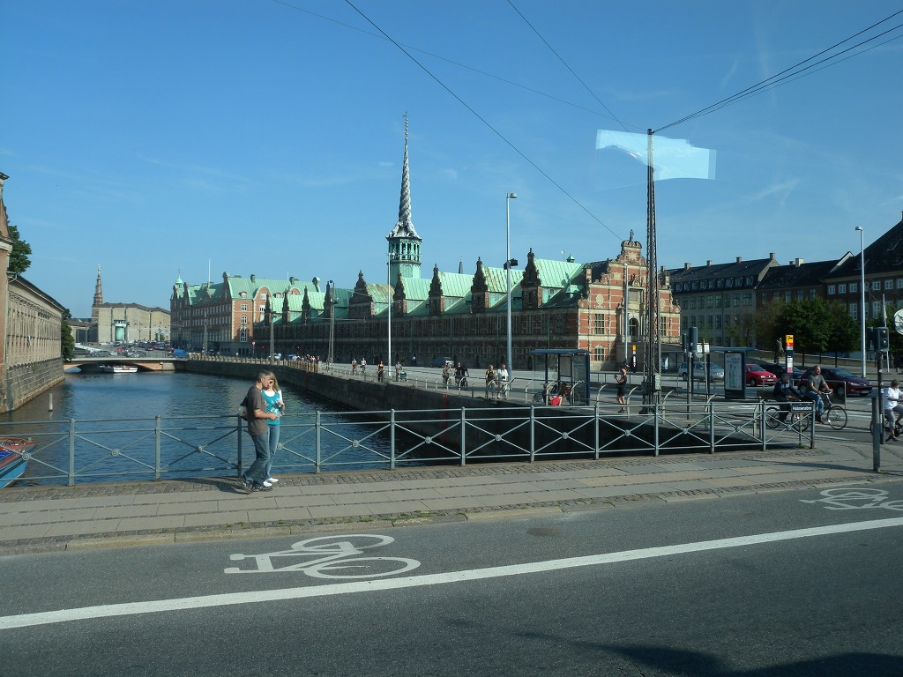

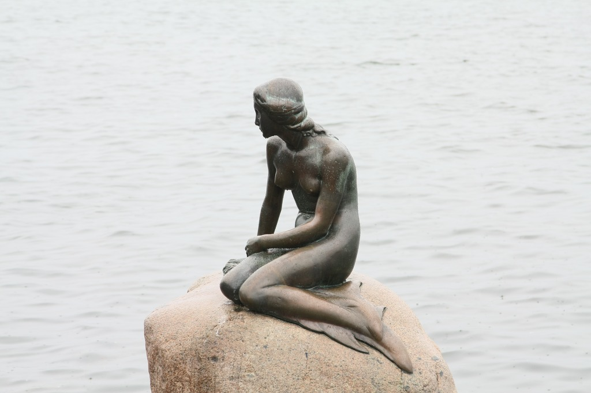

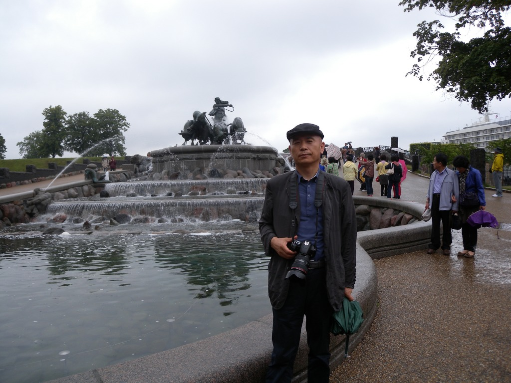

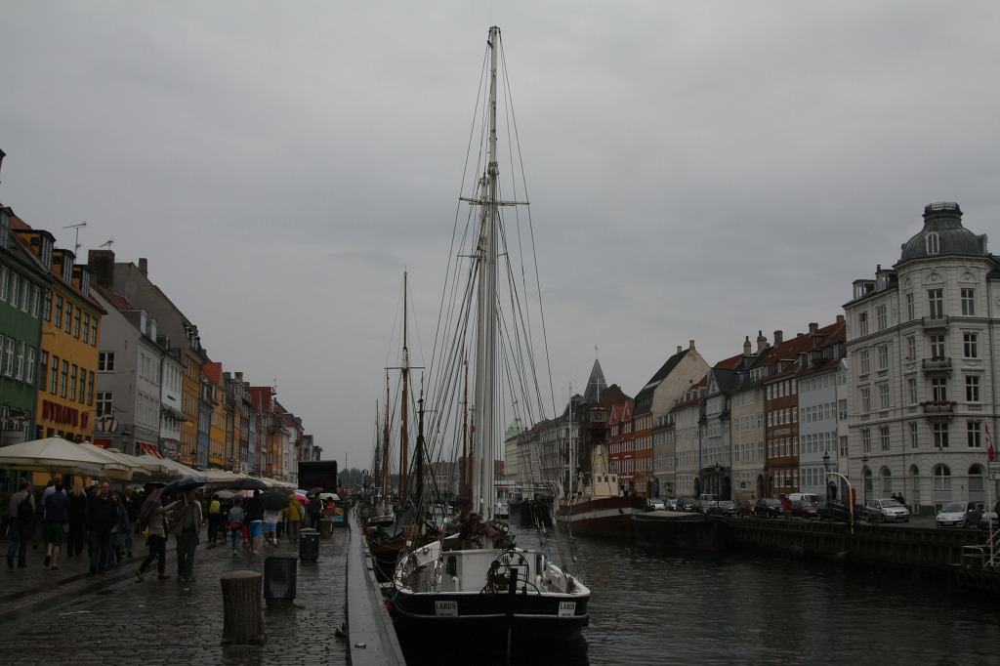

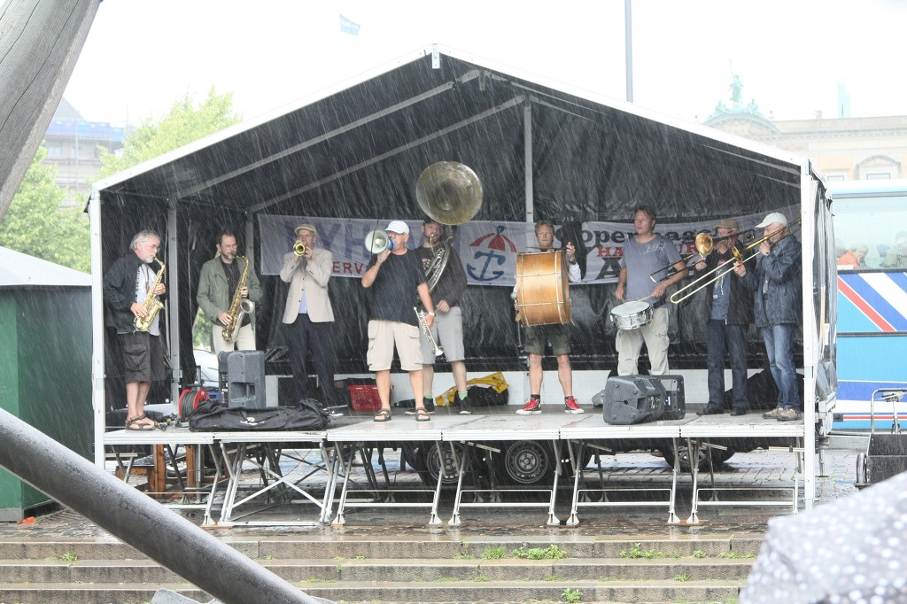

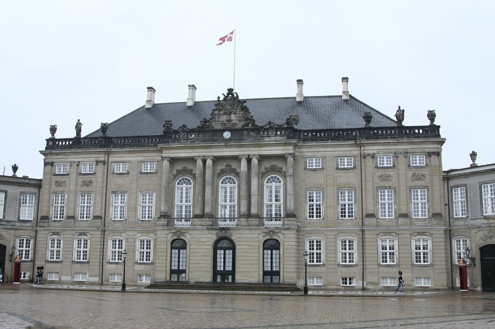

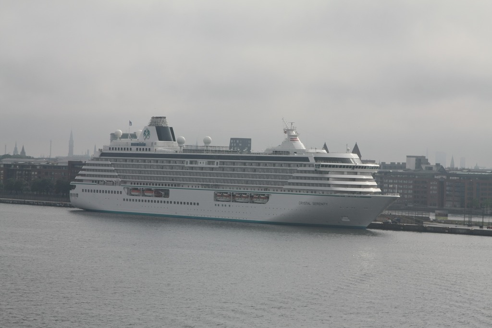

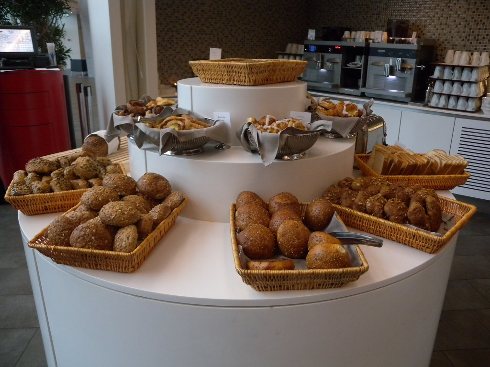

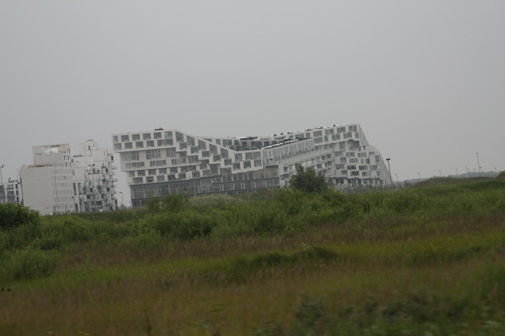

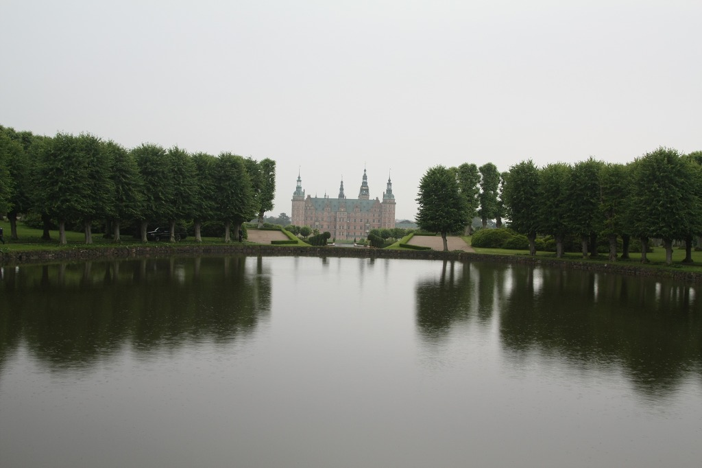

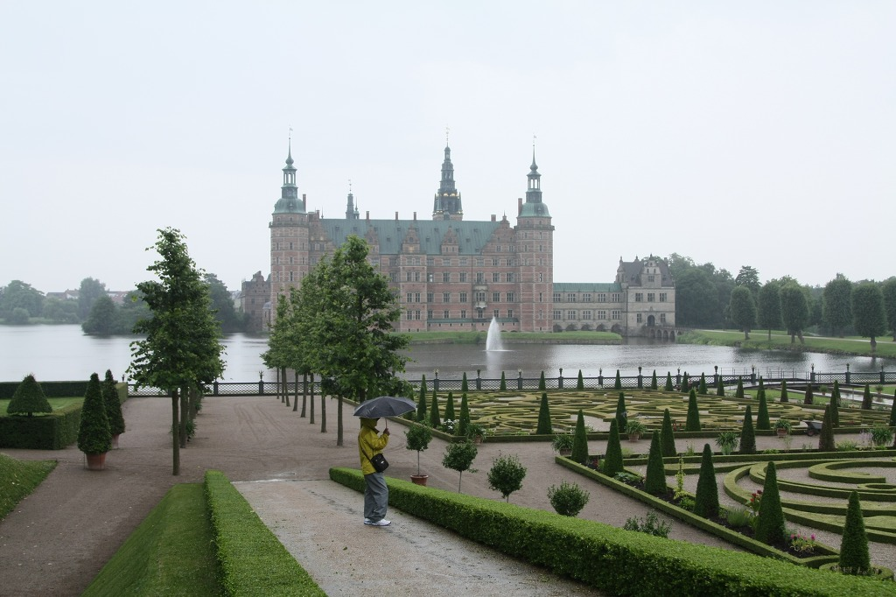

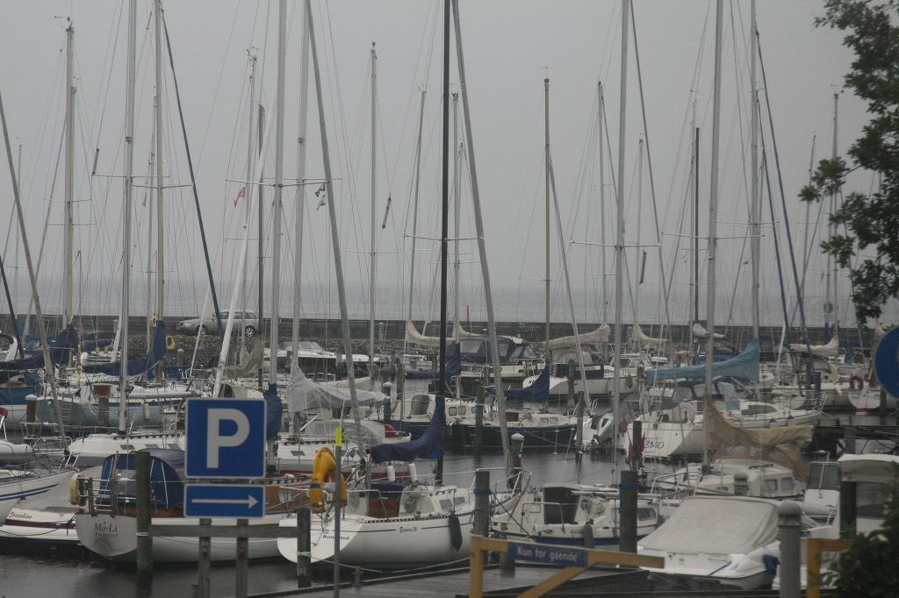

  
\*사진 위로부터 코펜하겐 공항 구내에서 만난 덴마크의 '열린 마음', 차창 밖으로 보이는 코펜하겐 거리, 인어공주상, 게피온 분수대에서, 뉘하운 항구의 재즈공연장(현재 재즈페스티벌 중), 아마리엔보 궁전, 코펜하겐 항구 DFDS 선상에서 바라본 크루즈선, 코펜하겐 크라운 플라자 호텔에서의 아침식사, 크라운플라자호텔 인근에서 만난 친환경 아파트(옥상까지 자전거로 올라갈 수 있다 함), 프레데릭 보르 성1, 프레데릭 보르 성2  
  
  
  

자연 속에 영글어 온 인간의 꿈, 덴마크

헬싱키 공항에서 비행기를 바꾸어 타고 7월 7일 오후 다섯 시쯤 도착한 코펜하겐 공항. 비행기에서 내려다 본 코펜하겐의 상공엔 흰 구름이 덮여 있었고, 항구엔 하얀색의 크루즈선들이 정박해 있었다. 풍력발전기의 바람개비들은 바다 위에 한 줄로 늘어서 돌고 있고, 그 사이를 날아다니는 갈매기들이 한가로웠다.

‘밖에서 잃은 땅, 안에서 찾자!’고 외치며 실의에 빠진 조국을 구한 달가스(Enriko Mylius Dalgas), 국민교육으로 조국을 구한 그룬트비(N.Fs Grundtvig), 동화를 통해 어린이들의 꿈을 키워준 안데르센(Hans Christian Andersen), 실존주의 철학자 키엘케골(Kierkegaard, Soren Aabye) 등. 그들이 만든 나라에 온 것이다. 북위 55도. 우리로 치면 ‘끔찍한 북쪽’이다. 그런데 날씨는 산산하고 밤 11시까지 지지 않는, 대낮 같은 백야의 석양 속에 길거리는 차분했다. 시내 일식집에서 한식으로 저녁을 해결하고 크라운 플라자 호텔에 짐을 풀었다. 꽤 높은 호텔 창밖으로 바다와 시가지가 어우러져 보였다. 호텔의 수돗물은 그대로 마셔도 무방하다는 그곳. 무엇보다 공기가 달았다. 그런데, 물가는 살인적이었다. 동행한 노선생은 자판기의 생수가격을 예로 들었다. 17크로네! 작은 생수 한 병이 우리 돈으로 3,400원이 넘었다. 껌 한 통이 2유로에 가깝다니, 북유럽은 ‘껌값’이란 말도 통할 수 없는 곳인가.

북유럽의 날씨를 보여주려는 듯 다음 날은 종일 비가 내렸다. 빗속에서 김동규가 ‘간지 나는’ 저음으로 들려주는 <시월의 어느 멋진 날에>를 들으며 덴마크를 친견하게 된 흥분을 겨우 잠재웠다. 호텔을 나서자 야산 하나 보이지 않는 평원과 푸른 숲이 끝없이 이어졌다. 해발 170m라니! 아예 산은 없는 셈이다. 남한의 3분지 1밖에 안 되는 땅, 530만 인구에 380여개의 작은 섬들로 이루어진 나라. 대체 굴뚝 하나 안 보이는 숲속 어디에서 87,000달러의 1인당 국민소득이 만들어져 나온단 말인가. 멀리 아름답게 디자인된 건물 사이로 솟은 굴뚝 하나가 보였다. 놀랍게도 쓰레기 소각장이란다. 버스가 뚫고 지나는 녹색의 숲이 덴마크의 오늘과 내일을 보여주는 현장이었다. 평평한 대지에 그득한 삼림, 그 속에 숨듯이 앉아 있는 아름다운 건물들이야말로 그들이 추구해온 그린 프로젝트(Green Project)의 현주소 아닐까.

삼림을 뚫고 나간 곳, 힐레뢰드에 프레데릭스 보르성[프레데릭 2세의 여름별장]이 있었다. 오늘날의 국립역사박물관으로, 1800년대 유명한 칼스버그 맥주회사의 CEO가 재건하여 덴마크 문화재단에 기부한 곳이란다. 눈만 뜨면 변칙 상속, 비자금 조성 등으로 영일이 없는 우리나라 재벌들을 생각나게 하는 곳이었다. 수천억의 재산을 갖고 있으면서도 못 사는 사람들의 것까지 빼앗아야 만족하고, 재산을 자식에게 물려주려 온갖 탈법을 자행하는 우리나라의 재벌들은 이들에 비하면 ‘나무를 갉아먹는 벌레들’일 뿐인가. 프레데릭 보르 성을 보며 ‘많이 벌면 나누어야 한다’거나 ‘문화가 없으면 관대하지 못하다’는 덴마크 재벌들의 철학이 오늘날의 이 나라를 이루었음을 절감한다. 덴마크를 포함한 북유럽 사람들의 행복지수가 세계 최고인 것도 돈과 문화에 대한 열린 사고 덕분이리라.

외레순 해협을 따라 펼쳐진 해안을 따라 조촐하고 조용하게 사는 이 나라 부자들의 실상을 차창으로나마 목격할 수 있었다. 날 좋으면 요트를 타고 바다로 나가 갈매기와 바닷물을 관조하며 혼자 즐기고, 날 궂으면 집 안에서 파티를 즐기는 그들의 단순하면서도 자연친화적인 삶이 차분한 색깔의 집들과 어울렸다. 덴마크의 세계적인 음악가 에드워드 그리그가 30년을 산 마을도 보았고, 우리의 서낭당과 비슷한 문화를 지녔다는 스코스보 마을도 지났다.

그런 다음 우리는 코펜하겐 시내에 로코코 양식으로 지어진 1800년대의 주거지를 보았고, 100년 전 칼스버그 사장이 돈을 내고 조각가 에릭슨과 합작으로 만들어 세운 인어 아가씨도 만났다. 1m 60cm의 아담한 체구인 그녀는 당시 에릭슨의 여친이었던 궁정 발레리나를 모델로 만들어졌다나? 그러나 어릴 적 동화책 속의 그 ‘인어공주’가 내게 심어준 ‘슬픈 아름다움’은 어디에서도 찾을 수 없었다.

뉘하운(Ny havn) 항구는 빗속에서도 붐볐다. 재즈 페스티벌이 열리고 있는지 가설무대에서는 재즈 가수들의 힘찬 노래에 정열적인 몸짓과 타악기ㆍ관악기의 분방한 소리들이 끊임없이 터져 나왔다. 재즈가 미국에서 나왔으나 무대에 올린 건 덴마크가 처음이라니, 그럴 법 해 보이는 순간이었다. 항구의 운하로 관광객을 실은 배들은 쉼 없이 드나들고, 갈매기들의 호위 속에 노천 주점의 서정이 무르익는 곳. 북유럽의 문화가 무엇인지를 보여주는 서정적 공간, 뉘하운이었다.

우린 이제 D.F.D.S. SEAWAYS 크라운호[길이 170m, 넓이 28m, 무게 35,498톤, 2,026명의 승객과 450대의 차량을 싣고 덴마크의 코펜하겐과 노르웨이의 오슬로를 왕복하는 페리]에 몸을 싣고, 잔잔한 발트해를 꿈결처럼 미끌어져 갈 것이다.

공유하기

게시글 관리

**백규서옥\_Blog ver.**