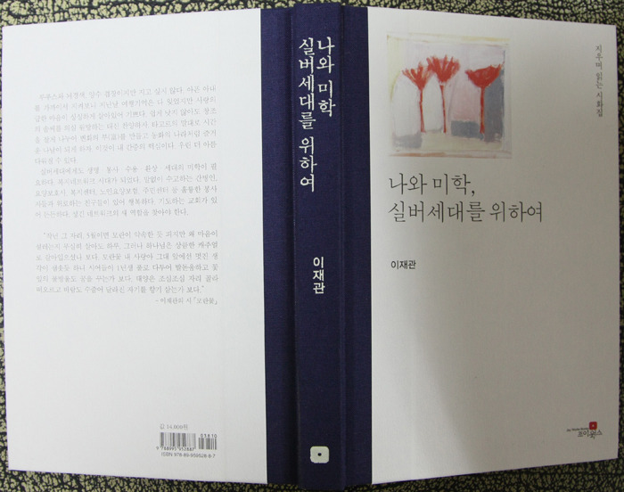

  

아, 두메솔 선생님!

남의 글을 읽으며 눈물을 흘려 보기 그 얼마만인가? 갈수록 인간의 나약함과 삶의 유한함을 깨달으며 내 이웃의 비극을 ‘타자화(他者化)’하는 데 익숙해지는 나날이다. 선생의 글과 시는 ‘인간 실존’에 대한 통곡이다. 한 남자와 한 여자가 만나 가정을 이루어 세속적인 행복을 누리다가 어느 날 갑자기 맞닥뜨린 불행. 요즘 흔히 보는 남녀 간의 다툼이나 이른바 ‘황혼이혼’ 같은 류가 아니다. 삶과 죽음의 갈림길에서, 아니 죽음보다 못할 수도 있는 삶의 한 복판에서 겪는 실존의 위기를 이보다 더 절절하게 외칠 수 있을까.

우리는 입만 열면 인간의 본질을 말한다. 신을 모델로 만들어졌다고 착각하는 인간, 완전무흠한 신의 곁으로 올라가고자 애쓰는, 아니 올라갈 수 있으리라고 믿는 인간. 그러면서 수시로 맞닥뜨리는 온갖 현실의 벽 앞에서 좌절하고 절망하는 스스로의 모습을 애써 외면하는 불쌍한 존재가 인간 아닌가. 우주 최고의 영장류(靈長類)로 자부하지만, 인간이 갖는 ‘영성(靈性)’이란 그 얼마나 하잘 것 없으며 비극적인가? ‘실존이 본질에 앞선다’거나 ‘실존주의는 휴머니즘’이라는 사르트르의 말을 오늘 두메솔 선생의 글에서 아프게 확인한다.

일생을 함께 한 배우자의 불행 앞에서 그 불행의 완력을 벗어날 수 없는 인간 두메솔의 절망과 불안이 어찌 선생 혼자만의 것이란 말인가. 사랑하는 배우자 주변에 어른거리는 죽음과 불안, 아니 자신의 주변에 어른대는 그런 불안이 어찌 두메솔 혼자 안고 가야할 개인적인 숙명일 것인가. 선생이 절규하는 것은 우리 모두의 절절한 현실이다. 우린 흔히 그럴 듯한 논리로 객관과 보편을 논하지만, 그런 논리가 결코 우리를 구원할 수는 없다.

\*\*\*

두메솔 선생의 <<나와 미학, 실버세대를 위하여>>(조이웍스, 2011)를 눈물을 훔치며 읽었다. ‘지우며 읽는 시화집’이란 부제가 페이지 가장자리에 위태롭게 매달려 있는 이 책. 두메솔 선생의 평소 모습처럼 깔끔하고 단정한 장정(裝幀)의 이 책이 슬픔을 배가해주는 건 글 속에 가득 들어찬 진실 때문이다. 루푸스 증상과 그 합병증으로 나타난 뇌경색, 아내의 뇌경색 징후를 전혀 알아차리지 못했던 두메솔 선생의 자책, 집으로 돌아오는 길을 잊은[아니 잃어버린] 아내를 찾아 도시의 미로를 헤맨 두메솔 선생. 선생은 그 미로를 다음과 같이 ‘미로’라는 제목으로 설명하고 있다.

당신이 머릿속 지도를 지우기 시작한 날

나는 지도를 꺼내들고 헤매기 시작했습니다.

당신이 전화하기를 그만 둔 그 때부터

나는 애원했습니다.

수신 좀 하라 먼저 끊지 말라

도시는 천 갈래 만 갈래.

인생의 미로보다 더한 미로,

어두운 골목에 있지 말고 큰 길로 나가요,

간판을 읽어요, 어딘지 물어요.

“나 힘들어 빨리 와줘” 라고 외치게 하는

솔직한 세포는 지워졌는가.

세포가 사랑보다 위대한 것인가

오토바이 소리가 귀청 울리는 거기

간판도 없는 회색의 미로에서

당신은 기진했으나 곧 일어나 걸었습니다.

며칠을 계속 걸었습니다.

분수광장 한 구석에서 누가 자고 있다.

커피를 엎지르며 마구 달려 가보니 남루한 사내.

이 무슨 실례의 상상일까

어딘가 조용한 벤치에 꼿꼿하게 앉아 눈 감고 있겠지

우리가 좋아라고 함께 마시던 커피 향기가 쓰다

죽을 만큼 쓰다.

나 같으면 지하철역을 택하겠다.

당신이 좋아하는 도넛 가게 그 옆엔 푹신한 소파와

나무의자, TV, 꽃무늬 벽, 바로 옆에 화장실,

조금 더 가면 초등학교, 어린 시절이 따라온다.

택시기사가 속도를 늦추며 눈을 닦는다.

차에서 내려 몇 발 못가 엉엉 울었다.

내게로 오는 길을 잊었어도 상관없습니다.

따지기 잘하는 사람과

평생의 미로를 뱅뱅 돌다가

시시한 기억부터 지워야 했겠지

그래도 서로 좋아하는 느낌,

너와 나의 골자,

사랑은 퍼내도 지워지지 않습니다.

귀갓길을 잊어 버려 방황하는 아내, 그 아내를 찾아 미로를 방황하는 남편, 남편의 간절한 염원 등 우리가 주변에서 늘상 목격하는 광경이다. 하지만 우리에겐 대책이 없다. 곁에 있다 사라진 아내를 찾아 남편을 찾아 헤매야 할 미로 만이 있을 뿐이고, 총명하던 시절의 음성이나 젊은 시절의 화사한 추억만 피곤에 절은 몸 안 어딘가에 남아 있을 뿐이다. 과연 사랑 만으로 그런 미로의 기억을 되살려낼 수 있을까.

\*\*\*

이제 본격적인 재활의 단계. 두메솔 선생의 마음처럼 우리 모두의 마음도 지쳐가고, 추억이 빠져나간 환자의 몸은 새로운 추억에의 갈구로 허전하고 피곤하다. 다음의 묘사는 바야흐로 후회의 무덤에 빠져들고 있는 우리를 건져내려는 배려에서 나온 것이리라.

“(엉금엉금 기어가는 아내를) 화장실 문 앞에서 일으켜 세울 때, 소파로 돌아와 앉기와 일어서기 운동을 시킬 때, 내 손이 거칠었나 보다. ‘그것도 못해?’ 나도 모르게 거친 말이 되었다. 금방 움츠린다. 억지로 시키는 내가 밉다고 한다. 야단친다는 말이 생각나지 않는지 ‘욕한다’고 한다. 무슨 욕을 했단 말인가. 억울하다. 아랫도리가 추울 테니 하의를 하나 더 입자고 했다. 반발하며 입지 않는다. TV를 틀고 과일 한 쪽과 찻잔을 앞에 놓아주고 돌아서니 오전 11시. 미뤄두었던 설거지를 하는데 한숨이 나온다. 총명하던 당신은 어디로 가셨나요. 그립습니다. 그립습니다. 지금 당신은 누구인가요. 나는 또 왜 이러나요.”

그렇다. 뇌를 다친 아내는 낯선 이로 변해 내 삶의 한 부분을 비집고 들어 앉아있으나, 피곤하고 낯설어 나 자신을 닦달할 뿐, 뾰족한 방도가 없다. 소통이 되지 않으니, 타인이다. 총명하고 조신하던 아내, 내 몸보다도 더 잘 소통되던 아내는 남으로 변했고, 그 ‘남처럼 낯설어진’ 아내를 받아들이기 위해 마땅히 사용할 도구가 없는 이 상황을 선생은 어떻게 타개해 나갈 것인가.

그러나, 끈질긴 두메솔 선생, 드디어 소명(召命)을 찾아내고야 말았다. 소명이란 무엇인가. ‘인간이 하나님을 대신 해 하나님의 일을 하도록[ 아니, 할 수 있도록] 하나님의 부르심을 받는 일’이 소명이다. 선생은 그 소명을 다음과 같이 들었다.

아름드리나무도 못하는 일을 하란다.

자투리땅에 화초 심듯

은근슬쩍 시작하는 사랑 이야기

쉴 새 없이 귓가에 속삭이시니

토마토가 오직 바라는 것은

햇빛과 흙, 버팀목,

타드는 날 장대비,

그뿐

가야지, 달려가야지

두툼한 과육과 작은 씨앗 만들어

얇은 표피 안에 감추는 재미

누가 알까

영혼의 단맛까지

소쿠리 듬뿍 담아 그대에게 바치리.

선생도 방황을 했으리라. 하나님이 시키신 일은 사실 ‘아름드리나무도 못할’ 정도로 크지 않은가. 그럼에도 하라고 시키신 데는 큰 뜻이 있을 것이다. 애당초 시련을 주신 데는 더 큰 뜻이 있었을 것이다. 그 크신 뜻을 따르는 일이 지금 주어진 유일한 선택지임을 알고, 선생은 달려가려는 것이다. 새롭게 태어난 아내와 함께 어디까지든 가야 한다는 것이 그 분의 소명 아니겠는가. 그러면서 선생은 에필로그로 다음과 같은 아포리아(aporia)를 남겼다. 선생은 쉽게 말씀하시지만, 우리 같은 범인(凡人)들에겐 해결할 수 없는 난제이면서 다른 방법이나 관점으로 새롭게 추구하고 탐구해야 할 출발점인 것이다.

“간병은 일방적으로 주기만 하는 봉사가 아니다. 손해만 보는 일이 아니다. 서로 친구가 되어 시간마다 함께 즐기는 일이다. 환자에게 우월성을 과시하듯 리드하면 실패하기 쉽다. 서로 돕는 친구가 되어야 한다. 나는 환자를 돕고 환자는 나를 돕는다.”

2011. 8. 13. 텅 빈 교정에 내려 꽂히는 빗소리를 들으며, 백규

공유하기

게시글 관리

**백규서옥\_Blog ver.**