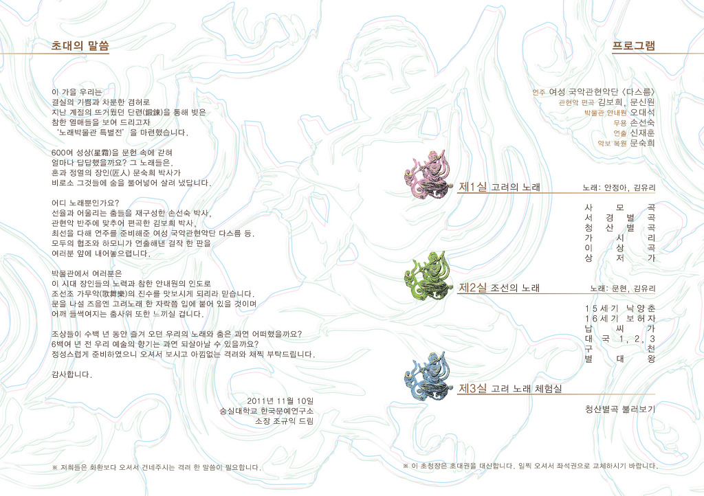
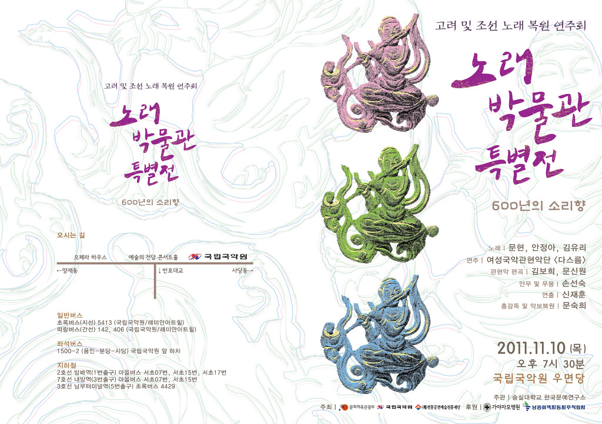
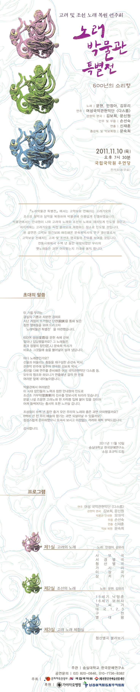

  
숭실대학교 한국문예연구소에서는 아래와 같은 일시와 장소에서 여러분을 모시고  
<<노래박물관 특별전>>을 갖고자 합니다. 많이 참석하셔서 깊어가는 가을밤의 정취를 우리 전통노래와 함께 만끽하시기 바랍니다.   
  
   1. 일시 : 2011. 11. 10.(목)  오후 7시 30분  
   2. 장소 : 국립국악원 우면당  
   3. 주관 : 숭실대학교 한국문예연구소  
   4. 출연자  
             1) 노래 : 문현, 안정아, 김유리  
             2) 연주 : 여성국악관현악단 <다스름>  
             3) 관현악 편곡 : 김보희, 문신원  
             4) 안무 및 무용 : 손선숙  
             5) 연출 : 신재훈  
             6) 총감독 및 악보복원 : 문숙희  
  
<<노래박물관 특별전>> 행사의 목적 및 취지   
  
『노래박물관 특별전』은 고악보로 전해지고 있는 우리의 옛노래들을 복원하여 들려드리는 음악회입니다. 고려와 조선의 많은 노래들은 ‘정간보’라는 고악보에 전해지고 있습니다. 정간보는 세종대왕이 한글과 비슷한 시기에 창제한 것으로서 음과 리듬을 함께 기보할 수 있는 악보입니다. 정간보는 서양의 오선보 못지않은 악보이지만 철학적인 의미가 담겨져 있어서, 그 리듬 해석에 대해서는 학자간 많은 이견을 보이고 있습니다. 리듬해석에 따라 정간보에 담긴 음악의 내용은 달라집니다.   
  
『노래박물관 특별전』에서는 한국문예연구소 연구원 문숙희 박사의 리듬해석으로 복원된 음악들을 연주합니다. 문숙희 박사는 최근 몇 년 간 정간보 연구에 매진해왔고, 그 결과로 많은 고악보의 음악들을 복원해왔습니다. 종묘제례악으로 연주되고 있는 정대업과 보태평 전곡을 모두 복원하였고, 이번에는 고려가요 및 조선조 향악과 당악을 복원하여 선보이게 되었습니다. 복원된 이 노래들은 우리에게 너무나 친숙한 리듬과 선율로 되어 있고 또 우리말의 어조에도 잘 맞습니다. 그리고 민요와 같이 단순하면서도 궁중에서 오랫동안 애창되었던 명곡들답게 아름다움도 담겨 있습니다. 가사를 프로그램에 첨부하였으니, 여러분들도 이 옛노래들을 음미하시면서 한 두 곡조 정도는 배워보시기 바랍니다.   
  
『노래박물관 특별전』에서는 우리의 옛 노래를 들려주면서 또한 공연의 흥미도 높이고자 최선을 다하였습니다. 복원된 선율은 단선율로 되어 있어서 성악곡으로 부르게 하였습니다. 그리고 단조로움을 피하기 위해 복원된 선율을 아름답게 꾸며 관현악으로 반주하게 하였고 또 노래의 앞뒤에는 전주곡과 후주곡을 붙이기도 하였습니다. 단, 향악화된 16세기의 보허자는 성악곡에서 기악곡으로 변하는 중의 음악이기 때문에, 악보에서 성악곡 부분과 기악곡 부분을 나누어 연주하게 하였습니다. 가장 서정적인 선율로 되어 있는 <사모곡>과 조선조 나례음악인 <대국~별대왕>에는 무용을 넣어 아름다움을 고조시켰습니다. 그리고 꽃미남 박물관 안내원이 나와 재치있는 해설로 여러분들을 재미있게 인도할 것입니다.   
  
지금까지 땀흘려 연구한 결실들을 여러분들께 조심스럽게 내어 놓습니다. 앞으로 남은 연구를 완성하기까지는 여러분들의 아낌없는 격려와 응원이 필요합니다. 부족하더라도 훈훈한 마음으로 감상하시고 즐겨주시면 많은 격려가 되겠습니다. 꼭 참석하셔서 즐겨 주시기 바랍니다.   
  
                  2011. 20. 27.  
  
                 한국문예연구소 소장  조규익 드림

공유하기

게시글 관리

**백규서옥\_Blog ver.**